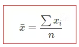
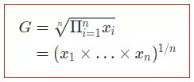
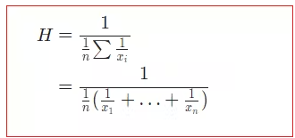
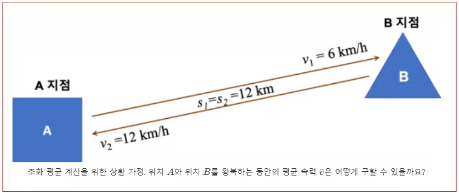
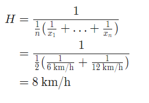

# 기하평균, 조화평균

## 산술평균

실생활에서 평균이라고 말하면 보통 산술 평균을 의미합니다. 산술 평균은 데이터 값 x_ixi​들을 모두 합한 후에 데이터의 갯수 nn으로 나눈 값입니다.

## 기하평균 

인구증가율, 물가상승율, 경제성장률 등과 같이 연속적인 변화율 데이터를 기반으로 어느 구간에서의 평균 변화율을 구할 때 사용하는 것이 기하평균입니다.

이 기하평균은 변화율에 대한 데이터 값 x_ixi​들을 모두 곱한 후에 데이터의 갯수로 nn제곱근을 취한 값입니다.

## 조화 평균
조화 평균은 평균속력을 구할 때 사용하게 됩니다. 아래 (7)식과 같이 각각의 데이터 값의 역수를 취하여 산술 평균을 구한 후 다시 역수를 취한 값이 조화 평균입니다.

A 지점에서 B 지점으로 갈 때 12km/h 속도 
B 지점에서 A 지점으로 갈 때 6km/h 속도 

혹시 산술평균으로 왕복하는 동안의 평균속력을 구하면 될것 같다고 생각하셨나요? 결과는 ‘그러시면 안됩니다‘ 입니다.

