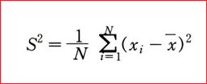
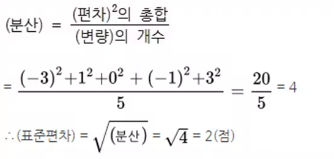

# 분산(Variance), 표준편차(Standard deviation) 계산 

## 분산과 표준편차 계산 
### 분산 

|과목 | 국어 | 영어 | 수학 | 과학1 | 과학2 | 과학 3 | 평균 |
|--|--|--|--|--|--|--|--|
|점수 | 10 |8 |10 |8 |8 |4 | 8.0 |
|편차=변량(점수) - 평균| 2 |0 |2 |0 |0 |-4 | - |
|편차의 제곱| 4 |0 |4 |0 |0 |16 | - |

* 편차 = 변량(점수) - 평균 

위 표에서 계산된 편차의 제곱을 모두 더한다. 

제곱의 합을 (변량의 갯수 -1)로 나눈다. 





```
        (편차)^2의 총합 
분산 = -------------------
         (변량)의 개수 
```
```
        (2)^2 + (0)^2 + (2)^2 + (0)^2 + (0)^2 + (-4)^2
분산 = --------------------------------------------------
                       6
```


> n은 처음 주어진 자료에 속한 숫자의 개수이다. 이 과정을 거치면 분산이 나오며, 여기서 n-1로 나누는 이유는 표본 분산과 모분산을 분리하기 위해서이다.


### 표준편차 
표준편차는 분산에 루트를 씌운다. 





```
(표준편차) = √분산 =√4.80 = 2.19 
```


## 분산과 표준편차 이해 

쉽게 말하면 평균(mean) 에 대한 오차이이다. 즉 , 실제 데이타 값이 평균을 기준으로 할때 얼마나 들쭉 날쭉하냐를 나타내는 것이다. 평균이 m이고, 표준편차가 3이라고 할때, 실제 값은 m+-3 값이라는 것이다.

먼저 편차랑, 원래의 값에서 평균을 뺀 값인데, 편차는 +도 될 수 있고, -도 될 수 있다.
그러면 우리가 구하고자 하는 표준편차라는 것은 평균 값이 실제 값에서 부터 얼마나의 오류가 있느냐 인데
예를 들어 4개의 데이타가 있을 때 평균을 m이라고 가정하고, 각 값이 m+1,m-2,m+3,m-4 라고 할때
편차의 합은 실제로 1+2+3+4=10 이 되야 하지만, 실제 값이 -2,-4 가 있기 때문에, (값-m)을 합한 값으로 계산해보면 1-2+3-4로 전혀 엉뚱한 값이 나온다.
그래서 이 음수를 양수화해야 하는데, 그러한 방법중의 하나가 제곱이다.
편차들을 합하기전에 제곱을 해서 합하면 1+4+9+16이된다. 이것이 바로 분산(Variance)으로 "편차의 제곱의 합"이다.

그렇다면 분산(Variance)을 바로 쓰지 않고, 표준편차를 구하는 이유는? 
분산은 편차에 제곱을 하여 계산을 하였기 때문에, 실제  값에서 너무 멀어져 있다. 그래서 실제 값으로 근접 시키기 위해서 제곱근(루트)를 씌워준 것이다. (분산에서 제곱했으니, 반대로 제곱근을 씌운다.)
즉 분산에 루트를 씌운것이 표준 편차(Standard deviation) 이며, 이 표준편차는 평균으로 부터 원래 데이타에 대한 오차범위의 근사값이다. (원래 데이타로 부터의 오차의 범위는 편차의 절대값들에 대한 평균값으로 절대편차라고 하며 Absolute deviation, 표준 편차와 값이 다소 다르지만, 평균값으로 부터의 얼마나 오차가 있는지를 표현한다는 의미에서는 같다. 그러면 왜 절대편차를 사용하지 않고 표준 편차를 사용하는가는 다른 글에서 다루도록 한다. 결론만 말하자면, 제곱을 한 표준편차가 모델링과 각종 통계 수식을 응용하기에 용이하다)


## 용어 

* mean 평균
* variance 분산 
* standard deviation 표준편차 


> 통계학이란 굳이 다 조사하지 않더라도, 대충의 결과를 알 수 있다. 일종의 prediction 의 개념이다. 조사대상인 모집단(population) 전체를 조사하는 경우를 전수조사라고 한다.
모집단이 커서 전수조사가 어려운 경우, 집단의 특성을 추정하기 위해서 일부 표본(sample)만 추출하여 하는 조사를 표본조사라고 한다. 이렇게 표본을 조사함으로써, 원래 모집단의 특성을 추측하는 것을 추정이라고 한다. (근대 통계학의 추론통계학 - inferential statistics의 개념 )


