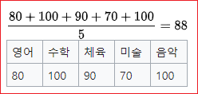
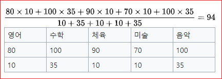
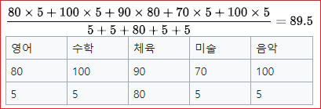
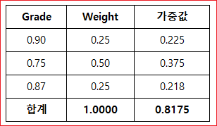
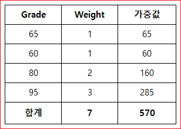
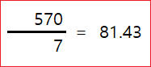

# 가중 이동 평균


## 가중평균
가중 산술 평균은 자료의 평균을 구할 때 자료 값의 중요도나 영향 정도에 해당하는 가중치를 반영하여 구한 평균값이다.

예를 들면,  어느 학생의 아래 성적표에서 평균은



이다.  그런데 이 학생이 A예술고의 실용음악과를 진학 하려는데, 해당 학과장님은 수학과 음악에 비중을 두어 입학생을 뽑으려 한다. 아래 가중치를 적용하여 가중 산술 평균을 구해보자



그러면 이 학생이 B체육고에 진학 해보려 한다면 아래 가중치를 적용하여 가중 산술 평균을 구해보자.



## 가중치가 백분율일 떄
가중치를 %로 나타낼 때에는 가중치의 합은 100%(1)이다. 대개 가중치는 합해서 100이 되거나 1이 되는 경우로 제시된다.




Grade를 Weight와 곱한다. 곱한 값들의 합을 구하면 가중 평균이 된다. 위의 표에서는 0.8175가 된다. 


## 가중치가 백분율이 아닐 때




가중치로 곱하여 얻은 값들의 합계를 가중치의 합계로 나눈다. 그것이 바로 가중치 평균, 즉 정답이다.



```
grades = [ 90, 80, 70, 60, 50]  # 성적 
print(grades)

weights = [ 10, 35, 10, 10, 35  ]  # 가중치 합계는 100 
print(weights)

g_sum = 0 
weights_sum = 0 

idx = 0
while idx < len(grades):
  g_sum = g_sum + (grades[idx] * weights[idx])  # 점수 * 가중치 합계 
  weights_sum = weights_sum + weights[idx]      # 가중치 합계 
  idx = idx + 1 

w_average = g_sum / weights_sum   # 가중치 평균 =  sum((점수 * 가중치)) / sum(가중치) 
print(w_average)
```


## 가중 이동 평균
최근 관측치에 비중을 더두면서 이동평균을 계산하는 방법

* 단순 이동평균의 문제점을 보완
  * 예측치가 가장 근접된 기간이 실제 결과에 닮았을 것이라는 가정하에서,
  * 최신자료일수록 예측치에 보다 민감하게 작용하도록 하는 평균화 기법

단순 이동 평균에 비해 선형 가중 이동 평균 (또는 단순히 가중 이동 평균, WMA )은 가장 최근 가격에 더 많은 가중치를 부여하고 시간을 거슬러 올라 갈수록 점차 감소합니다. 10 일 가중 평균에서 10 일의 가격에 10을 곱하고 9 일의 가격에 9를, 8 일의 가격에 8을 곱하는 식입니다. 총계는 가중치의 합으로 나뉩니다 (이 경우 : 55). 이 특정 예에서 가장 최근 가격은 총 가중치의 약 18.2 %, 두 번째 더 최근의 16.4 % 등이 가중치의 0.02 %를받는 창에서 가장 오래된 가격까지 계속됩니다.

* 가중 이동 평균 ( WMA )
* 지수 이동 평균 ( EMA )

n1 , n2, n3 가 존재한다고 가정하고 각각의 가중치를 w1, w2, w3라고 하면 (w1n1 + w2n2 + w3*n3) / (w1 + w2 + w3) 입니다. 일반적으로 최근일에 높은 가중치를 줍니다.
상황에 따라서 이벤특 발생한 특정일에 높은 가중치를 주어 사용할 수도 있습니다.


가중치는 주로 퍼센트로 표기한다. 확인 후, 가중치를 각각의 숫자 옆에 적는다.
가중치의 총 합은 100이기 때문에 가중치를 퍼센트로 표기하는 것은 흔한 표기법이다. 만약 성적, 투자 또는 다른 재무 데이터의 가중치를 찾아야 한다면, 100에서 얼마를 차지하는지에 대한 퍼센트를 알아야 한다.
만약 성적의 가중치를 알고 싶다면, 각각의 시험과 프로젝트의 가중치를 알아야 한다.


```
import numpy as np
import pandas as pd
import matplotlib.pyplot as plt
```


10 일 WMA 를 계산하려면 먼저 가중치 배열 (1부터 10까지의 정수)을 만듭니다.


```
weights = np.arange(1,11)
weights
```

```
array([ 1,  2,  3,  4,  5,  6,  7,  8,  9, 10])
```


```
dates = pd.date_range('20130101', periods=20)
dates
```
```
DatetimeIndex(['2013-01-01', '2013-01-02', '2013-01-03', '2013-01-04',
               '2013-01-05', '2013-01-06', '2013-01-07', '2013-01-08',
               '2013-01-09', '2013-01-10', '2013-01-11', '2013-01-12',
               '2013-01-13', '2013-01-14', '2013-01-15', '2013-01-16',
               '2013-01-17', '2013-01-18', '2013-01-19', '2013-01-20'],
              dtype='datetime64[ns]', freq='D')
```
```              
a = np.random.randint(10, size=20)
print(a)
```

```
[1 8 8 9 1 3 8 8 1 7 4 5 0 8 3 0 2 7 9 9]
```

```
df = pd.DataFrame(a, index=dates, columns=list('V'))
df
```

```
	V
2013-01-01	1
2013-01-02	8
2013-01-03	8
2013-01-04	9
2013-01-05	1
2013-01-06	3
2013-01-07	8
2013-01-08	8
2013-01-09	1
2013-01-10	7
2013-01-11	4
2013-01-12	5
2013-01-13	0
2013-01-14	8
2013-01-15	3
2013-01-16	0
2013-01-17	2
2013-01-18	7
2013-01-19	9
2013-01-20	9
```


```
points = [ 10, 20, 30]
points
weights = [1,2,3 ]
weights

nweights = np.array(weights)
nweights
```


```
array([1, 2, 3])
```