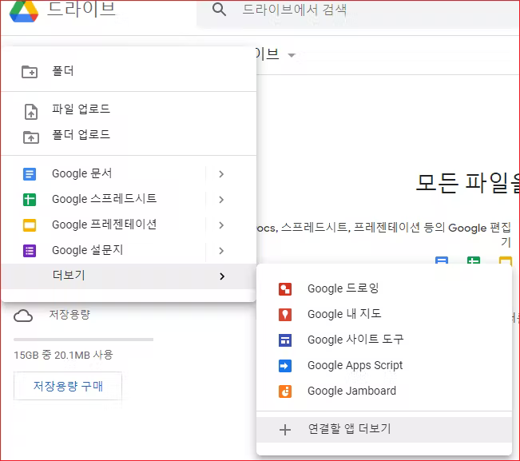
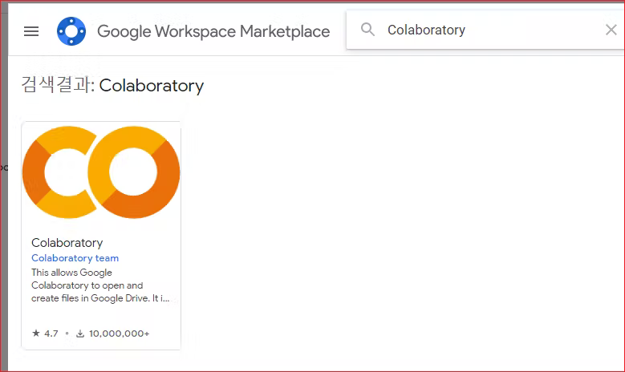
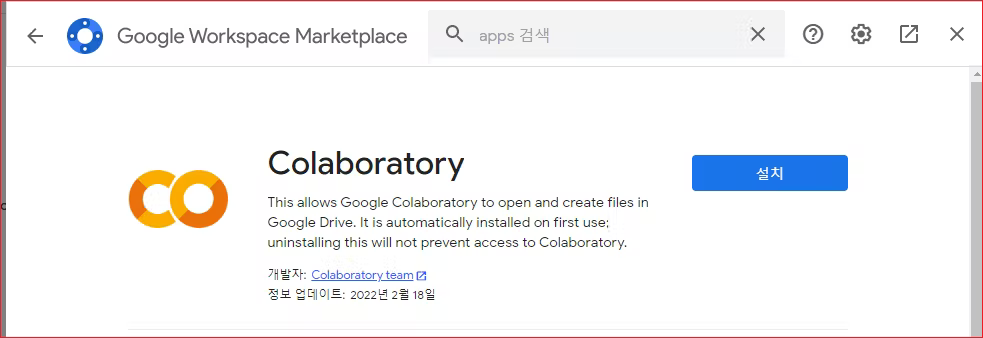
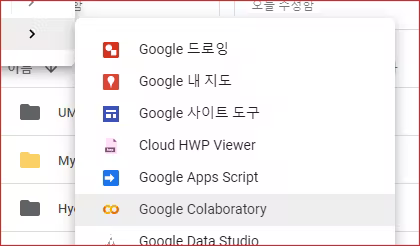
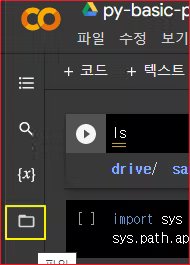
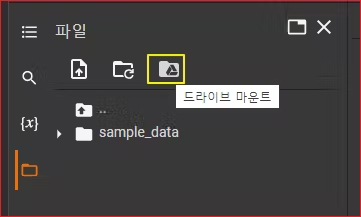
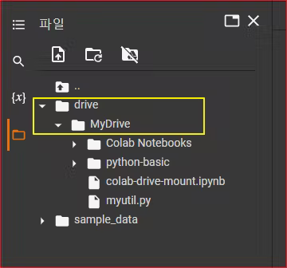

# Google Colab

## Colab이란?

Colaboratory(줄여서 'Colab'이라고 함)을 통해 브라우저 내에서 Python 스크립트를 작성하고 실행할 수 있다.

**구성이 필요하지 않음**

* GPU 무료 액세스
* 간편한 공유

## Colab 설치

자신의 구글드라이브로 간다.

새로만들기 > 연결할 앱 더보기'를 선택한다 .




colab 입력하면 Colaboratory 가 보인다.




클릭한다. 설치를 클릭한다.



앱이 설치되고, Google Drive에 연결된다.


새로 만들기


Google Colaboratory 선택



Untitled0.ipynb가 생성된다.


텍스트를 입력하고 저장해 본다.

내 드라이브에 Untitled가 저장된다.

드라이브에 보면 "Colab Notebooks"라는폴더가 생긴다.  디폴트인데변경colab 매뉴에 보면 디렉터리를 지정하여 저장하는 메뉴가 보이지 않는다. 디폴트인 것 같다. &#x20;


경로를 변경하고 싶으면 자신의구글드라이브에서 직접폴더를 만들어 옮긴다 .   &#x20;


&#x20;  &#x20;


## Colab에서 폴더 마운트하기

Jupyter와 비슷하지만 더 나은 기능을 제공하는 colab note 외에 자신이 만든 파이썬 패키지나 모듈을 업로드 하려면 자신의 구글 드라이브를 마운트 해야 한다.

colab 화면에서 맨 왼쪽에 보면 파일 아이콘이 있다. 이것을 클릭한다.





이것을 클릭하면 다음과 같이 화면이 보여진다. 여기서 드라이브 마운트 아이콘을 클릭한다.





엑세스 허용 팝업이 표시된다. Google Drive에 연결을 클릭한다.


drive/MyDrive 아래에 자신의 구글 드라이브가 마운트 된다.




# 드라이브 마운트 
코랩의 장점은 로그인만 하면 파일을 로컬드라이브에 저장하지 않고 컴퓨터가 있다면 어느 컴퓨터든 어디서나 사용 가능하다.
또 하나의 장점은 읽어올 파일 또한 드라이브에 저장하여 사용 가능한데, 파일을 읽기 위해 드라이브에 mount시켜야한다.

```
!python --version    # colab python 버전 확인 
```
```
Python 3.7.13   
```


## 나의 드라이브 마운트하기
드라이브 마운트는 메뉴를 통해서도 가능하지만 프로그램적으로 가능하다. 

drive를 import한다. 
```
from google.colab import drive
```

mnt를 마운트 포인트로 만든다. 
```
drive.mount('/content/mnt')
```
/content/mnt에 마운트 되었다는 메시지가 표시된다. 
```
Mounted at /content/mnt
```
pwd를 이용하여 현재 경로를 알아보자. 
```
pwd
```
현재 경로가 /content라는 것을 표시한다. 
```
/content
```
content에 어떤 폴더와 파일이 있는지 ls 명령어로 확인해보자. 


```
ls
```


mnt와 sample_data가 있는 것을 알 수 있다. 

```
mnt/  sample_data/
```


mnt 폴더에 들어가서 하위에 어떤 폴더나 파일들이 있는지 확인해보자. 
```
cd mnt
ls
```
MyDrive 폴더가 있는 것을 확인할 수 있다. 

```
MyDrive/
```

이 MyDrive가 자신의 구글 드라이브이다. MyDrive로 이동한다. 
```
cd MyDrive 
```

여기에 myutil.py 파일을 하나 업로드 한다. 

```
# myutil.py 
def hello2():
  print("Hello2222222222")


def say():
  print("Say....................")

def okay():
  print("OK")  
```  

myutil을 import하고 hello2()를 호출한다. 
```
from myutil import *
hello2()
```
hello2() 실행결과가 출력된다. 
```
Hello2222222222
```

## 파일 읽기 
좌측 메뉴에서 MyDrive를 마운트했을 때에는 다음과 같이 경로를 작성한다. 
```
import pandas as pd
df = pd.read_csv('drive/MyDrive/data/speed.csv')
```


