# 지수 

https://youtu.be/tVXNrdFMRkM

## 지수의 정수로의 확장 

정수 = 자연수, 0, 음의 정수 

지수법칙에 의하면  a의 m승에 a의 0승을 더하면 a에 m + 0 승이 되어야 한다. 

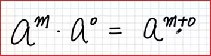

그러면 a의 m승이 되어야 한다. 

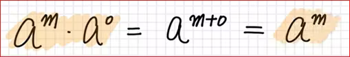

그러면 이 식이 성립하려면 양변을 a의 m승으로 나누어 보자. 
a의 m 승이 사라지고 똑 같은 것으로 나누었니까 1이 된다. 
단  a의 m 승이 0이 아니어야 한다. 그러니까 a가 0이 아니어야 한다. 

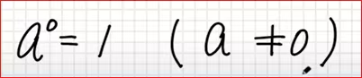

a가 0이 아닐 때 a 의 0 승이 1이다라고 약속을 한 것이다. 

그래야 지수 법칙이 성립한다. 

a의 n 승에  a의 -n 승을 곱하면  a의  n + (-1n)이 되어야 한다. 

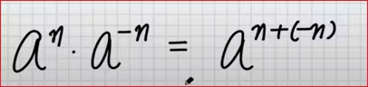

이게 성립해야만 지수 법칙이 성립한다. 
이게 성립하면 결국엔 a의  0승이 된다. 

a의 0 승이 1이라는 것을 알았기 때문에 a의 0승은 1이다. 

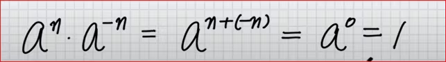

그래서 양변을 a의 n 승으로 나누면 a의 -n 승은 a의 n 승 분의 1이된다. 

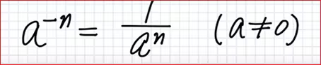

## 지수의 유리수로의 확장
지수 법칙에 이런게 있었다. 

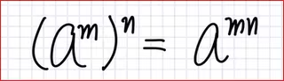

그러면, 
a의  m분 1승의 m 승은 지수 법칙에 의해 a가 된다. 

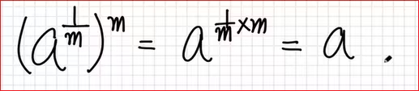

a가 정수라는 상황에서 a의 m분의 1이 유리수가 된다. 
유리수 일때도 지수 법칙이 성립해야 한다. 

다시 쓰면 

a의 m분의 1이 뭔지는 모르지만 x라고 하자 
x를 m 번 곱했더니 a가 되었다. 
이러한 x는 a의  m 제곱근이다. 

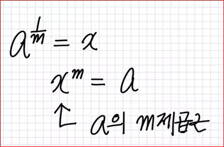

실수만 다룰 거고 실근을 다룰 거기 때문에  때문에 a > 0 이어야 한다. 
a의  m 제곱근은  m제곱근 루트 a라고 본다. 

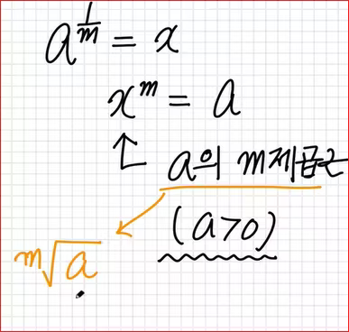

정체를 모를 때는 a 의  m분의 1승이 x라고 보았는데 
정체를 알고 보니 a의  m분의 1 승이 m 제곱근 a라고 본다. 
단, a > 0 이어야 한다. 

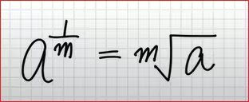

지수법칙을 쓰려면 a > 0 이어야 한다. 그래서 첫번째 풀이는 틀렸다. 

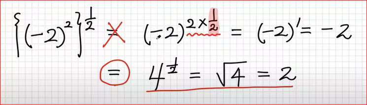

루트 4에서 앞에 2는 생략한다. 

a > 0 크면 ,  a의  m분의 1승의 n 승은  a의  m분의  n 승이 된다. 

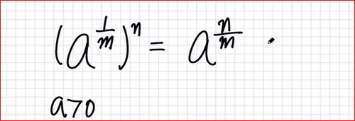

이것을 다시  a의 n 승의  m분의 1승으로 쓸 수 가 있고, 결국엔 m 제곱근 a의 n 승이 된다. 

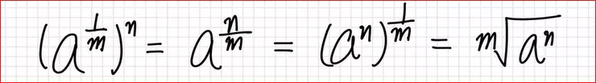

n제곱근 a와 n제곱근 b글 곱하면 n 제곱근 ab가 되고 

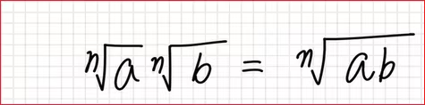

이것은 a의 n분의 곱하기 b의 n분의 1, 이것이 ab의 n분의 1이된다. 
결국 n제곱근 ab가 된다. 

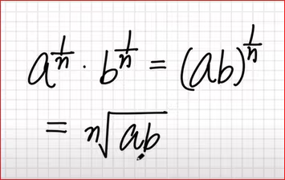

## 지수의 실수로의 확장 

유리수 + 무리수 = 실수  

## 지수법칙 

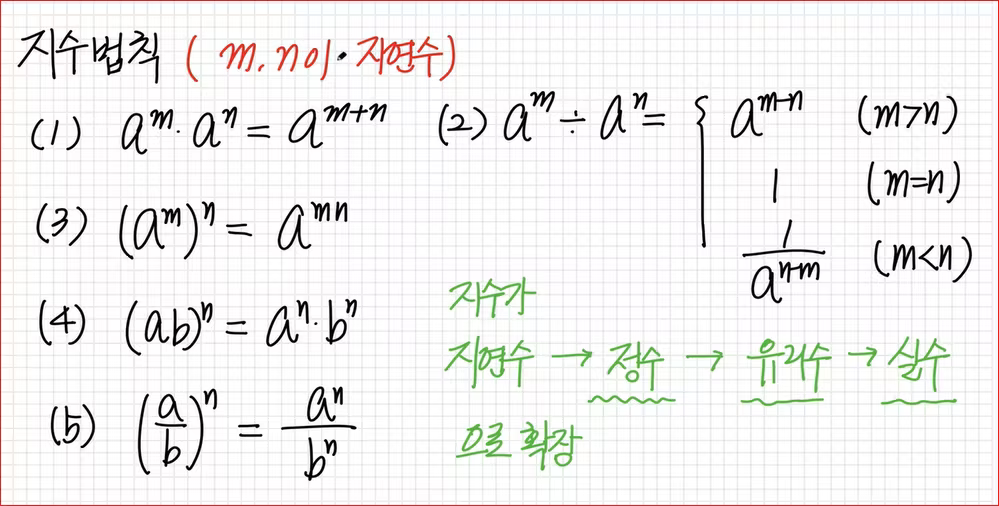

