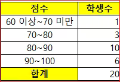
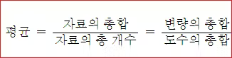
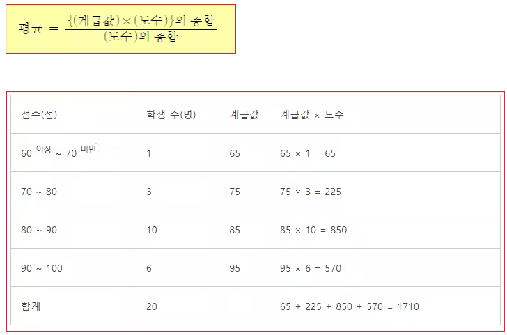
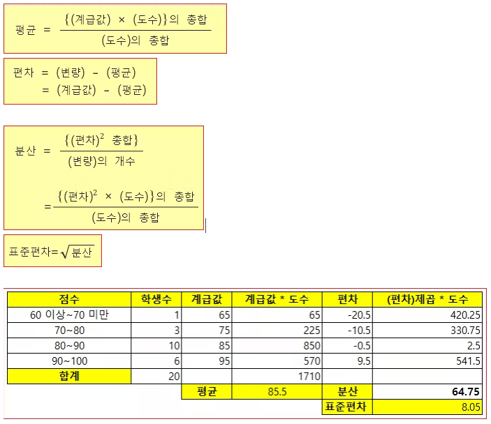

# 도수분포표


## 용어

**변량**    
어떠한 자료에 속해 있는 값들을 수량으로 나타낸 것이다.

**계급**    
변량들을 일정한 간격으로 나눈 구간을 말한다.

**계급값**    
각 계급의 중앙에 위치한 값이다. 도수분포표에서 평균 등을 구할 때는 보통 이 값을 사용한다. 'm 이상 n 미만'과 같은 반개구간의 경우에도 그냥 m과 n의 산술평균으로 계산하는데, 'n 미만이니 n을 안 포함한다'라면서 m과 n-1의 산술평균으로 계산해버리는 오개념이 생기기 쉽다. 그리고 계급값에 대해 배우지 않은 사람들에 의해 계급값이 몇이냐 하는 병림픽이 벌어진다(...).

계급값 =( 계급의 양 끝값의 합) /  2

**계급의 크기**    
각 계급의 너비를 뜻한다. 

계급의 크기 =(계급의 큰 쪽 끝값) - (계급의 작은 쪽 끝 값)


**도수**    
계급에 속한 값들의 양을 뜻한다.


## 도수분포표를 만드는 순서
* 가장 큰 변량과 작은 변량을 찾는다
* 가장 큰 변량과 가장 작은 변량이 포함될 수 있는 계급을 만든다. 
  * 계급은 00 이상 00 미만이 되도록 하고, 계급의 크기가 모두 같아야 한다. 
  * 계급의 개수는 5 ~ 15개 정도가 적당하다
* 각 계급에 속하는 변량의 개수를 세어 계급의 도수를 구한다. 





계급은 4개
점수가 82점인 학생이 속하는 계급은 80점 이상 90점 미만
점수가 10번째로 높은 학생이 속하는 계급은 80점 이상 90점 미만. 계급값은 양 끝값을 더해서 2로 나눈다. 
(80+90)/2=85= 계급값
도수가 가장 작은 계급은 도수가 1인 60점이상 70점 미만이다. 


## 도수분포표에서 평균

https://mathbang.net/71





정확한 평균을 구할 수는 없지만 대략적인 평규을 구할 수 있다. 


1. 각 계급의 계급값을 구한다. 
2. 각 계급의 (계급값) * (도수)를 구한다. 
3. (계급값) * (도수)를 모두 더한다. 
4. (계급값) * (도수)의 총합을 도수의 총합으로 나눈다. 





```
평균 = 1710 / 20 =85.5 
```


## 도수분포표에서 분산과 표준편차

https://mathbang.net/119




