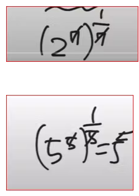

# 거듭제곱근 

## 참고 

* [거듭제곱근의 성질](https://mathbang.net/585)  
* [N제곱근 계산기](https://www.calculat.org/kr/%EA%B1%B0%EB%93%AD%EC%A0%9C%EA%B3%B1%EA%B3%BC-%EA%B1%B0%EB%93%AD%EC%A0%9C%EA%B3%B1%EA%B7%BC/n%EC%A0%9C%EA%B3%B1%EA%B7%BC.htmlㅠ)
* [거듭제곱](https://www.mathfactory.net/10667) 

## 거듭제곱 

실수 a와 양의 정수 n에 대하여 a를 n번 거듭하여 곱한 것을 a의 n제곱이라 하고, a^ n으로 나타낸다.

이 때 a, a^2, a^3,....,a^n 을 통틀어 a의 거듭제곱이라고 하고 a를 거듭제곰의 밑, n을 거듭제곱의 지수라한다. 

## 거듭제곱근 
실수 a와 2 이상의 자연수 n에 대하여 n제곱하여 a가 되는 수, 즉 x^n=a를 만족시키는 x를 a의 n제곱근이라 한다.

이 때 a의 제곱근, a의 세제곱근, a의 네제곱근,... 을 통틀어 a의 거듭제곱근이라고 한다. 

## 실수인 거듭제곱근 

n이 홀수이면, 실수 a의 n제곱근 중 실수인 것은 한 개 있고, 이것을 n√a로 나타낸다. 

n이 짝수이면,     
a > 0 일 때 ,  a의 n 제곱근 중 실수인 것은 두 개 있고, 그 중 양수를 √a , 음수를  -√a로 나타낸다. 

a = 0 일 때, a의 n제곱근은 0이다.     
a < 0일 때 , a의 제곱근 중 실수인 것은 없다. 

## n제곱근 

자세한 내용은 아래를 참고한다. 

[지수기초 n제곱근 계산](https://www.youtube.com/watch?v=ywAZW3gnu1Y)

a의 제곱근은 제곱하면 a가 되는 어떤 수를 말한다. 

a의 n 제곱근은, n 제곱하면 a가 되는 어떤 수를 말한다. 

수학1에서 ‘a의 n 제곱근’의 정의는 간단하다.

아래에서 

루트2와 루트3은 계산이 안된다. 

루트2와 3루트2는 계산이 된다. 동류항이기 때문이다. 

a + 3a는  = 4a인 것과 같다. 

아래도 달라서 계산이 안된다. 

3루트2와 7곱하기3루트2는 계산할 수 있다. 

a +  7a와 같다. 

루트2와 루트3은 계산이 가능한가.  

가능하다고 했다. 
2가 생략된 형태라고 했다. 

아래는 계산이 가능한가? 가능하다. 

다음과 같이 계산이 가능하다. 

루트 8은 2의 3승이어서 약분이 가능하다.

약분해서 루트를 나갈 있다.  

2의 제곱이 나갈 수 있는 이유와 같다.  앞에 2가 생략된 것이기 때문에 약분해서 나간다. 

5루트5의5제곱과 7루트2의7제곱은 나갈 수 있다. 

지수법칙에 의해 1/7 승이니까. 

## 거듭제곱근의 성질 

더 자세한 내용은 아래의 링크를 참조하라. 

* [거듭제곱근의 성질](https://mathbang.net/585)  

