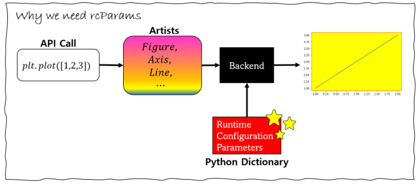

# Matplot 구조 

```
import matplotlib 
import matplotlib.pyplot as plt 
```


plt.plot() 으로 그래프를 그리면 다음 3 단계를 거친다. 

1. pyplot을 이용한 명령
2. 객체들의 생성 (Figure, Line, Axes)
3. 그리기


3번째인 그래프를 그리기 위한 모든 것을 담고 있는 것이 matplotlib이다. 호출을 위한 간단한 API를 제공하는 것이 matplotlib.pyplot이다. 

그래프를 그리는데 필요한 것은 matplotlib에서 다룬다. 


matplotlib은 그래프를 그리기 위해서 Runtime Configuration Parameters, 줄여서 rcParams라는 딕셔너리 값을 이용해서 그린다. 





rmParams 딕셔너리의 값을 바꿔주면, backend 에서 그릴 때, 다른 방식으로 그린다. 그래프의 폰트 사이즈, 크기, 바탕색 등 여러가지 성질들이 모두 matploblit.rcParams 딕셔너리에 담겨있다. 

다음과 같이 값을 변경할 수 있다. 
```
import matplotlib 
import matplotlib.pyplot as plt 
matplotlib.rcParams['axes.edgecolor'] = "red"
matplotlib.rcParams['axes.facecolor'] = "yellow"
plt.plot([1,3,2])
```


## plt.figure() 

 plt.figure()이 맨 처음에 나오는 경우가 많다. figure()은 Figure인스턴스를 생성하는데 Figure인스턴스의 역할은 이미지 전체의 영역을 확보하는 것이다.

 인수로 아래와 같은 항목을 지정할 수 있다.

* figsize : (width, height)의 튜플을 전달한다. 단위는 인치이다.
* dpi : 1인치당의 도트 수
* facecolor : 배경색
* edgecolor : 외곽선의 색


plt.figure()에서는 이미지 영역의 확보뿐이므로, 그래프에는 아무것도 그려지지 않는다


출처: https://engineer-mole.tistory.com/215 [매일 꾸준히, 더 깊이]
## 마이너스 부호 


그래프에서 마이너스 기호가 깨진다. 마이너스 기호도 표시되도록 코드를 다음과 같이 작성한다. 
```python 
import matplotlib
matplotlib.rcParams['axes.unicode_minus'] = False
```


