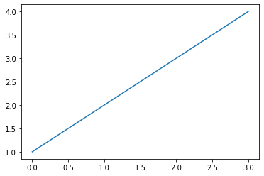
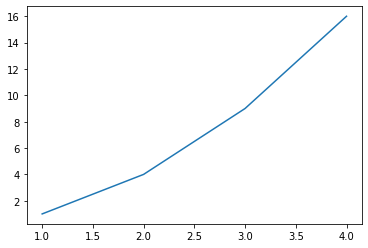
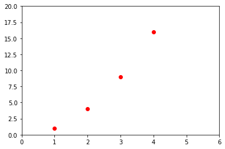
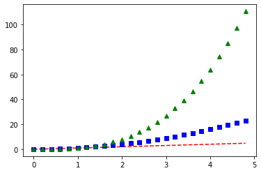

# Metplotlib 기본사용

matplotlib.pyplot 모듈은 MATLAB과 비슷하게 명령어 스타일로 동작하는 함수의 모음입니다.

matplotlib.pyplot 모듈의 각각의 함수를 사용해서 간편하게 그래프를 만들고 변화를 줄 수 있습니다.

예를 들어, 그래프 영역을 만들고, 몇 개의 선을 표현하고, 레이블로 꾸미는 등의 일을 할 수 있습니다


https://wikidocs.net/92071


```
import matplotlib.pyplot as plt
import numpy as np
```




## 기본그래프 그리기
### 예제1


pyplot.plot() 함수에 하나의 숫자 리스트를 입력함으로써 아래와 같은 그래프가 그려집니다.

plot() 함수는 리스트의 값들이 y 값들이라고 가정하고, x 값 [0, 1, 2, 3]을 자동으로 만들어냅니다.

matplotlib.pyplot 모듈의 show() 함수는 그래프를 화면에 나타나도록 합니다.

### 예제2

plot() 함수는 다양한 기능을 포함하고 있어서, 임의의 개수의 인자를 받을 수 있습니다.

예를 들어, 아래와 같이 입력하면,**x-y** 값을 그래프로 나타낼 수 있습니다.

```
plt.plot([1, 2, 3, 4], [1, 4, 9, 16])
plt.show()
```





## 스타일 지정하기
x, y 값 인자에 대해 선의 색상과 형태를 지정하는 포맷 문자열 (Format string)을 세번째 인자에 입력할 수 있습니다.

```
plt.plot([1, 2, 3, 4], [1, 4, 9, 16], 'ro')
plt.axis([0, 6, 0, 20])
plt.show()
```




포맷 문자열 ‘ro’는 빨간색 (‘red’)의 원형 (‘o’) 마커를 의미합니다.

또한, 예를 들어 ‘b-‘는 파란색 (‘blue’)의 실선 (‘-‘)을 의미합니다.

matplotlib.pyplot 모듈의 axis() 함수를 이용해서 축의 범위 [xmin, xmax, ymin, ymax]를 지정했습니다.


```
plt.plot([1,2,3,4], [1,4,9,6], format string)
plt.axis([xmin , xmax, ymin, ymax ])
```


## 여러개의 그래프 그리기


Matplotlib에서는 일반적으로 NumPy 어레이를 이용하게 되는데, 사실 NumPy 어레이를 사용하지 않더라도 모든 시퀀스는 내부적으로 NumPy 어레이로 변환됩니다.  이 예제는 다양한 스타일을 갖는 여러 개의 곡선을 하나의 그래프로 나타냅니다.


```

# 200ms 간격으로 균일하게 샘플된 시간
t = np.arange(0., 5., 0.2)

# 빨간 대쉬, 파란 사각형, 녹색 삼각형
plt.plot(t, t, 'r--', t, t**2, 'bs', t, t**3, 'g^')
plt.show()
```





