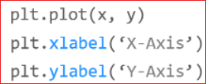
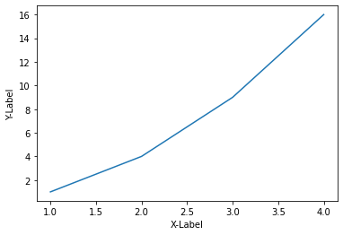
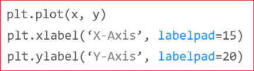
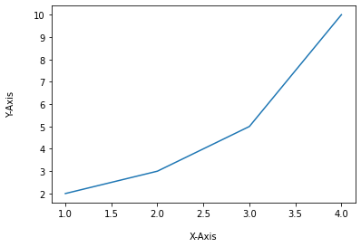
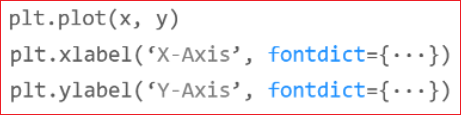
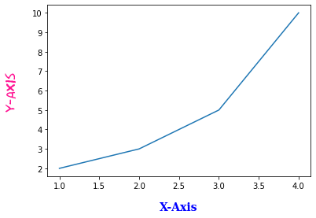
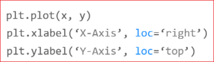
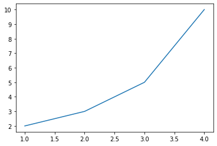

# Matplotlib 축 레이블 설정하기
matplotlib.pyplot 모듈의 xlabel(), ylabel() 함수를 사용하면 그래프의 x, y 축에 대한 레이블을 표시할 수 있습니다.

이 페이지에서는 xlabel(), ylabel() 함수를 사용해서 그래프의 축에 레이블을 표시하는 방법에 대해 소개합니다.
```
import matplotlib.pyplot as plt
import numpy as np
```


## 기본사용




xlabel(), ylabel() 함수에 문자열을 입력하면, 아래 그림과 같이 각각의 축에 레이블이 표시됩니다.


```
plt.plot([1, 2, 3, 4], [1, 4, 9, 16])
plt.xlabel('X-Label')
plt.ylabel('Y-Label')
plt.show()
```





## 여백지정하기





xlabel(), ylabel() 함수의 labelpad 파라미터는 축 레이블의 여백 (Padding)을 지정합니다.

예제에서는 X축 레이블에 대해서 15pt, Y축 레이블에 대해서 20pt 만큼의 여백을 지정했습니다.

결과는 아래와 같습니다.

```
plt.plot([1, 2, 3, 4], [2, 3, 5, 10])
plt.xlabel('X-Axis', labelpad=15)
plt.ylabel('Y-Axis', labelpad=20)
plt.show()
```





## 폰트설정하기





xlabel(), ylabel() 함수의 fontdict 파라미터를 사용하면 축 레이블의 폰트 스타일을 설정할 수 있습니다.

예제에서는 ‘family’, ‘color’, ‘weight’, ‘size’와 같은 속성을 사용해서 축 레이블 텍스트를 설정했습니다.

아래와 같이 작성하면 폰트 스타일을 편리하게 재사용할 수 있습니다.


```
plt.plot([1, 2, 3, 4], [2, 3, 5, 10])
plt.xlabel('X-Axis', labelpad=15, fontdict={'family': 'serif', 'color': 'b', 'weight': 'bold', 'size': 14})
plt.ylabel('Y-Axis', labelpad=20, fontdict={'family': 'fantasy', 'color': 'deeppink', 'weight': 'normal', 'size': 'xx-large'})
plt.show()
```




## 위치 지정하기





colab에서는 버전이 안 맞는지 오류가 발생한다. Matplotlib 3.3 부터 지원한다고 하는데 말이야.

```
plt.plot([1, 2, 3, 4], [2, 3, 5, 10])
# plt.xlabel('X-Axis', loc='right')   # 오류가 나서 
# plt.ylabel('Y-Axis', loc='top')     # 왜 오류가 나는지?
plt.show()
```



