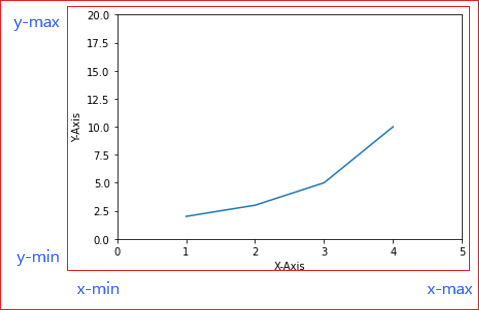
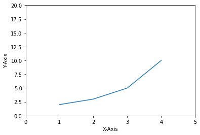
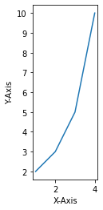

# 축 범위 지정하기 


[Matplotlib Tutorial - 파이썬으로 데이터 시각화하기](https://wikidocs.net/137791)


matplotlib.pyplot 모듈의 xlim(), ylim(), axis() 함수를 사용하면 그래프의 X, Y축이 표시되는 범위를 지정할 수 있다 

* xlim() - X축이 표시되는 범위를 지정하거나 반환
* ylim() - Y축이 표시되는 범위를 지정하거나 반환
* axis() - X, Y축이 표시되는 범위를 지정하거나 반환





## 기본사용 


### xlim(), ylim() 

axis() 함수에 [xmin, xmax, ymin, ymax]의 형태로 X, Y축의 범위를 지정할 수 있다. 
axis() 함수에 입력한 리스트 (또는 튜플)는 반드시 네 개의 값 (xmin, xmax, ymin, ymax)이 있어야 한다. 


```
plt.xlim(xmin, xmax)
plt.xlim((xmin, xmax))
plt.xlim([xmin, xmax])


plt.ylim(ymin, ymax)
plt.ylim((ymin, ymax))
plt.ylim([ymin, ymax])
```

```
import matplotlib.pyplot as plt

plt.plot([1, 2, 3, 4], [2, 3, 5, 10])
plt.xlabel('X-Axis')
plt.ylabel('Y-Axis')
plt.xlim([0, 5])      # X축의 범위: [xmin, xmax]
plt.ylim([0, 20])     # Y축의 범위: [ymin, ymax]

plt.show()
```




### axis()
```
plt.axis((xmin, xmax, ymin, ymax))
plt.axis([xmin, xmax, ymin, ymax])
```


## 옵션 지정하기 


```
xmin , xmax = plt.xlim()
ymin,  ymax = plt.ylim()

xmin, xmax, ymin, ymax = plt.axis() 
```


axis() 함수는 축에 관한 다양한 옵션을 제공한다. 


https://matplotlib.org/3.5.0/api/_as_gen/matplotlib.pyplot.axis.html

```
'on' | 'off' | 'equal' | 'scaled' | 'tight' | 'auto' | 'normal' | 'image' | 'square'
```
```
plt.plot([1, 2, 3, 4], [2, 3, 5, 10])
plt.xlabel('X-Axis')
plt.ylabel('Y-Axis')
# plt.axis('square')
plt.axis('scaled')

plt.show()
```





## 축범위 얻기 

xlim(), ylim() 함수는 그래프 영역에 표시되는 X축, Y축의 범위를 각각 반환한다.  
axis() 함수는 그래프 영역에 표시되는 X, Y축의 범위를 반환한다. 

```
plt.plot([1, 2, 3, 4], [2, 3, 5, 10])
plt.xlabel('X-Axis')
plt.ylabel('Y-Axis')

x_range, y_range = plt.xlim(), plt.ylim()
print(x_range, y_range)

axis_range = plt.axis('scaled')
print(axis_range)

plt.show()
```


```
(0.85, 4.15) (1.6, 10.4)
(0.85, 4.15, 1.6, 10.4)
```