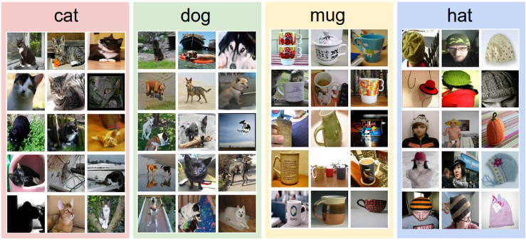

# 기본 용어 및 개념 


## 학습이란?
머신러닝에서 프로그램은 ‘학습(Learning)’을 하게 된다.  이 때, 학습을 하는 방법에 따라 크게 두 가지로 나눌 수 있다. 
* 지도학습
* 비지도 학습 


### 지도학습
* 지도 학습(Supervised Learning)은 
  * 특징(features)이 이미 정해진 데이터를 사용하여 학습하는 방법
  * 이 때 각 데이터에 정해진 특징은 레이블(label)이라고도 표현
  * 레이블이 있는 데이터들의 집합은 트레이닝 세트(Training Set)

다음은 특정 사물에 해당하는 사진을 짝지어둔 데이터이다  사진이라는 데이터에 해당하는 특징(사물)을 짝지어 둔 데이터들의 집합이므로 이는 트레이닝 세트의 한 예로 들 수 있다. 고양이의 그림을 주면서 고양이라고 학습시킨다. 


 


* 지도 학습에서는 이와 같은 트레이닝 세트를 통해 각 레이블에 대한 특징을 학습
* 트레이닝 데이터 세트는 다음과 같이 표를 사용하여 표현할 수도 있다. 
* 이 표에서 X는 자료의 특징을 표현할 때 사용하고, Y는 레이블을 의미

```
X1 X2 X3 Y
3	6	9	3
2	5	7	2
2	3	5	1
```


이렇게 주어진 트레이닝 세트를 학습하게 되면 이 데이터들을 기반으로 한 모델이 생성되고, 이 모델을 사용하면 어떠한 특징을 갖는 데이터가 어떤 레이블에 속할지 추측할 수 있게 된다. 


### 비지도 학습
비지도 학습(Unsupervised Learning)은 지도 학습과 달리 학습에 사용하는 데이터에 특징(레이블)이 부여되어 있지 않다. 

지도 학습이 기존에 있는 데이터를 기반으로 새로운 데이터에 대한 특징을 추론하는 것을 목표로 한다면, 비지도 학습은 주어진 데이터들이 어떻게 구성되어있는지를 분석하는 것을 목표로 한다. 

비지도 학습의 대표적인 예로 다음 사례들을 들 수 있다. 

* 구글 뉴스 서비스: 비슷한 주제의 뉴스끼리 묶어줌
* 단어 클러스터링: 유사한 단어끼리 묶어줌


## 지도 학습의 유형

* 지도 학습는 결과에 따라 분류를 할 수 있다.  
  * 회귀(regression) : 공부한 시간에 따른 시험 점수 예측
    * 다음과 같은 데이터로 학습시킨 다음에 7시간 정도 공부했을 때 몇 점이나 받을까?

  * 이진 분류(binary classification) : 공부한 시간에 따른 시험 점수를 통과와 실패 두 종류로 분류
  * 다중 분류(multi-label classification) : 공부한 시간에 따른 시험 점수를 등급(A, B, C, E, F)으로 분류


### 회귀분석
회귀분석은 어떠한 변수에 영향을 받는 결과가 연속적인 경우에 사용한다. 시험 공부에 투자한 시간(변수)에 따라 예상되는 기말고사 점수(0~100 사이의 연속적인 값)을 추측하는 모델을 대표적인 예로 들 수 있다. 


### 분류
분류는 어떠한 변수에 영향을 받는 결과를 연속적이지 않은 값들로 나눌 때 사용한다. 시험 공부에 투자한 시간(변수)에 따라 예상되는 합격 여부(Pass/Fail) 혹은 학점 (A/B/C/D/E/F)을 추측하는 모델을 대표적인 예로 들 수 있다.

다음은 시험 공부에 투자한 시간과 실제로 획득한 학점(Pass/Fail)를 담고 있는 트레이닝 세트이다.


```
X (TIME SPENT FOR EXAM)	Y (PASS/FAIL)
10	P
9	P
3	F
2	F
```


여기에서는 데이터를 합격(P) 혹은 불합격(F) 두 가지로 나뉘낟. 따라서 이러한 데이터 구분은 Binary Classification이라 부른다. 

합격 여부가 아닌 학점을 추측하는 모델을 만드는 경우, 다음과 같은 트레이닝 세트를 사용하게 될 것입니다.
```
X(TIME SPENT FOR EXAM)	Y(GRADE)
10	A
9	B
3	D
2	F
```

주어진 데이터를 두 개 이상으로 분류하였으므로 이는 Multi-label classification이라 할 수 있다. 


## 참고 
[용어와 개념설명](https://www.androidhuman.com/2018-03-04-ml_for_everyone_basics_01)      
[용어와 개념설명 Youtube](https://youtu.be/qPMeuL2LIqY)     
