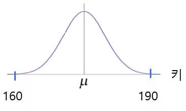
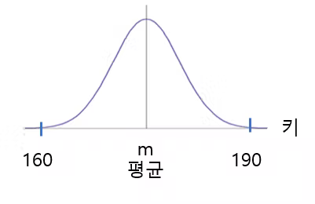
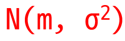
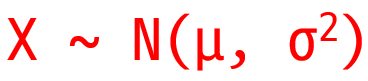
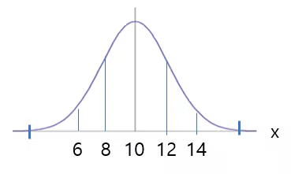
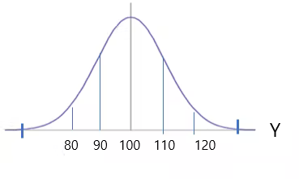
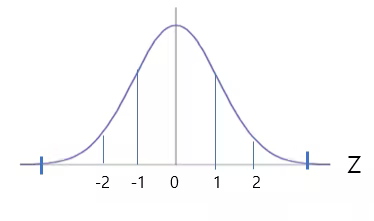
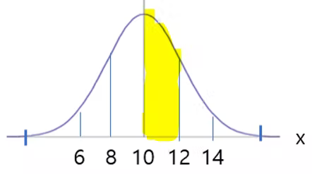
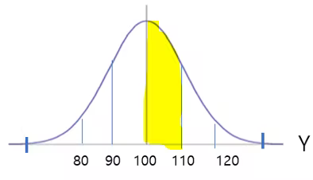
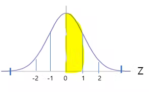

# 정규분포 기초 (1)


정규분포는 2개의 매개 변수 평균 μ 과 표준편차 σ 에 대해 모양이 결정되고, 이때의 분포를 N(μ , σ^2 )로 표기한다. 특히 평균이 0이고 표준편차가 1인인 정규분포 N(0, 1)을 표준정규분포(standard normal distribution)라고 한다. 

```
 N(μ , σ^2 )
```


https://youtu.be/cUDr0BydCGg


연속확률분포란, 예를들어 키가 있다고 하자 160인 사람은 적고 점검 커져서 중간이 가장 많고 190인 사람이 적다. 이를 그래프로 표현하는 것을 연속확률분포라고 한다. 





연속확률분포를 그래프로 표현하는 것을 확률밀도함수라고 한다. 

위와 같은 그래프가 정규분포라고한다. 


그래프의 한 가운데는 반드시 평균이되고 스몰 m으로 표현한다. 





정규분포를 기호로 표현한다고 하면 Normal하다고 해서 다음과 같이 표현한다. 




1차 연속형 확률 변수 X가 우연적 상태에서 무한히 집합할 때, 중심 값 근처에 대다수가 밀집되는 좌우 대칭의 종 모양분포가 형성되는데 이러한 확률 분포를 
N(μ, α^2)로 표현되는 정규분포라고 정의한다. 





평균이 10이고 표준 편차가 2인 정규분포 그래프는 다음과 같다. 

```
X ~ N(10, 2^2)
```
* 평균 10 
* 표준편차 2 





평균이 100이고 표준편차가 10인 정규분포 그래프는 다음과 같다. 
```
X ~ N(100, 10^2)
```




평균이 0이고 표준편차가 1인 정규분포 그래프는 다음과 같다. 


```
X ~ N(0, 1 ^ 2)
```




그런데, 변수 X가 10에서 12일 때의 확률이 얼마냐고 묻는다면? 


```
P(10 <= x <= 12) 
```

변수 x가 10에서 12일때까지의 확률을 구하는게 10에서 12의 넓이를 구하는게 확률을 구하는 것이다. 




재미 있는 것은 평균에서 10에서 12, 그러니까 평균에서 편차 하나를 더한 것의 넓이가 변수는 다르지만 아래 그림의 평균에서 평균 하나까지 더한 것의 넓이와 같다. 




마찬가지로 Z 변수의 평균과 평균에서 편차를 하나 더한 것과 같다. 그러면 그 확률은 어떻게 구하는가? 
바로 아래 Z 변수의 확률로 구한다. 




바로 평균이 0이고 표준편차가 1인 정규분포를 표준정규분포라고 한다.  표준정규분포를 가직고 확률을 구할 것이다. 

평균이 0이고 표준편차가 1인 면적은 곡선이기 때문에 일반적으로 구하기 힘들다. 

그 넓이는 어떤 사람이 0~1, 0~2, 0~3까지의 넓이를 다 구해 놓았다. 
그것이 표준 정규 분포표이다. 


P(0 <= Z <=1) 의 확률은 0.3413 
P(100 <= Y <=110) 의 확률은 0.3413 
P(10 <= X <=12) 의 확률은 0.3413 

모두 같다. 


