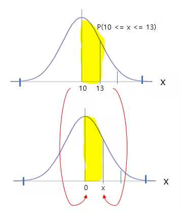
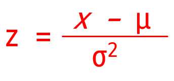
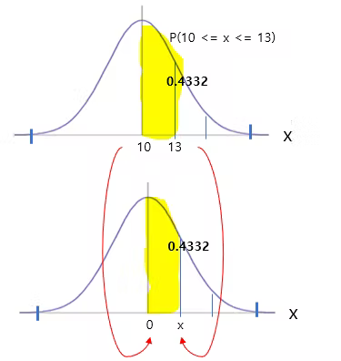

# 정규분포 기초 (2)

N(10, 2 ^ 2) 정규분포가 있다고 하자. 그러면  변수 x가 10에서 13까지의 확률은 어떻게 구하는가? 

```
P(10 <= X <= 13 )
```

10은 표준정규분포의 0이 되고 13은 표준정규분포의 x가 된다. 





우리는 x가 궁금한 것이다. 이렇게 바꾸는 것을 표준화라고 한다. 
공식이 있는데, 





즉, 관찰값의 편차(평균과의 차이, x - μ)를 표준편차(σ)로 나눈 값이다. 


> 평균(μ)이 0이고 표준편차(σ) 1인 표준정규분포(standard normal distribution)가 자주 사용된다.  모든 정규분포는 z-값(z-score) 을 사용하여 표준화할 수 있는데, 표준 정규분포는 그렇게 표준화된 수치들의 확률분포이다.


평균 10을 계산해 보면 

```
      값(10) - 평균(10)
Z =  -------------------    = 0
        표준편차(2)
```


13을 계산하면 
```
    값(13) - 평균(10)
Z = ----------------  =  1.5 
      표준편차(2)
```

그러면 x  = 1.5이다. 

그러면 표준정규분포표에서 1.50을 찾는다.  그래서 넓이가 0.4332라는 것을 알 수 있다.  이것이 확률이다. 





