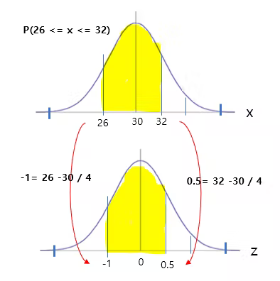
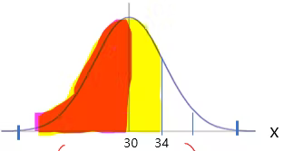
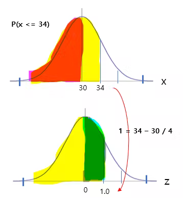
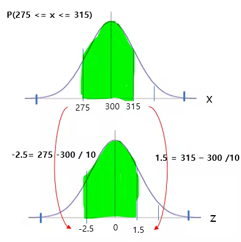

# 정규분포 기초 (3)

## 예제 

확률변수 X가 정규분포 N(30, 4^2)을 따를 때, 다음 확률을 구하라. 

```
P(26 <= X <=32)
```


26과 32를 표준화하여 값을 구한다. 




그러면 다음 식은 같다. 
```
P(26 <= x <= 32) = P( -1.0 <=  z <= 0.5)
```


-1.0일 때의 확률과 0.5일 때의 확률을 더하면 된다. 

```
= P( -1.0 <=  z <= 0) + P( 0 <=  z <= 0.5)
```


정규분포는 평균을 기준으로 좌/우 넓이가 같기 때문에 
-1.0을 다음과 같이 바꾼다. 


```
= P( 0 <=  z <= 1.0) + + P( 0 <=  z <= 0.5)
```

정규분포표에서 값을 찾으면 
```
= 0.3413 + 0.1915
= 0.5328
```


## P(X <=34)
아래 그림에서 평균 아래는 0.5이다. 확률값 전체의 크기는 1이고 정규분포에서 반은 0.5이다. 





그래서 30에서 34까지의 넓이만 구하면 된다. 그 값에 0.5를 더한다. 





```
P( X  <= 34) = 0.5 + 0.3413 = 0.8413
```


## 서술형
어느 공장에서 생산된 통조림의 무게는 평균이 300g, 표준편차는 10g인 정규 분포를 따른다고 한다. 이 공장에서 생산된 통조림을 임의로 선택했을 때, 그 무게가 275g이상 315g 이하일 확률을 구하라. 


변수 x ,평균 300,표준편차 30 

```
x => N(300, 10^2)
```





음수는 양수로 바꾸어서 계산해도 넓이가 같으므로 다음과 같이 계산가능하다. 

```
P(0 <= x <= 2.5) + P(0 <= x <=1.5)
= 0.4938 + 0.4332
= 0.9270
```

