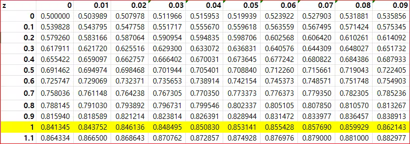
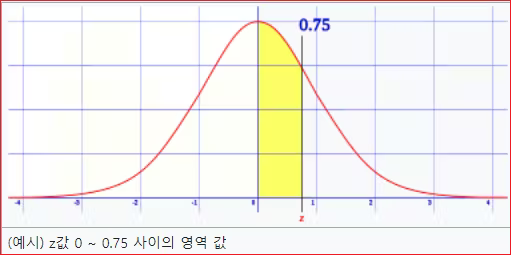
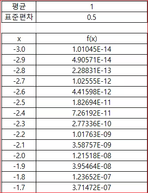
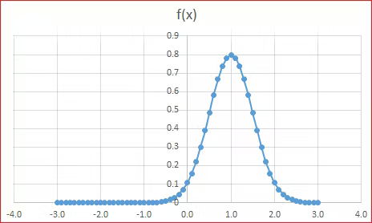
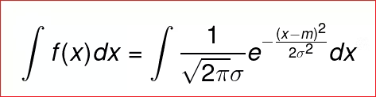
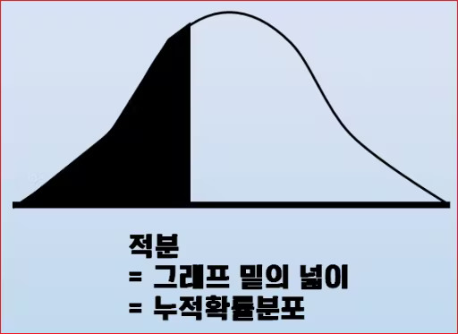
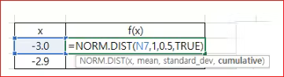
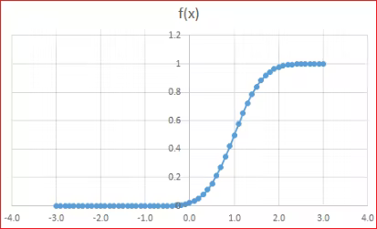

# 정규분포 기초 (4)


## 엑셀 정규분포 함수 


[엑셀 NORM.DIST 함수 사용법 :: 통계함수](https://www.oppadu.com/%EC%97%91%EC%85%80-norm-dist-%ED%95%A8%EC%88%98/?utm_source=coda&utm_medium=iframely)


**NORM.DIST**    
엑셀 NORM.DIST 함수는 정규분포에서 특정 값이 분포 내 몇 %에 위치하는지 위치를 계산(누적분포함수계산=TRUE)하거나, 몇 %의 확률로 발생하는지 발생 확률을 계산(누적분포함수계산=FALSE)하는 통계함수입니다.


**NORM.S.DIST**     
NORM.S.DIST 함수는 표준 정규 분포의 확률밀도함수와 누적분포함수 값을 반환한다.


## 표준 정규분포표


[위키백과 표준 정규분포](https://ko.wikipedia.org/wiki/%ED%91%9C%EC%A4%80%EC%A0%95%EA%B7%9C%EB%B6%84%ED%8F%AC%ED%91%9C?utm_source=coda&utm_medium=iframely) 


### 엑셀로 만들기 
아래는 누적정규분포의 예이다.




NORM.S.DIST 함수를 사용하여 Z 값을 넣어주고 TRUE로 설정한다.

```
=NORM.S.DIST($A2+B$1, TRUE)
```

## 정규분포표 사용 
Z값이 0.75일 때  0~0.75사이의 면적을 구하는 방법이다. 
* 표준정규분포표에서 0.75의 값을 구한다. 값이 0.77337임을 확인할 수 있다. 
* 표준정규분포표에서 Z값이 0일때 값이 0.5임을 확인할 수 있다. 
* 따라서, Z값 0~0.75 사이의 영역값은 0.77337 - 0.5 =0.27227임을 알 수 있다. 





## 확률계산 연습 

### P(0 <= x <= 90)의 확률?

* 점수 90
* 평균 80
* 표준편차 10 
* 정규분포 0.341345

```
=NORM.DIST(B6,C6,D6,TRUE) - 0.5
```

### P(0 <= x <= 165cm)의 확률?

* 점수 165
* 푱균 160
* 표준편차 7
* 정규분포 0.262475


```
=NORM.DIST(B11,C11,D11,TRUE) - 0.5
```


### 90점 이상이 상위 몇 % ?
* 점수 90
* 평균 80
* 표준편차 10
* 정규분포 0.841345
* 상위몇 % 0.16


```
=1-E16
```

### 165cm는 상위 몇 %? 


* 점수 165
* 평균 160
* 표준편차 7
* 정규분포 0.762475
* 상위몇 % 0.24


```
=1-E21
````


## 누적분포함수
NORM.DIS() 함수에서 마지막에 TRU하면 누적분포함수이고, FALSE는 확률질량함수이다. 
확률질량함수
일단 FALSE로한다. 




그래프를 그려보자. 





이제, 평균이 1이고, 표준편차가 0.5인 정규분포 그래프가 완성되었다. 

### 누적분포함수 
누적분포함수의 의미는 위의 정규분포에서 
x = 0 ~ (어떤 확률변수) 까지의 적분값을 의미한다. 
따라서 누적분포함수는 부정적분으로 다음과 같이 나타낸다. 




보통 적분을 하게되면, 어떤 일이 일어날 확률을 의미하는가?
그래서 다음과 같이 나타낼 수 있다. 





셀에서 밑의 cultivate의 값을 True 로 변경하면, 누적확률분포를 구할 수 있다. 





엑셀에서 밑의 cultivate의 값을 True 로 변경하면, 
이를 통해 그래프로 나타내면




기준값이 -3인 경우, [-3,x]의 범위에서
발생할 수 있는 확률을 순서대로 나타내는 것이다. 

만일, [-3,1]의 확률을 구하고 싶다면 f(1)만 구하면 끝이다. 