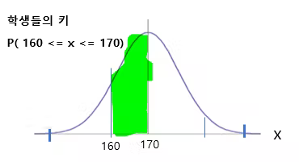
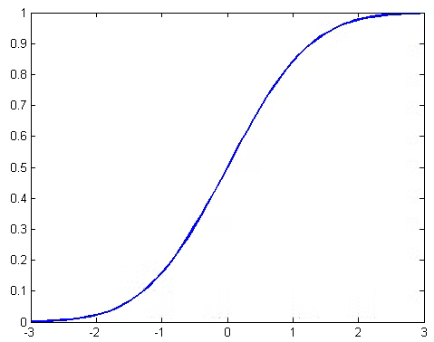

# 확률밀도함수(probability density function )

## 확률분포 

확률 분포는 서로 독립적이면서도 불연속적인 여러 사건들이 일어날 가능성이 각각 얼마나 되는지를 수치화한 개념이라고 할 수 있다. 

* 독립성
  주사위를 던졌을 때 2와 4와 같은 다른 값들이 동시에 나올 수 없음. 독립적이다. 
* 불연속성
  주사위를 던져서 발생하는 사건들은 불연속성을 가지고 있다. 

독립성과 불연속성에 입각해서, 주사위를 한 번 던졌을 때 각 숫자가 나올 확률이 얼마나 되는지를 특정할 수 있게 되는데, 이것이 바로 주사위 눈의 확률 분포가 된다. 

* 일반적으로 확률 분포는 여러가지 가능성 중에 특정한 사건이 일어날 확률을 숫자로 나타낸 것이며, 
* 모든 경우의 수에 대한 확률을 더했을 때 1 (100%)이 되는 것이 특징
* 참고로 숫자로 나타낸 확률에 100을 곱하면 퍼센테이지 (percentage : %)단위로 변환이 된다. 예를 들어서 확률이 0.25라고 표현하는 것과 25%라고 표현하는 것은 동일한 것이다.

## 연속확률분포, 확률밀도 함수

https://youtu.be/Ktyy_n9wlOU

* 이산확률 : 떨어져 있는(셀수 있다.)   
ex) 주사위 1,2,3,4,5,6 
* 연속확률: 셀수없다. 
키 또는 체중     
X =150,151.1,151.2 ....무수히 많다. 그래서 표로 나타내지 않는다. 그래서 함수(그래프로) 나타낸다. 

160에서 170사이의 키를 가진 학생들의 수는 색칠해진 그래프의 넓이를 구하면된다. 

연속확률분포의 확률은 구간의 넓이로 구한다. 
그래서 그 함수를 확률밀도함수라고 한다. 
처음부터 끝까지의 비율은 100% 인 1이다.

## 누적분포함수

https://www.youtube.com/watch?v=RoY8_SooipI

연속확률변수 X의 누적분포함수 정의를 보면 확률밀도함수 f(x)를 적분한다. 이것은 반대로 누적분포함수를 미분하면 확률밀도함수가 된다. 

연속확률변수의 누적분포함수를 그래프로 그려보면 다음과 같다. 

앞에서 우리는 확률변수가 주어졌을때 그 확률변수가 주어진 값에 따른 확률을 어떻게 구할 수 있는지 알아보았습니다. 하지만, 보셨다시피 그 과정이 상당히 불편합니다. 만약 이러한 것을 매번 반복해야한다면 확률변수를 사용하는 의미가 없겠죠? 통계학에서는 확률변수를 정의한 다음, 그 확률변수로 표현할 수 있는 사건들의 확률을 구하기 쉽도록, 누적분포함수라는 확률 함수를 미리 정의하여 놓습니다. 일종의 각 확률변수들의 명함 역할을 하는 셈이죠. 

https://www.theissaclee.com/ko/courses/rstat201/week4/

### 엑셀에서
https://blog.naver.com/PostView.naver?blogId=falcon2026&logNo=221379299344
https://www.oppadu.com/%EC%97%91%EC%85%80-norm-dist-%ED%95%A8%EC%88%98/

