# NumPy

numpy는 과학 계산을 위한 라이브러리로서 다차원 배열을 처리하는데 필요한 여러 유용한 기능을 제공하고 있다. 넘파이(numpy)의 주요 특징 중의 하나가 n차원 배열(ndarray) 객체이다. 이 객체는 빠르고 유연한 자료형이다. 수학식에서 행렬 연산과 비슷한 연산을 할 수 있다. 즉, 성분별 계산을 할 수 있다.

NumPy는 같은 유형의 "항목" 모음을 설명 하는 N차원 배열 유형인 ndarray 를 제공한다.즉, 파이썬의 리스트 처럼 다른 타입을 포함할 수 없다.

[Numpy 공식 홈페이지](https://numpy.org/doc/stable/reference/index.html#reference)


배열은 1차원, 2차원, 3차원 배열 이렇게 있는데, 배열에는 축이라는 개념이 있다. 

**Numpy의 차원**     
* 1차원 축(행) : axis 0. vector라고 한다. 
* 2차원 축(열) : axis 1. matrix라고 한다. 
* 3차원 축(채널) : axis 2. tensor(3차원 이상)라고 한다. 


**numpy 배열**    

numpy에서 배열은 동일한 타입의 값들을 가지며, **배열의 차원을 rank** 라 하고, 각 **차원의 크기를 튜플**로 표시하는 것을 shape 라 한다.

* rank 차원의 크기
* shape 각 차원의 크긱를 튜플로 표시


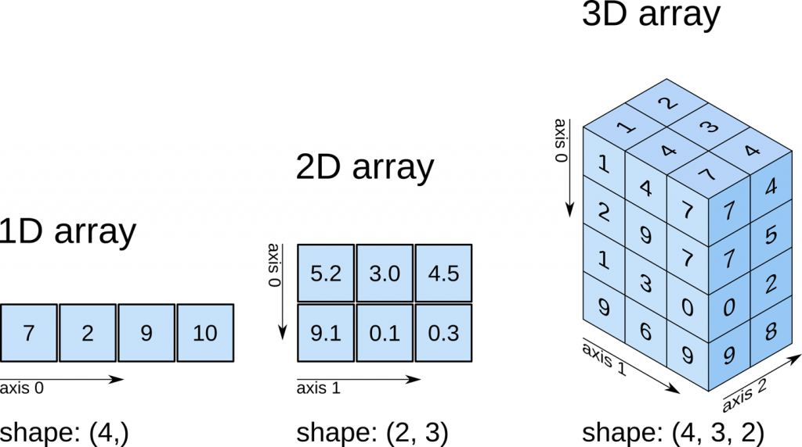
출처: https://predictivehacks.com/tips-about-numpy-arrays/


numpy는 pip을 사용하여 아래와 같이 간단히 설치할 수 있다.

```
 pip install numpy    
```


## Vectors, the 1D Arrays

### Vector initialization 

NumPy 배열을 만드는 한 가지 방법은 Python 목록을 변환하는 것이다. 유형은 목록 요소 유형에서 자동 추론된다. 


```python 
a = np.array( [ 1.,2.,3. ])
```

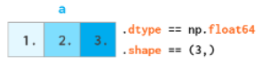


NumPy 배열은 Python 목록과 같은 방식으로 증가할 수 없다. 빠른 추가를 용이하게 하기 위해 어레이 끝에 공간이 예약되어 있지 않다.


#### zeros()

* zeros()
* zeros_like()
* ones()
* ones_like()
* full()
* full_like()


zeros()는 해당 배열에 모두 0을 집어 넣는다. 
```python 
b = np.zeros(3, int) 
```

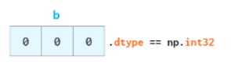

모양 및 요소 유형별로 기존 배열과 일치하는 빈 배열을 만들어야 하는 경우가 많다.

```python
c = np.zeros_like(a)
```


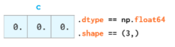


사실, 상수 값으로 채워진 배열을 생성하는 모든 함수에는 _like 대응하는 함수가 있다.


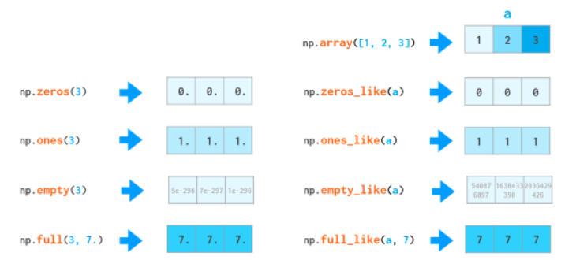


#### monotonic sequence로 초기화 
NumPy에서는 monotonic sequence로 array를 초기화 하는 두 가지 function이 있다. 

* arange()
* linspace() 

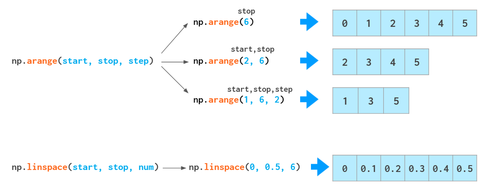


**Syntax**     
```
arange(start, stop, step, dtype=None)
```

* start 배열의 시작값
* stop 배열의 끝값
* step 간격
* dtype 배열의 타입을 지정

step이 생략되면 default는 1이다.


그러나 arange는 float를 처리하는데 좋지는 않다. 


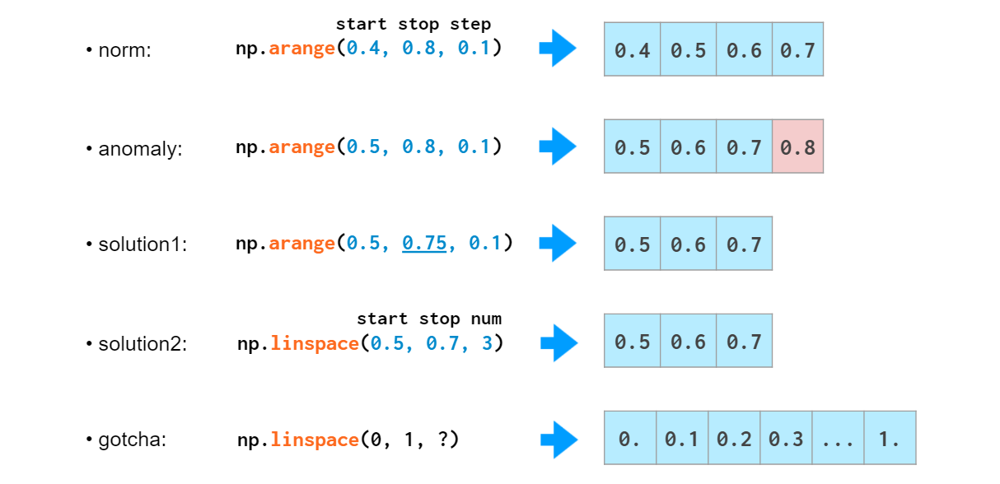


#### 랜덤하게 생성

* randint()
* rand()
* uniform() 

종종 테스트를 위해 random하게 array를 생성할 필요가 있다. 


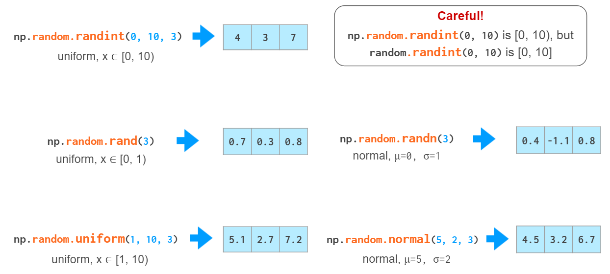


## Vector indexing
일단 배열을 가지면, NumPy는 그것을 되롤려 주는 쉬운 방법들을 제공한다. 


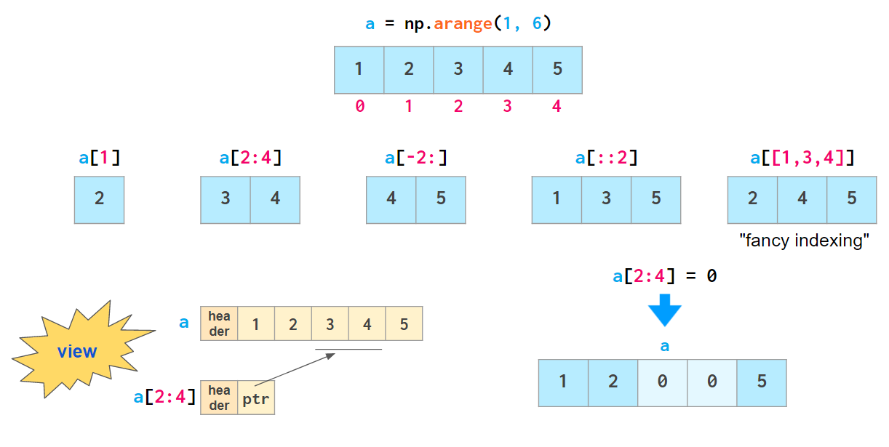


fancy-indexing을 제외하고 views라고 부른다. 

배열의 복사는 NumPy에서는 copy() 함수를 사용한다. 


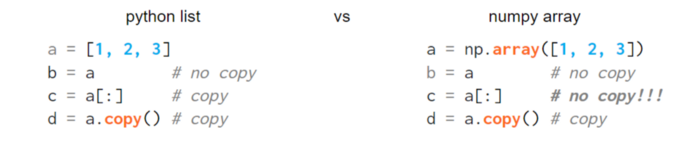

또한 이러한 할당은 배열의 크기를 변경해서는 안 되므로 다음과 같은 트릭이 있다.


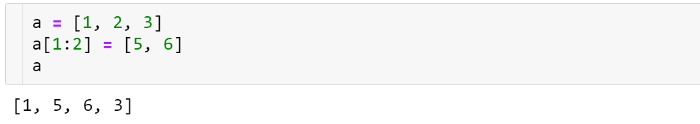


NumPy 배열에서 데이터를 가져오는 또 다른 매우 유용한 방법은 모든 종류의 논리 연산자를 사용할 수 있는 부울 인덱싱이다. 


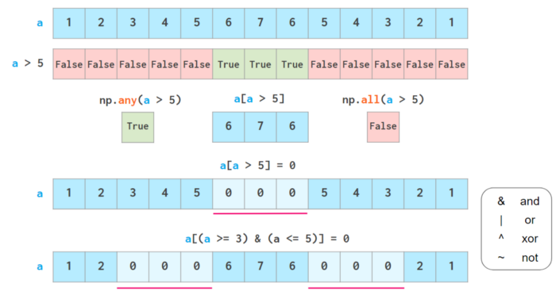


위에서 볼 수 있듯이 부울 인덱싱도 쓰기 가능하다.  전용 기능으로 분리된 두 가지 일반적인 사용 사례: 과도하게 오버로드된 np.where와 np.clip 


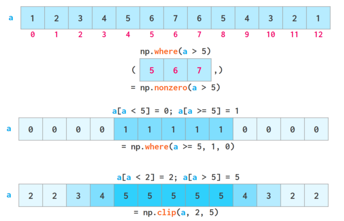


### Vector operations

산술은 NumPy 속도가 가장 빛나는 곳 중 하나이다. 벡터 연산자는 C++ 수준으로 이동하여 느린 Python 루프 비용을 피할 수 있다. NumPy를 사용하면 일반 숫자처럼 전체 배열을 조작할 수 있다.

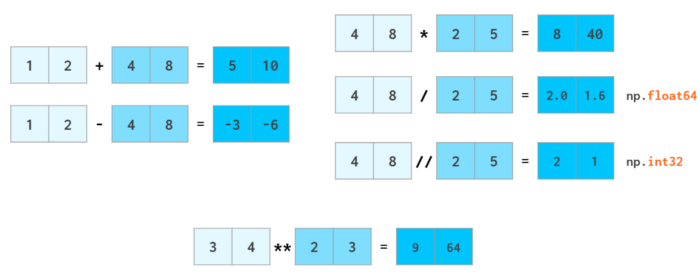


더하거나 뺄 때 int가 float로 승격되는 것과 같은 방식으로 스칼라는 배열로 승격(일명 브로드캐스트)된다.


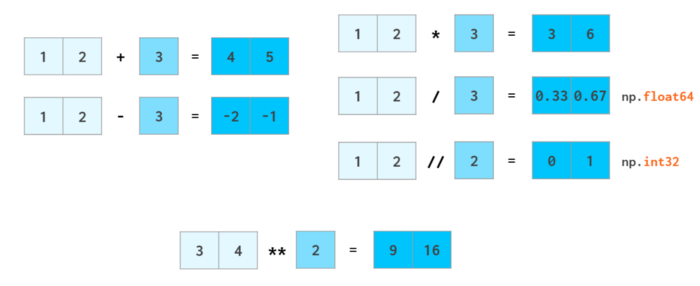

#### 수학 연산 

대부분의 수학 함수에는 벡터를 처리할 수 있는 NumPy 대응 기능이 있다. 


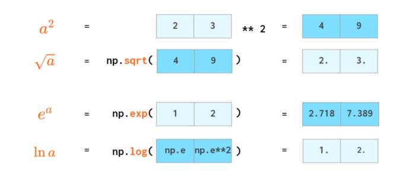

```python
# 제곱 계산
a = np.array([2,3])
r = a ** 2
print(r)
```
```
[4 9]
```
```python 
# 루트계산 
r =  np.sqrt(np.array([4,9]))
print(r)
```
```
[2. 3.]
```

#### 스칼라 곱 
스칼라 곱에는 자체 연산자가 있다. 
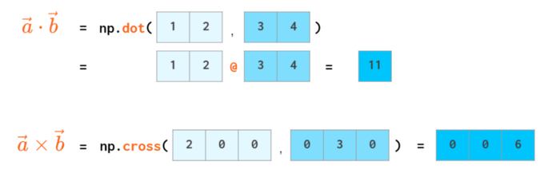


#### 올림, 내림 
배열은 전체적으로 반올림될 수 있다. 
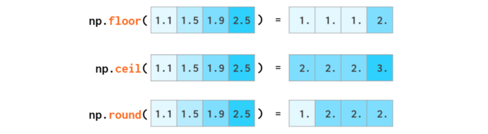


```python
r =  np.floor( np.array([1.1, 1.5, 1.9, 2.5]))
print(r)
```
```
[1. 1. 1. 2.]
```


* round(수, 자리수)  반올림 
* ceil(수) 올림. 정수중 가장 가까운 값을 반환 
* floor(수) 내림. 입력값보다 같거나 작은 정수중 가장 가까운 값을 반환 


#### 통계 
NumPy는 기본 통계도 수행할 수 있다. 
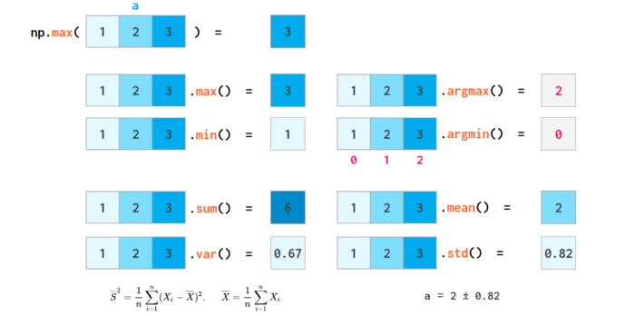


```python
a = np.array( [1,2,3])
r = np.max(a)
print(r)
```
```
3
```


* std(arr, axis=None, dtype=float64)  표준편차 
  * 입력배열 
  * asix 축 
  * dtype  데이터 유형 
* var(arr, axis=Nopne, dtype=None, out=None, ddof=0, keepdims=<no value>) 분산 
  * arr 배열
  * axis 축 
  * dtype 데이터 타입 
  * out 이 함수 출력 결과로, 기존 배열에 덮어쓰고 싶을 경우에 지정한다.
  * ddof 델타의 자유도
  * keepdims bool 이 옵션을 True를 하면, 분산 배열 차원수가 arr와 동일하게 된다. 


* mean(arr, axis=None, dtype=float64) 
  * arr 배열
  * axis 축 
  * dtype 데이터 타입 

* argmax(arr,axis=None, out=None)   
  * arr 배열
  * axis 축 
  * np.argmax 메소드의 결과에 대한 자리 표시자. 결과를 보관하려면 적절한 크기이어야 한다. 

위의 공식에서 알 수 있듯이 std와 var 모두 Bessel의 수정을 무시한다. 모집단 평균을 알 수 없는 경우 표본에서 표준을 추정하는 가장 일반적인 사용 사례에서 편향된 결과를 제공한다. 

덜 편향된 추정을 얻기 위한 표준 접근 방식은 분모(denominator)에 n-1을 갖는 것이다.  이것은 ddof=1 로 할 수 있다. (delta degrees of freedom).


> 통계학에서 베셀 보정(Bessel’s Correction)은 표본분산이나 표본표준편차에 대한 식에서 표본크기 n을 대신하여 n-1을 사용하는 것을 말한다. 이러한 방법은 모분산을 추정하는데에 있어서 편향(bias)를 보정하는 역할을 하며, 이를 통해 표본분산을 불편 추정량(Unbiased estimator)이라 할 수 있다. 그러나 이러한 보정은 평균제곱오차를 증가시키는 문제점이 있다. 이러한 보정밥법은 Friedrich Bessel에 의해 처음 사용되었다.

> 모평균이 불분명한 상황에서 모분산을 추정할 때, 보정되지 않은 표본 분산은 표본평균에서 표본값의 편차의 제곱평균이다. 이 경우 분산은 표본 분산의 모분산의 편향 추정량(Biased estimator)이다. 이 값에 다음 인자를 곱함으로써 모분산의 불편 추정량(Unbiased estimator)을 얻을 수 있다. [출처: 위키백과]


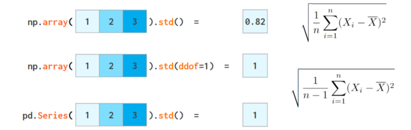


Bessel 보정의 효과는 표본 크기가 증가함에 따라 빠르게 감소한다. 또한 만병통치약이 아니다. 예를 들어 정규 분포의 경우 ddof=1.5가 더 좋다. 


#### 소팅 

소팅 기능은 Python 대응 기능보다 덜 유용하다. 

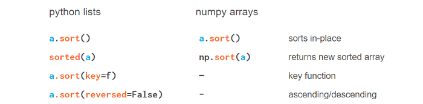


### 찾기 

Python 목록과 달리 NumPy 배열에는 인덱스 메서드가 없다. 

요소를 찾는 방법의 하나는 np.where(a==x)[0][0]을 사용하는 것이다. 그것은 찾을 항목이 맨 처음에 있더라도 배열의 모든 요소를 ​​살펴봐야 하므로 우아하지도 빠르지도 않다. 

numpy 모듈의where()함수는 일부 조건을 충족하는 요소의 인덱스를 포함하는 배열을 반환하는 데 사용된다. 조건은 함수 내에서 지정된다. 

아래와 같이 배열에서 특정 값의 첫 번째 인덱스를 찾는 데 사용할 수 있다. 


```python
a = np.array([7,8,9,5,2,1,5,6,1])

print(np.where(a==1)[0][0])
```
```
5
```

원문서에서는 Numba를 사용하는 방법과 베열이 정렬하여 처리하는 방버들을 설명하고 있는데 찾는 방법이 적절하지 않는 것 같다. 

#### nonzeros()를 사용하여 찾기 
nonzero()함수는 numpy 배열에서 0이 아닌 모든 요소의 인덱스를 리턴합니다. 다차원 배열에 대해 여러 배열의 튜플을 반환한다. where()함수와 유사하게 조건을 지정하여 특정 요소의 위치도 반환 할 수 있다. 

```python 
a = np.array([7,8,9,5,2,1,5,6,1])

print(np.nonzero(a==1)[0][0])
```
```
5
```

#### argmax()를 사용하여 찾기 
argmax()는 배열에서 최대 요소의 인덱스를 찾는다. 함수에서 같음 조건을 지정하고 필요한 요소의 인덱스도 찾을 수 있다. 

```python 
a = np.array([7,8,9,5,2,1,5,6,1])
print(np.argmax(a==1))
```

```
5
```

#### index() 함수를 사용하여 

이 방법에서는 먼저tolist()함수를 사용하여 배열을 목록으로 변환한다. 그런 다음index()함수를 사용하여 지정된 요소의 위치를 ​​반환한다. 

```python 
a = np.array([7,8,9,5,2,1,5,6,1])

print(a.tolist().index(1))
```
```
5
```


### floats 비교 
이 부분은 원문을 참고한다. 


## Matrices, the 2D Arrays


