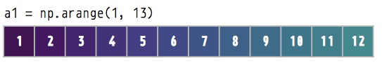
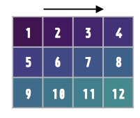

# arange
numpy 모듈의 arange 함수는 반열린구간 [start, stop) 에서 step 의 크기만큼 일정하게 떨어져 있는 숫자들을 array 형태로 반환해 주는 함수다.

## Syntax
```
arange(start, stop, step, dtype=None)
```

* start 배열의 시작값
* stop 배열의 끝값
* step 간격
* dtype 배열의 타입을 지정

step이 생략되면 default는 1이다.

```python 
import numpy as np 
```


## 기본 사용법
0부터 2까지 세 개의 수열을 만든다.


```
x = np.arange(3)
x
```
```
array([0, 1, 2])
```
소수로 0에서 3까지 수열을 만든다. 4는 포함되지 않는다.
```
x = np.arange(0, 4.0)
print(x)
```
```
[0. 1. 2. 3.]
```


```python
import numpy as np
a1 = np.arange(1, 13)  # numbers 1 to 12
print(a1.shape)
# (12,)
print(a1)
# [ 1  2  3  4  5  6  7  8  9 10 11 12]
```




# reshape
```python 
a1_2d = a1.reshape(3, 4)  # 3_4
print(a1_2d.shape)
# (3, 4)
print(a1_2d)
# [[ 1  2  3  4]
#   [ 5  6  7  8]
#   [ 9 10 11 12]]
```   




