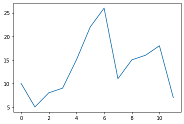

# 평균

```
import numpy as np
import matplotlib.pyplot as plt
```

각 과목별 점수
```
points = [ 90,75,40,40,90,65,70]
npoints = np.array(points)
npoints
```

```
array([90, 75, 40, 40, 90, 65, 70])
```


average()로 평균을 구한다.


```
np.average(npoints)
```
```
67.14285714285714
```


amax()로 최대값을 구한다.

```
x = np.amax(npoints)
x
```
```
90
```


numpy의 bincount와 argmax로 쉽게 최빈값을 찾을 수 있다. bincount는  0부터 최대 n-1까지 숫자가 몇 개 있는지 array로 돌려준다.

```
x = np.bincount(npoints)
x
```
```
array([0, 0, 0, 0, 0, 0, 0, 0, 0, 0, 0, 0, 0, 0, 0, 0, 0, 0, 0, 0, 0, 0,
       0, 0, 0, 0, 0, 0, 0, 0, 0, 0, 0, 0, 0, 0, 0, 0, 0, 0, 2, 0, 0, 0,
       0, 0, 0, 0, 0, 0, 0, 0, 0, 0, 0, 0, 0, 0, 0, 0, 0, 0, 0, 0, 0, 1,
       0, 0, 0, 0, 1, 0, 0, 0, 0, 1, 0, 0, 0, 0, 0, 0, 0, 0, 0, 0, 0, 0,
       0, 0, 2])
```

```
y = np.argmax(x)
y
```
```
40
```


amin()으로 최소값을 구한다.
```
x = np.amin(npoints)
x
```
```
40
```


중간값(median)을 구한다.
```
x = np.median(npoints)
x
```
```
70.0
```


# 이동평균

## 누적합계 cumsum 함수 
cumsum은 배열에서 주어진 축에 따라 누적되는 원소들의 누적 합을 계산하는 함수.

```
a = np.array([[1, 2, 3], [4, 5, 6]])
a
```
```
array([[1, 2, 3],
       [4, 5, 6]])
```       

```
print(np.cumsum(a))
```
```
[ 1  3  6 10 15 21]
```


각 원소들의 누적 합을 표시함. 각 row와 column의 구분은 없어지고, 순서대로 sum을 함.

```
print(np.cumsum(a, dtype = float))
```

```
[ 1.  3.  6. 10. 15. 21.]
```

결과 값의 변수 type을 설정하면서 누적 sum을 함.

```
print(np.cumsum(a, axis = 0))
```
```
[[1 2 3]
 [5 7 9]]
```

axis = 0은 같은 column 끼리의 누적 합을 함.


```
print(np.cumsum(a, axis = 1))
```
```
[[ 1  3  6]
 [ 4  9 15]]
```

axis = 1은 같은 row끼리의 누적 합을 함.


## 이동 평균

먼저 이동평균을 구하기 전에 numpy를 이용하여 평균을 구할 때 나누기 하기전에 주어진 기간동안의 이동 합계를 구해보자

```
 a = np.array([10,5,8,9,15,22,26,11,15,16,18,7])
 ret = np.cumsum(a, dtype=float)  #  배열의 누적 합계를 구한다.
 ret
```
```
array([ 10.,  15.,  23.,  32.,  47.,  69.,  95., 106., 121., 137., 155.,
       162.])
```

```
n = 4  # 4일 누적(인덱스는 0부터 시작하니까)
```

```

x = ret[n:] # 4부터 반환(5번째 요소임. 인덱스는 0부터시작), 4포함이니까 8개 반환
x
```
```
array([ 47.,  69.,  95., 106., 121., 137., 155., 162.])
```
```
y = ret[:-n]  # 뒤에 4개 제외 , 8개 반환 
y
# x y는 배열 크기가 같다. 
```
```
array([ 10.,  15.,  23.,  32.,  47.,  69.,  95., 106.])
```

```
z = ret[n:] - ret[:-n] # 각 배열의 원소들끼리 뺀다. 
z
```
```
array([37., 54., 72., 74., 74., 68., 60., 56.])
```
```
ret[n:] =  ret[n:] - ret[:-n] # n번째부터 계산된 값을 설정
ret
```
```
array([10., 15., 23., 32., 37., 54., 72., 74., 74., 68., 60., 56.])
```

```
ret[n-1:] #  n-1번재로 해야 누적 합계가 된다.
```
```
array([32., 37., 54., 72., 74., 74., 68., 60., 56.])
```


```
def moving_average(a, n) :
    ret = np.cumsum(a, dtype=float)
    ret[n:] = ret[n:] - ret[:-n]
    return ret[n - 1:]
    #return ret[n - 1:] / n
```

```
data = np.array([10,5,8,9,15,22,26,11,15,16,18,7])

print(print(moving_average(data,4)))
```
```
32. 37. 54. 72. 74. 74. 68. 60. 56.]
None
```

위 함수에서 나누기 수식을 추가하면 이동평균이 구해진다.
```
def moving_average2(a, n) :
    ret = np.cumsum(a, dtype=float)
    ret[n:] = ret[n:] - ret[:-n]
    return ret[n - 1:] / n
```
```
data = np.array([10,5,8,9,15,22,26,11,15,16,18,7])

print(print(moving_average2(data,4)))
```

```
[ 8.    9.25 13.5  18.   18.5  18.5  17.   15.   14.  ]
None
```

```
plt.plot(data)
plt.show()
```




