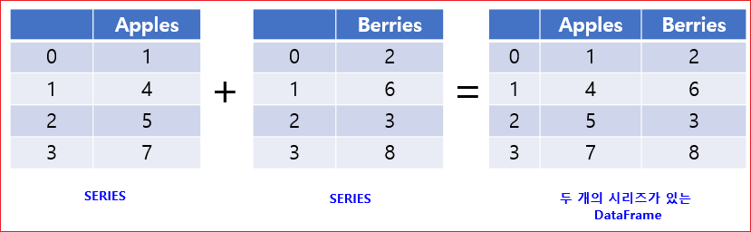
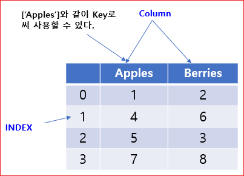

# Pandas

Pandas는 데이터 조작과 분석을 위한 파이썬 라이브러리이며, 대규모의 데이터를 처리하는데 편리하게 활용할 수 있다. 


## Pandas 객체 생성하기


### Series와 DataFrame

* Series: 레이블을 갖는 1차원 어레이
* DataFrame: 레이블을 갖는 행과 열을 갖는 2차원 어레이


Series는 다양한 자료형을 담을 수 있는 1차원의 어레이이며, 엑셀 문서의 하나의 열 (column)과 같다. 

Series는 Index라고 하는 레이블을 가진다. 




DataFrame은 행과 열을 갖는 2차원의 자료형이다.  여러 개의 Series가 모이면 DataFrame을 구성할 수 있다.


## series 만들기
그림과 같이 DataFrame은 Index와 Key, 그리고 Value들로 구성된다. 




### 정수형

```
import numpy as np
import pandas as pd
```

```
s = pd.Series([1, 3, 5, 4, 6, 8])
print(s)
```

```
0    1
1    3
2    5
3    4
4    6
5    8
dtype: int64
```


시리즈인 경우 리스트의 인덱스 처럼 값을 꺼낼 수 있다.

```
s[2]
```
```
5
```

정수 자료형의 Series를 하나 만들었습니다. Series()에 값들의 리스트를 입력해서 Series를 만들면, Pandas가 정수 인덱스를 자동으로 만들어준다.


### 실수형
```
s = pd.Series([1, 3.5, 5, 4, 6.2, 8])
print(s)
```
```
0    1.0
1    3.5
2    5.0
3    4.0
4    6.2
5    8.0
dtype: float64
```


정수와 실수가 함께 있는 리스트를 입력하면 두 자료형을 모두 표현할 수 있는 실수 자료형의 Series가 하나 만들어진다.


### dictionary

```
d = {"a": 0.0, "b": 1.0, "c": 2.0}
pd.Series(d)
```
```
a    0.0
b    1.0
c    2.0
dtype: float64
```
key가 있는 시리즈는 키를 인덱스로 사용하여 값을 꺼낼 수 있다.

```
d['b']
```
```
1.0
```
```
pd.Series(d, index=["b", "c", "d", "a"])
```
```
b    1.0
c    2.0
d    NaN
a    0.0
dtype: float64
```
### 인덱스 지정하기
```
s = pd.Series([1, 3.5, 5, 4, 6.2, 8], index=['a', 'b', 'c', 'd', 'e', 'f'])
print(s)
```
Series()의 index 키워드를 사용해서 인덱스를 자유롭게 설정할 수 있다.

