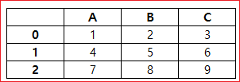

# DataFrame 만들기
pandas dataframe의 3요소는 컬럼, 데이터(로우), 인덱스가 있다.


## 사전 또는 시리즈로 만들기

```
import numpy as np
import pandas as pd
```
아래는 시리즈로 사전을 만들었다. 만든 사전을 DataFrame을 생성하는데 사용했다.
```
d = {
    "one": pd.Series([1.0, 2.0, 3.0], index=["a", "b", "c"]),
    "two": pd.Series([1.0, 2.0, 3.0, 4.0], index=["a", "b", "c", "d"]),
}

df = pd.DataFrame(d)
df
```
```
	one	two
a	1.0	1.0
b	2.0	2.0
c	3.0	3.0
d	NaN	4.0
```

one 시리즈와 two 시리즈의 크기가 다르다. one에는 index d가 없기 때문에 아래는 값이 NaN으로 표시된다.


```
pd.DataFrame(d, index=["d", "b", "a"])
```
```
  one	two
d	NaN	4.0
b	2.0	2.0
a	1.0	1.0
```
아래는 three라는 키가 없기 때문에 모두 NaN으로 표시된다. 


```
pd.DataFrame(d, index=["d", "b", "a"], columns=["two", "three"])
```
```

  two	three
d	4.0	NaN
b	2.0	NaN
a	1.0	NaN
```


행 및 열 레이블은 인덱스 및 열 속성에 액세스하여 각각 액세스할 수 있다.

> **특정 열 집합이 데이터 사전과 함께 전달되면 전달된 열이 사전의 키를 재정의합니다.**


```
df.index
```
```
Index(['a', 'b', 'c', 'd'], dtype='object')
```

```
df.columns
```
```
Index(['one', 'two'], dtype='object')
```

위에서 사전의 key가 컬럼명으로 사용된  것을 알 수 있다.


##  NumPy 어레이로 만들기

```
dates = pd.date_range('20130101', periods=6)
print(dates)
```
```
DatetimeIndex(['2013-01-01', '2013-01-02', '2013-01-03', '2013-01-04',
               '2013-01-05', '2013-01-06'],
              dtype='datetime64[ns]', freq='D')
```

```
df = pd.DataFrame(np.random.randn(6, 4), index=dates, columns=list('ABCD'))

print(df)
```

```
                   A         B         C         D
2013-01-01 -0.807166 -0.868852 -1.568632  0.122629
2013-01-02 -0.291784 -0.864063 -1.211730  0.635537
2013-01-03  0.488824 -0.667747 -0.318332  0.649179
2013-01-04 -0.323940 -2.192904  0.482824  0.083699
2013-01-05 -1.566934 -0.340595  0.868126 -0.250677
2013-01-06  0.525450 -0.419884  0.849277  1.203607
```

날짜 인덱스와 레이블이 지정된 열이 있는 NumPy 어레이를 전달함으로써 DataFrame을 만들 수 있다.

date_range() 함수를 사용해서 ‘20130101’를 시작으로 하는 6개의 DatetimeIndex를 만들었다.

각 날짜마다 A, B, C, D열에 해당하는 난수 데이터의 DataFrame이 만들어진다.


## data 보기
프레임의 상단 및 하단 행을 보는 방법은 다음과 같다. 


```
df.head()
```
```
  one	two
a	1.0	1.0
b	2.0	2.0
c	3.0	3.0
d	NaN	4.0
```

```
df.tail(3)
```

```
  one	two
b	2.0	2.0
c	3.0	3.0
d	NaN	4.0
```

인덱스를 확인한다.

```
df.index
```

```
Index(['a', 'b', 'c', 'd'], dtype='object')
```


컬럼을 확인한다.

```
df.columns
```

```
Index(['one', 'two'], dtype='object')
```

shape를 통해 dataframe의 row와 column의 수를 알 수 있다. 
```
df.shape
```
```
(6, 4)
```
df가 6 X 4의 배열임을 알 수 있다. 

len()을 통해 dataframe의 길이(row의 갯수)를 알 수 있다.

```
print(len(df.index))
```

```
6
```


## 로우/컬럼 선택하기
파이썬 딕셔너리로 dataframe을 만들자.
```
df = pd.DataFrame({"A":[1,4,7], "B":[2,5,8], "C":[3,6,9]})
```





### 행선택
iloc()로 행을 선택한다.

```
display(df.iloc[0])
```
```
A    1
B    2
C    3
Name: 0, dtype: int64
```
```
display(df.loc[0])
```
```
A    1
B    2
C    3
Name: 0, dtype: int64
```


### 컬럼 선택
컬럼을 선택한다.


```
display(df.loc[:,'A'])
```

```
0    1
1    4
2    7
Name: A, dtype: int64
```


```
display(df.loc[0:1,'A'])
```
```
0    1
1    4
Name: A, dtype: int64
```
```
display(df['A'])
```

```
0    1
1    4
2    7
Name: A, dtype: int64
```

### 특정 row, column 선택하기
```
display(df.loc[0]['A'])
```
```
1
```

## 로우, 인덱스 추가
pandas는 기본적으로 row에 인덱스를 0부터 차례대로 자연수를 부여한다.


```
# Print out your DataFrame `df` to check it out
df = pd.DataFrame({"A":[1,4,7], "B":[2,5,8], "C":[3,6,9]})
display(df)
```


```
	A	B	C
0	1	2	3
1	4	5	6
2	7	8	9
```

### 인덱스 추가
이를 변경하는 방법은 set_index 함수를 이용하는 것이다. 아래의 df.set_index('A')는 A 컬럼을 인덱스로 지정하는 것을 뜻한다. 그러면 3개의 row에 대하여 인덱스가 1,4,7이 부여된다.

```
# Set 'C' as the index of your DataFrame
df = df.set_index('A')
display(df)
```

```

  B	C
A		
1	2	3
4	5	6
7	8	9
```


### 로우 추가하기

```
df = pd.DataFrame(data=np.array([[1, 2, 3], [4, 5, 6], [7, 8, 9]]), index= [2.5, 12.6, 4.8], columns=[48, 49, 50])
display(df)
```
```
      48 49 50
2.5	  1	2	3
12.6	4	5	6
4.8	  7	8	9
```


loc을 사용하면 새로운 index=2인 row를 만들고, 그 곳에 row를 추가하게 된다.


```
df.loc[2] = [60, 50, 40]
display(df)
```
```
	    48	49	50
2.5	  1	2	3
12.6 	4	5	6
4.8	  7	8	9
2.0	  60	50	40
```

인덱스 2.5를 [10,10,10] 리스트로 바꾼다.

```
df.loc[2.5] = [ 10,10, 10]
display(df)
```

```
	    48	49	50
2.5	  10	10	10
12.6	4	5	6
4.8	  7	8	9
2.0	  60	50	40
```

### append를 이용한 로우 추가
때론 인덱스를 신경쓰지 않고 그냥 데이터의 가장 뒤에 row를 추가하고 싶을 수도 있다. 이 경우에는 append를 사용하면 좋다. 아래는 df 데이터프레임에 a를 추가하여 row를 추가하는 코드를 보여준다. 

```
df = pd.DataFrame(data=np.array([[1, 2, 3], [4, 5, 6], [7, 8, 9]]), columns=[48, 49, 50])
display(df)
```
```
	48	49	50
0	 1	2	3
1	 4	5	6
2	 7	8	9
```

```
a = pd.DataFrame(data=[[1,2,3]], columns=[48,49,50])
display(a)
```

```
	48	49	50
0	1	2	3
```


```
df = df.append(a)
display(df)
```
```
   48	49	50
0	 1	2	3
1	 4	5	6
2	 7	8	9
0	 1	2	3
```
ow를 추가한 후에 reset index를 통해 index를 0부터 새롭게 지정한다. 이는 실제 작업할 때 많이 쓰는 테크닉이다.


```
df = df.reset_index(drop=True)
display(df)
```
```
	48	49	50
0	 1	2	3
1	 4	5	6
2	 7	8	9
3	 1	2	3
```


## 컬럼 추가하기
컬럼을 추가하는 방법도 여러가지가 있다. 아래는 loc을 통해 추가하거나, df['column']을 통해 추가하는 방법이다.


```
df = pd.DataFrame(data=np.array([[1, 2, 3], [4, 5, 6], [7, 8, 9]]), columns=['A', 'B', 'C'])

# Study the DataFrame `df`
display(df)
```
```
   A	B	C
0	 1	2	3
1	 4	5	6
2	 7	8	9
```


```
# Append a column to `df`
df.loc[:, 'D'] = pd.Series(['5', '6', '7'], index=df.index)
display(df)
```

```
	A	B	C	D
0	1	2	3	5
1	4	5	6	6
2	7	8	9	7
```

```
df['E'] = pd.Series(['5', '6', '7'], index=df.index)
display(df)
```
```
A	B	C	D	E
0	1	2	3	5	5
1	4	5	6	6	6
2	7	8	9	7	7
```

## 인덱스 삭제
인덱스를 지워야할 경우는 그렇게 많지 않을 것이다. 주로 reset_index를 이용해서 index를 리셋하는 것을 많이 사용한다. 혹은 index의 이름을 삭제하고 싶다면 del df.index.name을 통해 인덱스의 이름을 삭제할 수 있다. 

## 컬럼 삭제
drop 명령어를 통해 컬럼 전체를 삭제할 수 있다. axis=1은 컬럼을 뜻한다. axis=0인 경우, 로우를 삭제하며 이것이 디폴트이다. inplace의 경우 drop한 후의 데이터프레임으로 기존 데이터프레임을 대체하겠다는 뜻이다. 즉, 아래의 inplace=True는 df = df.drop('A', axis=1)과 같다.
```
df = pd.DataFrame(data=np.array([[1, 2, 3], [4, 5, 6], [7, 8, 9]]), columns=['A', 'B', 'C'])
display(df)
```

```
A	B	C
0	1	2	3
1	4	5	6
2	7	8	9
```

```
# Drop the column with label 'A'              
# drop axis의 경우 column이면 1, row이면 0이다.
df.drop('A', axis=1, inplace=True)
display(df)
```

```
  B	C
0	2	3
1	5	6
2	8	9
```

## 로우 삭제

### 중복 로우 삭제
drop_duplicate를 사용하면 특정 컬럼의 값이 중복된 로우를 제거할 수 있다. keep 키워드를 통해 중복된 것들 중 어떤 걸 킵할지 정할 수 있다.

```
df = pd.DataFrame(data=np.array([[1, 2, 3], [4, 5, 6], [7, 8, 9], [40, 50, 60], [23, 35, 37]]), 
                  index= [2.5, 12.6, 4.8, 4.8, 2.5], 
                  columns=[48, 49, 50])

display(df)
```

```
	    48	49	50
2.5	  1	2	3
12.6  4	5	6
4.8	  7	8	9
4.8	  40	50	60
2.5	  23	35	37
```


```
df = df.reset_index()
display(df)
```

```
	index	48	49	50
0	2.5	1	2	3
1	12.6	4	5	6
2	4.8	7	8	9
3	4.8	40	50	60
4	2.5	23	35	37
```

```
df = df.drop_duplicates(subset='index', keep='last').set_index('index')
display(df)
```
```
	48	49	50
index			
12.6	4	5	6
4.8	40	50	60
2.5	23	35	37
```
### 인덱스를 통한 로우 삭제
drop 명령어를 통해 특정 index를 가진 row를 삭제할 수 있다. df.index[1] 명령어는 1번 째 위치에 있는 index를 가져온다. 가져온 이 index를 drop에 인풋으로 넣어주면 해당 index를 가진 row를 삭제할 수 있다.

```
# Check out your DataFrame `df`
df = pd.DataFrame(data=np.array([[1, 2, 3], [1, 5, 6], [7, 8, 9]]), columns=['A', 'B', 'C'])
display(df)
```

```
    A	B	C
0	1	2	3
1	1	5	6
2	7	8	9
```

```
# df.index[1] 명령어는 1번 째 위치에 있는 index를 가져온다
print(df.index[1])
```
```
1
```
```
#  df.index[1] 명령어는 1번 째 위치에 있는 index를 가져온다. 가져온 이 index를 drop에 인풋으로 넣어주면 해당 index를 가진 row를 삭제할 수 있다.
print(df.drop(df.index[1]))
```
```
   A  B  C
0  1  2  3
2  7  8  9
```
```
print(df.drop(0))
```
```
   A  B  C
1  1  5  6
2  7  8  9
```

```
df2 = df.drop(0)
print(df2)
```
```
   A  B  C
1  1  5  6
2  7  8  9
```

## 데이터 수정하기
> ix는 pandas 1.0.0 버전부터 deprecated 되었다.
```
df = pd.DataFrame(data=np.array([[1, 2, 3], [1, 5, 6], [7, 8, 9]]), columns=['A', 'B', 'C'])
display(df)
```
```
    A	B	C
0	1	2	3
1	1	5	6
2	7	8	9
```

```
df.loc[0]['A'] = 9999
display(df)
```
```
A	B	C
0	9999	2	3
1	1	5	6
2	7	8	9
```


## 참고
https://pandas.pydata.org/docs/user_guide/10min.html#object-creation

https://3months.tistory.com/292