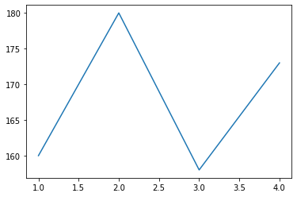

# Rolling

Window 창이 이동하면서 x축의 창을 이동하면서 Y값의 평균,최소, 최대값을 구해야 하는 경우가 있다.

이동평균을 구할 때 rolling() 함수를 사용하면 간단히 할 수 있다.

```
Series.rolling(window, min_periods=None, center=False, win_type=None, on=None, axis=0, closed=None, method='single')
```

**window**

윈도우의 크기. 30일에 대한 평균을 이동하면서 구할 때 윈도우 사이즈는 30이된다.

**min_periods**

윈도우 사이즈보다 데이터가 작을 때 NaN으로 표기할 것인지 최소한의 갯수만 잇으면 데이터를 처리할지를 정한다.


**win_type**


윈도우에 weighting을 주는 형태이다. 가령 Gaussian 형태로 무게를 다르게 주고 싶으면 window 내에서 값들이 Gaussaian으로 weighting을 받고 수식이 결정된다.


rolling의 결과는 아래와 같은 수식을 계산할 수 있다.

* mean
* max
* sum
* min
* median
* std

```
import numpy as np
import pandas as pd
import matplotlib.pyplot as plt
```


## 이동 평균
컬럼이 하나인 데이터프레임의 이동 평균을 구해보자.

```
data = np.array([1,2,3,4,5,6,7,8,9,10])
df = pd.DataFrame({'B': data})
df
```
```
  B
0	1
1	2
2	3
3	4
4	5
5	6
6	7
7	8
8	9
9	10
```


window 크기를 3으로 설정하면 3개의 데이터의 이동 평균을 구한다.

```
means = df.rolling(window=3).mean()
means
```

```
	B
0	NaN
1	NaN
2	2.0
3	3.0
4	4.0
5	5.0
6	6.0
7	7.0
8	8.0
9	9.0
```


컬럼이 두 개인 데이터프레임을 만들어 보자.

```
data1 = np.array([1,2,3,4,5,6,7,8,9,10])
data2 = np.array([11,12,13,14,15,16,17,18,19,20])

df = pd.DataFrame({'A': data1, 'B': data2})
df
```
```
	A	B
0	1	11
1	2	12
2	3	13
3	4	14
4	5	15
5	6	16
6	7	17
7	8	18
8	9	19
9	10	20
```

컬럼이 두 개인 데이터프레임의 이동 평균을 구해보자

```
means = df.rolling(window=3).mean()
means
```
```
	A	B
0	NaN	NaN
1	NaN	NaN
2	2.0	12.0
3	3.0	13.0
4	4.0	14.0
5	5.0	15.0
6	6.0	16.0
7	7.0	17.0
8	8.0	18.0
9	9.0	19.0
```


## 합계
창 크기가 2 인 롤링 합계를 찾습니다

```
dataframe=pd.DataFrame({'Attendance': {0: 60, 1: 100, 2: 80,3: 78,4: 95},
                        'Obtained Marks': {0: 90, 1: 75, 2: 82, 3: 64, 4: 45}})
print("The Original Data frame is: \n")
print(dataframe)
The Original Data frame is: 
```
```
   Attendance  Obtained Marks
0          60              90
1         100              75
2          80              82
3          78              64
4          95              45
```

```
dataframe1 = dataframe.rolling(2).sum()
print("The Rolling Window After Calculation is: \n")
print(dataframe1)
```
```
The Rolling Window After Calculation is: 

   Attendance  Obtained Marks
0         NaN             NaN
1       160.0           165.0
2       180.0           157.0
3       158.0           146.0
4       173.0           109.0
```
```
att = dataframe1['Attendance']
display(att)
display(att[1:])
plt.plot(att[1:])
plt.show()
```
```
0      NaN
1    160.0
2    180.0
3    158.0
4    173.0
Name: Attendance, dtype: float64
1    160.0
2    180.0
3    158.0
4    173.0
Name: Attendance, dtype: float64
```





## 참고
https://scribblinganything.tistory.com/386

https://pandas.pydata.org/pandas-docs/stable/reference/api/pandas.Series.rolling.html

https://ichi.pro/ko/python-trading-toolbox-gajung-mich-jisu-idong-pyeong-gyun-108585933988521

https://ordo.tistory.com/67