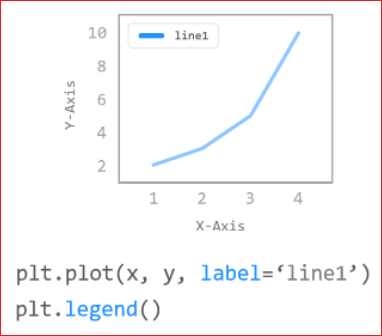
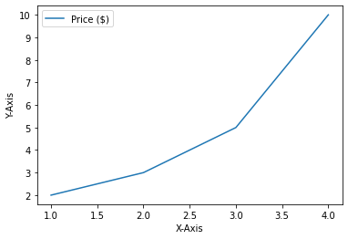
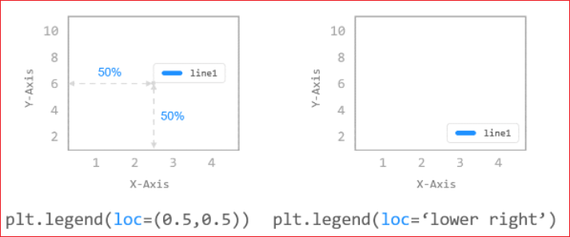
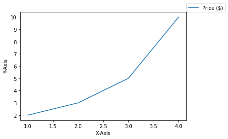
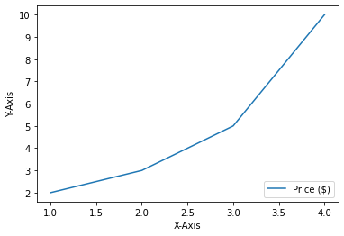
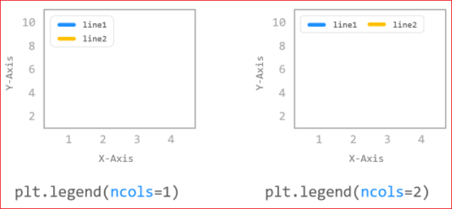
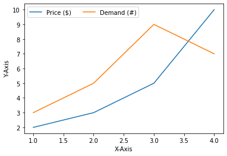

# Matplotlib 범례 표시하기

[Matplotlib Tutorial - 파이썬으로 데이터 시각화하기](https://wikidocs.net/137791)


##  기본사용
범례 (Legend)는 그래프에 데이터의 종류를 표시하기 위한 텍스트입니다.

matplotlib.pyplot 모듈의 legend() 함수를 사용해서 그래프에 범례를 표시할 수 있습니다.

이 페이지에서는 그래프에 다양한 방식으로 범례를 표시하는 방법에 대해 소개합니다.




```
import matplotlib.pyplot as plt
import numpy as np
```
그래프 영역에 범례를 나타내기 위해서는 우선 plot() 함수에 label 문자열을 지정하고,

matplotlib.pyplot 모듈의 legend() 함수를 호출합니다.

아래와 같이 그래프의 적절한 위치에 데이터를 설명하는 범례가 나타납니다.

```
plt.plot([1, 2, 3, 4], [2, 3, 5, 10], label='Price ($)')
plt.xlabel('X-Axis')
plt.ylabel('Y-Axis')
plt.legend()

plt.show()
```





## 위치 지정하기



xlabel(), ylabel() 함수의 labelpad 파라미터는 축 레이블의 여백 (Padding)을 지정합니다.

legend() 함수의 loc 파라미터를 이용해서 범례가 표시될 위치를 설정할 수 있습니다.

loc 파라미터를 숫자 쌍 튜플로 지정하면, 해당하는 위치에 범례가 표시됩니다.

loc=(0.0, 0.0)은 데이터 영역의 왼쪽 아래, loc=(1.0, 1.0)은 데이터 영역의 오른쪽 위 위치입니다.

loc 파라미터에 여러 숫자 쌍을 입력하면서 범례의 위치를 확인해보세요.


```
plt.plot([1, 2, 3, 4], [2, 3, 5, 10], label='Price ($)')
plt.xlabel('X-Axis')
plt.ylabel('Y-Axis')
# plt.legend(loc=(0.0, 0.0))
# plt.legend(loc=(0.5, 0.5))
plt.legend(loc=(1.0, 1.0))

plt.show()
```




```
plt.plot([1, 2, 3, 4], [2, 3, 5, 10], label='Price ($)')
plt.xlabel('X-Axis')
plt.ylabel('Y-Axis')
plt.legend(loc='lower right')

plt.show()
```




loc 파라미터는 예제에서와 같이 문자열로 지정할 수도 있고, 숫자 코드를 사용할 수도 있습니다.

loc=’lower right’와 같이 지정하면 아래와 같이 오른쪽 아래에 범례가 표시됩니다.


## 열개수 지정하기




legend() 함수의 ncol 파라미터는 범례에 표시될 텍스트의 열의 개수를 지정합니다.

기본적으로 아래 첫번째 그림과 같이 범례 텍스트는 1개의 열로 표시되며,

ncol=2로 지정하면 아래 두번째 그림과 같이 표시됩니다.


```
plt.plot([1, 2, 3, 4], [2, 3, 5, 10], label='Price ($)')
plt.plot([1, 2, 3, 4], [3, 5, 9, 7], label='Demand (#)')
plt.xlabel('X-Axis')
plt.ylabel('Y-Axis')
# plt.legend(loc='best')          # ncol = 1
plt.legend(loc='best', ncol=2)    # ncol = 2

plt.show()
```


