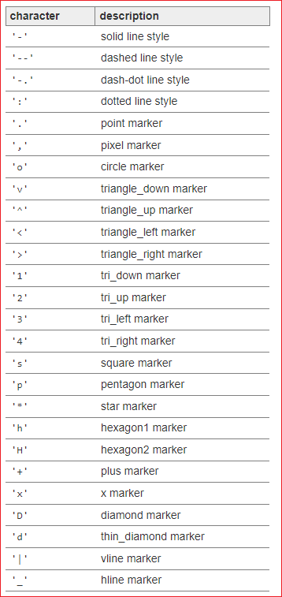

# 선 종류 지정하기 

[Matplotlib Tutorial - 파이썬으로 데이터 시각화하기](https://wikidocs.net/137791)


## 기본사용

Matplotlib에서 선의 종류를 지정하는 가장 간단한 방법은 포맷 문자열을 사용하는 것이다. 
* Solid
* Dashed
* Dotted
* Dash-dot




```
import matplotlib.pyplot as plt

plt.plot([1, 2, 3], [4, 4, 4], '-', color='C0', label='Solid')
plt.plot([1, 2, 3], [3, 3, 3], '--', color='C0', label='Dashed')
plt.plot([1, 2, 3], [2, 2, 2], ':', color='C0', label='Dotted')
plt.plot([1, 2, 3], [1, 1, 1], '-.', color='C0', label='Dash-dot')
plt.xlabel('X-Axis')
plt.ylabel('Y-Axis')
plt.axis([0.8, 3.2, 0.5, 5.0])
plt.legend(loc='upper right', ncol=4)
plt.show()
```
다음의 컬러 약어도 지원한다. 
|	character	|	color	|
|	‘b’	|	blue	|
|	‘g’	|	green	|
|	‘r’	|	red	|
|	‘c’	|	cyan	|
|	‘m’	|	magenta	|
|	‘y’	|	yellow	|
|	‘k’	|	black	|
|	‘w’	|	white	|


## linestyle 지정하기
plot() 함수의 linestyle 파라미터 값을 직접 지정할 수 있다. 포맷 문자열과 같이 ‘solid’, ‘dashed’, ‘dotted’, dashdot’ 네가지의 선 종류를 지정할 수 있다. 

```
lt.plot([1, 2, 3], [4, 4, 4], linestyle='solid', color='C0', label="'solid'")
plt.plot([1, 2, 3], [3, 3, 3], linestyle='dashed', color='C0', label="'dashed'")
plt.plot([1, 2, 3], [2, 2, 2], linestyle='dotted', color='C0', label="'dotted'")
plt.plot([1, 2, 3], [1, 1, 1], linestyle='dashdot', color='C0', label="'dashdot'")
plt.xlabel('X-Axis')
plt.ylabel('Y-Axis')
plt.axis([0.8, 3.2, 0.5, 5.0])
plt.legend(loc='upper right', ncol=4)
plt.tight_layout()
plt.show()
```

## 선끝 모양 지정하기 
plot() 함수의 solid_capstyle, dash_capstyle를 사용해서 선의 끝 모양을 지정할 수 있다. 각각 ‘butt’, ‘round’로 지정하면 아래 그림과 같이 뭉뚝한, 둥근 끝 모양이 나타난다. 

```

plt.plot([1, 2, 3], [4, 4, 4], linestyle='solid', linewidth=10,
      solid_capstyle='butt', color='C0', label='solid+butt')
plt.plot([1, 2, 3], [3, 3, 3], linestyle='solid', linewidth=10,
      solid_capstyle='round', color='C0', label='solid+round')

plt.plot([1, 2, 3], [2, 2, 2], linestyle='dashed', linewidth=10,
      dash_capstyle='butt', color='C1', label='dashed+butt')
plt.plot([1, 2, 3], [1, 1, 1], linestyle='dashed', linewidth=10,
      dash_capstyle='round', color='C1', label='dashed+round')


plt.xlabel('X-Axis')
plt.ylabel('Y-Axis')
plt.axis([0.8, 3.2, 0.5, 5.0])
plt.legend(loc='upper right', ncol=2)
plt.tight_layout()
plt.show()
```
