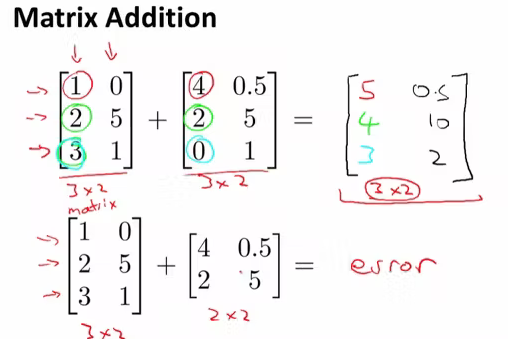
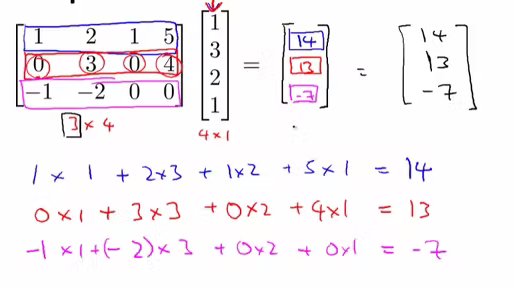
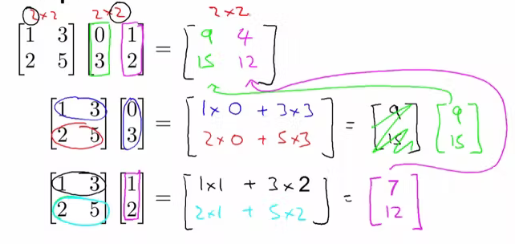

# Numpy 

**행렬(matrix)**    
사각형 모양안에 숫자들을 나열해 놓은 형태로 아래 그림과 같이 표기가 됩니다.이 숫자들은 행(rows)과 열(columns)로 구분이 가능합니다. 그래서 전체를 하나로 표기할 수도 있고 내부에 숫자들을 각각 표기할 수도 있게 됩니다. Matrix를 표기할 때 4 x 2와 같이 표기를 합니다. 그냥 4개의 행과 2개의 열로 이루어진 Matrix이며 4 by 2라고 읽습니다.

**벡터(vector)**    
Vector는 행렬과 비슷하게 생겼지만 다른 점은 열(column)이 1개만 존재하는 형태라는 것입니다. 그래서 항상 한줄로만 표기가 됩니다. 즉, n x 1의 matrix 이면서 vector가 되는 것입니다.

**행렬 더하기**    
Matrix와 Vector의 정의를 알았으니 이제 더하는 방법을 알아봅니다. 두개의 Matrix를 더하는 것은 같은 자리의 숫자를 더해서 새로운 Matrix를 만들어 내는 것입니다. 아래 그림에서 3x2 Matrix+ 3x2 Matrix를 하면 같은 사이즈를 가지는 3x2 Matrix가 생성된다는 것을 보여주고 있습니다.

**행렬의 곱**    
**Matrix X Vector (Matrix 곱하기 Vector)**    
Matrix와 Vector를 곱하면 어떻게 될까요 각각 크기를 가지고 있으므로 곱하기가 되는 대상에 주의를 해야 합니다. 아래 그림은 기본적인 곱하기에 대한 특성을 보여주고 있습니다. A Matrix의 크기가 m x n이라고 할 경우에 x Vector의 크기는 n x 1이 되어야 한다 입니다. 같은 사이즈의 n이 되어야 곱하기를 할 수 있다는 뜻이됩니다. 이렇게 곱하기를 한 결과는 m의 크기를 갖는 Vector가 됩니다. 그럼 어떻게 곱하기가 되는지 예제를 보면 쉽습니다.
결과 값을 차례대로 Vector 형식으로 적어주면 m개의 크기를 갖는 결과 Vector가 생성이 됩니다. 이와 같이 연산이 되기에 Matrix의 가로 크기와 Vector의 세로 크기가 같아야 하겠습니다. 그리고 그 결과는 Matrix 의 세로 크기와 같은 크기를 갖는 Vector로 만들어집니다.

**Matrix x Matrix (Matrix 곱하기)**     
Matrix 끼리의 곱셈입니다. column만 늘어나는 것이고 연산은 동일합니다. 아래 그림은 m x n Matrix와 n x o Matrix를 곱하면 m x o Matrix가 결과가 된다는 것을 이야기 합니다.

[매트릭스와 벡터 계산하기](https://daeson.tistory.com/168)     