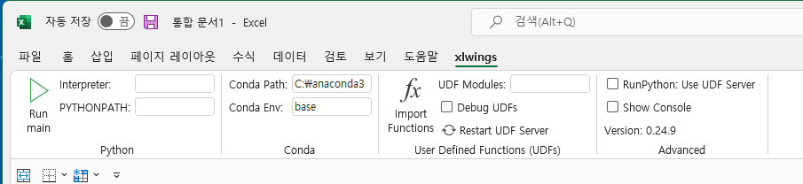

# Python for Excel and Google Sheets
xlwings is open source and free, comes preinstalled with Anaconda and WinPython, and works on Windows and macOS.

Automate Excel via Python scripts or Jupyter notebooks, call Python from Excel via macros, and write user-defined functions (UDFs are Windows-only).

자세한 내용은 [Xlwings](https://www.xlwings.org/)을 참조한다. 


## 설치 

xlwings comes pre-installed with

* Anaconda (Windows and macOS)
* WinPython (Windows only) Make sure not to take the dot version as this only contains Python.

설치에 문제가 있으면 다음과 같이 
```shell
pip install xlwings
```
or conda:
```shell
conda install xlwings
```


## Add-in 
Add-in을 설치하기 위해서 다음과 같이 한다. 
```
xlwings addin install
```

자세한 내용은 [Installation](https://docs.xlwings.org/en/stable/installation.html)를 참조한다. 


Excel을 실행하니 메뉴에 xlwings가 추가되었다. 





**다음 사이트 참조**     
* [Excel 설정하는 방법 설명](https://blog.naver.com/PostView.naver?blogId=o12486vs2&logNo=222270908439)     
* [파이썬 업무 자동화](https://wikidocs.net/157782)     
