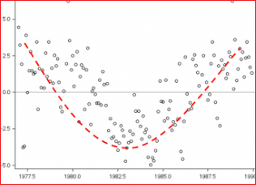
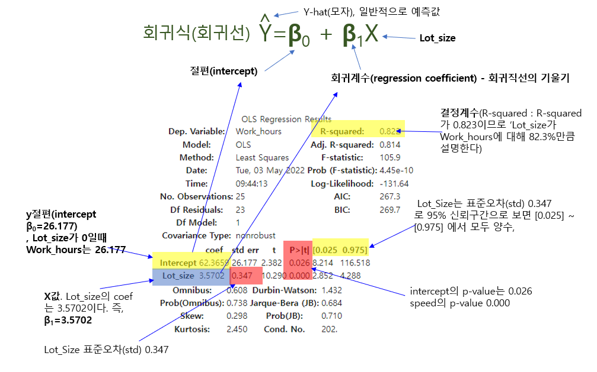
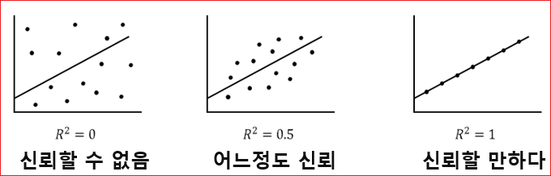

# statsmodel 단순회귀분석


선형 회귀 그래프로는 산점도(Scatter plots)를 많이 활용한다. 그리고 독립 변수와 종속 변수 간의 상관관계를 나타내는 척도를 상관 계수(correlation coefficient)라고 한다.상관 계수는 보통 r로 표기합니다. 여러 상관 계수가 있지만 선형 회귀의 상관 계수로 가장 많이 쓰이는 것은 피어슨 상관 계수(Pearson correlation coefficient)이다.  피어슨 상관 계수는 선형 관계의 강도(Strength)와 방향(Direction)을 나타내며, -1부터 1 사이의 값으로 표시한다.  선형 계수가 -1일 수록 음의 상관관계를 가지고, 1일 수록 양의 상관관계를 가진다. 

* 강도(Strength) 
  * Strong       0.7 ≤ | r | ≤ 1.0 
  * Moderate     0.3 ≤ | r | ≤ 0.7 
  * Weak         0.0 ≤ | r | ≤ 0.3 

* 방향(Direction)
  * Positive  r > 0 
  * Negative  r < 0


피어슨 상관 계수는 선형 관계일때만 유의미하고, 아래 그래프처럼 2차식에서는 의미가 없다. 아래 2차식의 피어슨 상관 계수는 0입니다. r=0일 때는 상관관계가 없다고 보지만 아래 2차 식이 실제로 상관관계가 없는 것은 아니다.  피어슨 상관 계수는 선형 관계일 때만 쓴다. 



**최소자승법(OLS : Least-squres Method)**     

산점도로 데이터의 분포 그래프를 그렸을 때, 이 데이터들의 경향을 알고 싶다면 추세선을 그린다. 어떤 데이터가 주어졌을 때 최적의 추세선을 그리기 위한 방법 중 하나가 최소자승법 (Least-squares Method)이다. 데이터의 추세선을 그리고 싶을 때 쓰는 방법이 최소자승법이다. 

## 데이터 살펴보기 

```python 
import pandas as pd
import matplotlib.pyplot as plt
import matplotlib

matplotlib.rcParams['axes.unicode_minus'] = False ## 마이나스 '-' 표시 제대로 출력

from statsmodels.formula.api import ols
from sklearn.linear_model import LinearRegression
 
df = pd.read_csv('drive/MyDrive/data/toluca_company_dataset.csv') ## 데이터 불러오기
# df = pd.read_csv('drive/MyDrive/data/speed.csv') ## 데이터 불러오기 
```

데이터를 5개만 출력해본다. 


```python 
df.head(5)
```

Lot_size는 제품크기이고 Work_hours는 작업시간이다. 


```
Lot_size	Work_hours
0	80	399
1	30	121
2	50	221
3	90	376
4	70	361
```


## 데이터 분포 확인 

데이터 분포를 살펴보자. 


```python 
## 시각화
fig = plt.figure(figsize=(8,8))
fig.set_facecolor('white')
 
font_size = 15
plt.scatter(df['Lot_size'],df['Work_hours']) ## 원 데이터 산포도
# plt.scatter(df['speed'],df['dist']) ## 원 데이터 산포도
 
plt.xlabel('Lost_size', fontsize=font_size)
plt.ylabel('Work_hours',fontsize=font_size)
plt.show()
```


## 모형 적합시키기 
### statsmodels 라이브러리 이용

statsmodel에서 OLS를 사용한 선형 회귀 분석 배치.
OLS는 ordinary least square의 약자로 최소자승법으로 회귀 모델을 구하는 메서드이다. (Reference4)

모델이 얼마나 효율적으로 배치되는지 확인하기 위한 모델 요약


```python 
from statsmodels.formula.api import ols
from sklearn.linear_model import LinearRegression
```

### ols('y ~ x', data).fit() 모형 적합시키기 
'y ~ x1 + x2 + x3' -> 독립변수가 여러개 일 경우에는 + 로 추가해준다. 


```python 
## states model 사용
fit = ols('Work_hours ~ Lot_size',data=df).fit() ## 단순선형회귀모형 적합
# fit = ols('dist ~ speed',data=df).fit() ## 단순선형회귀모형 적합
```
결과를 요약하여 제공한다. 

```python 
fit.summary()
```





**모형 수식** 

```
Y = 26.177 + 3.5702 * X 
```

* 절편(intercept)
  * 회귀직선의 절편.
  * x=0일 때의 예측값으로 b0 또는 β0로 표기. 즉, Lot_Size가 0 일 때 y절편은 26.177

* 회귀계수(regression coefficient)  
  * 회귀직선의 기울기. b1 또는 β1로 표기
  * 기울기(slope), 모수 추정값(parameter estimate),  가중값(weight)

* 상관계수(correlation coefficient)
  * 두 변수의 상관성을 나타내는 척도이다. 
  * 항상 -1과 1 사이의 값을 가지며( -1 ≤ r ≤ +1), 계수 값이 -1 또는 1일때 두 변수가 완전한 직선관계임을 뜻한다.

* 결정계수(R-squared)
  * R^2(R제곱)으로 표시 
  * 독립변수가 종속변수를 얼마나 잘 설명해주는지 보여주는 지표이다. 
  * 문제는 독립변수의 개수가 증가하면 함께 증가한다. 그러므로 결정계수에만 의존하여 회귀모델을 평가하는데에는 루미가 있다. 따라서 조정된 결정계수(Adjusted R-squared)가 제시되었다. 
  * 모형의 예측 정확도가 높아지면 결정계수가 1에 가까워진다
  * 회귀식이 얼마나 정확한지를 나타내는 숫자가 결정계수이다.  기호는 R2을 사용한다. 보통 숫자 0부터 1까지만 사용한다. ( 0 ≤ R2 ≤ 1 ). 
  * R2가 0.4라면 40%의 설명력을 가진다고 해석하면된다. 
  * 결정계수는 독립변수 개수가 증가하면 함께 증가하므로 독립변수 개수가 2개 이상일 경우에는 조정된 결정개수를 사용해야 한다. 


> 회귀분석 중 독립변수 하나로 분석을 시행하는 경우, y= a + b*x 에서 나오는 결정계수는 x, y의 상관계수의 제곱이다. 즉, 단순회귀의 경우 "상관계수의 제곱 = 결정계수의 제곱"가되는것이다.

> 다중회귀의 경우  y = a + b1*x1 + b2*x2 에서 나오는 결정계수는 독립변수들(x1, x2)이 y를 얼마나 설명하냐를 나타낸다. 따라서 이 경우의 상관분석은 (y, x1)의 상관계수와 (y, x2)의 상관계수를 각각 구해야한다.


## smmmary 항목 설명

* Dep. Variable: Dependent variable, 즉 종속변수를 의미한다.
* Model: 모델링 방법을 뜻하고, OLS는  Ordinary Least Squares의 약자이다.
* No. Observations: Number of observations, 관찰표본 수, 즉 총 표본 수를 뜻한다. 
* Df Model: 독립변수의 개수이다.
* R squared: R의 제곱이라는 뜻이고 결정계수를 의미한다. 전체 데이터 중 해당 회귀모델이 설명할 수 있는 데이터의 비율, 회귀식의 설명력을 나타낸다. SSTr/SST이나 상관계수 R을 제곱해서 구할 수 있다. 
* F-statistics: F통계량을 뜻한다. F통계량은 MSR/MSE로 구할 수 있다. 
* Prob: F통계량에 해당하는 P-value를 의미한다. P는 Probability의 첫글자이다.
* Intercept coef: Intercept coefficient는 회귀식의 절편 값을 의미한다.
* speed coef: 독립변수 coefficient는 독립변수 "speed"의 회귀계수를 의미하며, 회귀식에서 기울기를 의미한다. 

* std err : 계수 추정치의 표준오차(standard error), 값이 작을 수록 좋음 
* t : t-test 독립변수와 종속변수 사이의 상관관계. 값이 클 수록 상관도가 큼 
* p-value(p > |t|) : 독립변수들의 유의확률, 0.05보다 작아야 유의미함. 
* [0.025 0.975] : 회귀 계수의 신뢰구간 
* coef(Coefficient) : 회귀 계수 
* Omnibus : 디아고스티노 검정(D'Angostino's Test). 비대칭도와 첨도를 결합한 정규성 테스트이며 값이 클 수록 정규 분포를 따름 
* Prob(Omnibus) : 디아고스티노 검정이 유의한지 판단(0.05이하일 경우 유의하다고 판단)
* DF Residuals : DF는 Degree of Freedom으로 자유도를 뜻하는데, DF Residuals는 전체 표본 수에서 측정되는 변수들(종속변수, 독립변수)의 개수를 빼서 구한다.  DF Residuals = 전체 표본수 - 종속변수 - 독립변수 


## 결정계수 
회귀식이 얼마나 정확한지를 나타내는 숫자가 결정계수이다. 결정계수가 0에 가까울 수록 "회귀식의 정확도는 매우 낮다"고 할 수 있고 1에 가까울 수록 "회귀식읜 정확도는 매우 높다"고 할 수 있다. 





결정계수에도 한계가 있는데 수치가 어중간할 경우에는 정확도를 판단하기가 애매해진다.  예를들어 0.4가 나올 경우는 판단하기 애매하다. 그래서 회귀식의 정확도가 애매할 경우에 해당 회귀식의 결과를 신뢰할지 여부를 판단해야 하는데 결정계수로 의사결정을 못한다. 


그래서 가설검정을 통해서 이러한 의사결정을 한다. 


## 회귀 모형 검정 

**회귀 분석의 결과에 대한 해석**     
* F-검정(F-test)
  * F-검정은 t-검정과는 달리 회귀식 전체에 대한 유의성을 검정함
  * 즉, t-검정의 경우는 각 독립변수가 개별적으로 유의한지를 보는 것임
  * 회귀식 전체가 유의한지 여부를 검정한단느 것은 "모든 회귀계수가 0"이라는 귀무가설(H0)의 기각 여부를 검정하는 것임
  * 따라서, 귀무가설이 기각되지 않고 채택된다면 해당 회귀식은 의미가 없게 됨 
  * 예를 들어 F-검정을 하는 쉬운 방법은 "유의한 F-값"이 0.05(95% 신뢰수준) 또는 0.01(999% 신뢰수준)보다 큰지 또는 작은지 여부를 보면 됨 
    * a=0.05(or 0.01) < 유의한 F-값: 귀무가설 채택 → 해당 회귀식은 유의하지 않음(의미가 없음) 
    * a=0.05(or 0.01) ≥ 유의한 F-값: 귀무가설 기각 → 해당 회귀식은 유의함(의미가 있음) 


### 회귀모형은 타당한가? 
* 귀무가설 : 회귀모형은 타당하지 않다. 제품사이즈가 커지도 작업시간은 변화가 없다.
* 대립가설 : 회귀모형은 타당하다.      제품사이즈가 커지면 작업시간이 늘어난다. 


**결과**   
* F-statistic : 검정통계량 = 105.9
* Prob (F-statistic) : P-value = 0.026

유의확률이 0.026이므로 유의수준 0.05에서 회귀모형은 통계적으로 유의하게 타당한 것으로 나타났다.


### X는 Y에게 영향을 주는가? 

* 귀무가설 : X는 Y에게 영향을 주지 않는다.
* 대립가설 : X는 Y에게 영향을 준다.

**결과**    

* coef : 회귀계수 (beta_1) = 0.347
* std err : 표준오차 (standard error) = 0.347
* t : 회귀계수 / 표준오차 = 62.3659 / 26.177 = 2.382
* P > |t| : P-value = 0.026


유의확률이 0.026이므로 유의수준 0.05에서 제품사이즈(Lot_size)는 작업시간(work_Hours)에 통계적으로 유의한 영향을 주는 것으로 나타났다.


### X는 Y에게 어떤 영향을 주는가?
* 회귀계수의 값이 크면 X가 Y에게 많은 영향을 준다.
* 회귀계수의 값이 작으면 X가 Y에게 작은 영향을 준다.
* 회귀계수의 부호가 +이면 X가 Y를 증가시키는 영향을 준다.
* 회귀계수의 부호가 -이면 X가 Y를 감소시키는 영향을 준다.


**결과**     
* coef : 회귀계수 = 3.5702

**(해석방법 정리할 것)**
작업시간이 몇 증가하면 작업시간은 62.3659 증가한다. 


### 회귀모형의 설명력 또는 X의 설명력 

* Y의 다름(변동)을 회귀모형이 얼마나 설명하고 있는가?
* Y의 다름(변동)을 X가 얼마나 설명하고 있는가?

**결과**     
* R-squared (uncentered) = 0.82
* 회귀모형이 Y의 다름(변동)을 약 82.3% 정도 설명하고 있다.

X가 Y의 다름(변동)을 약 82.3% 정도 설명하고 있다.


**MSE**
```python 
from sklearn.metrics import mean_squared_error

mean_squared_error(y_true = , y_pred = )
```

* 회귀 모델의 적합도를 나타내는 척도로 0에 가까울 수록 적합도가 높음

### 회귀모형의 진단 또는 가정 
**잔차(오차) 검정** 
회귀 모형을 통해 구한 조건부 평균이 실제 데이터를 잘 대표하는 값이 되려면 잔차가 정규성, 독립성, 등분산성이라는 가정을 만족해야 한다.  


#### 정규성 검정 
Residuals는 잔차의 정규성을 개략적으로 확인할 때 사용한다. 

모델의 잔차들을 직접 이용해서 정규성을 확인하는 것이 좋다. 만약 잔차가 정규 분포에 가깝다면, 표시된 잔차들이 대각선으로 그려진 점선에 가깝게 표시된다. 

* 귀무가설 : 정규분포를 따른다. 
* 대립가설 : 정규분포를 따르지 않는다. 
* Jarque-Bera Normality tes t
* Jarque-Bera(JB) = 0.684
* Prob(JB) = 0.710
* 유의확률이 0.011이므로 유의수준 0.05에서 정규성 가정이 깨짐 


#### 독립성 검정

잔차의 독립성을 보기 위해 세가지를 확인한다. 
* 회귀 모델을 통해 구한 예측값과 잔차와의 독립성
* 잔차와 회귀 변수 사이의 독립성
* 잔차끼리의 독립성 

* 귀무가설: 독립이다
* 대립가설: 독립이 아니다 
* Durbin-Watson = 1.432

> * DW 값이 2에 가까우면 오차들은 독립
> * DW 값이 0에 가까우면 독립 X, 양의 자기상관 O
> * DW 값이 4에 가까우면 독립 X, 음의 자기상관 O


#### 등분산성 검정 
잔차의 등분산성이란 잔차가 회귀모델의 예측치 값에 상관없이 분산이 일정하다는 뜻이다. 


* 귀무가설 : 등분산이다.
* 대립가설 : 등분산이 아니다

```
stats.bartlett(X, residuals)
```

* 유의확률이 0.026이므로 유의수준 0.05에서 등분산 가정이 깨짐


## 회귀 계수 구하기 

회귀 계수 값 자체는 summary 함수를 통해서 볼 수 있지만 직접 가져와서 계산을 할 때도 있을 것이다. 절편과 기울기 추정값은 다음과 같이 얻을 수 있다.


```python 
print(fit.params.Intercept) ## 절편
print(fit.params.Lot_size) ## 기울기
```
```
62.36585858585867
3.5702020202020197
```


설명변수에 대응하는 작업시간의 추정치는 fittedvalues 필드를 통하여 얻을 수 있다. 
```python 
fit.fittedvalues
```
```
0     347.982020
1     169.471919
2     240.875960
3     383.684040
4     312.280000
5     276.577980
6     490.790101
7     347.982020
8     419.386061
9     240.875960
10    205.173939
11    312.280000
12    383.684040
13    133.769899
14    455.088081
15    419.386061
16    169.471919
17    240.875960
18    383.684040
19    455.088081
20    169.471919
21    383.684040
22    205.173939
23    347.982020
24    312.280000
dtype: float64
```

## 잔차구하기 

잔차는 resid 필드를 이용하여 구할 수 있다. 

```python 
fit.resid
```
```
0      51.017980
1     -48.471919
2     -19.875960
3      -7.684040
4      48.720000
5     -52.577980
6      55.209899
7       4.017980
8     -66.386061
9     -83.875960
10    -45.173939
11    -60.280000
12      5.315960
13    -20.769899
14    -20.088081
15      0.613939
16     42.528081
17     27.124040
18     -6.684040
19    -34.088081
20    103.528081
21     84.315960
22     38.826061
23     -5.982020
24     10.720000
dtype: float64
```


## 예측(Prediction) 
새로운 제품 크기에 대한 작업 시간의 예측값을 얻고 싶다면 다음과 같이 한다. 

```python 
fit.predict(exog=dict(Lot_size=[80]))
```
```
0    347.98202
dtype: float64
```
predict 함수의 exog 인자에 설명 변수 이름과 해당 값을 딕셔너리로 넘겨주어야 한다. 제품 크기가 80이라면 작업시간은 약 348시간이 걸린다고 예측할 수 있다.

## 회귀직선 그리기
```python 
## 시각화
fig = plt.figure(figsize=(8,8))
fig.set_facecolor('white')
 
font_size = 15
plt.scatter(df['Lot_size'],df['Work_hours']) ## 원 데이터 산포도
plt.plot(df['Lot_size'],fit.fittedvalues,color='red') ## 회귀직선 추가
 
plt.xlabel('Lot Size', fontsize=font_size)
plt.ylabel('Work Hours',fontsize=font_size)
plt.show()
```


## 잔차도 그리기 
제품 크기에 대한 잔차도를 그려보자. 잔차도는 모형이 잘 적합되었는지를 시각적으로 확인하기 위해 필요한 그래프이다. 


```python 
## 잔차도 Residual Plot
fig = plt.figure(figsize=(8,8))
fig.set_facecolor('white')
 
font_size = 15
 
plt.scatter(df['Lot_size'],fit.resid) ## 잔차도 출력
 
plt.xlabel('Lot Size', fontsize=font_size)
plt.ylabel('Residual', fontsize=font_size)
plt.show()
```


## 참고 
[Velog의 회귀분석 정리한 블로그](https://velog.io/@pyose95/Data-Analysis-15.-%EB%8B%A8%EC%88%9C%EC%84%A0%ED%98%95-%ED%9A%8C%EA%B7%80%EB%B6%84%EC%84%9D-Simple-Linear-Regression-Analysis-2)     
[Python을 이용한 회귀분석](https://zephyrus1111.tistory.com/52)      
[선형회귀분석 결과해석하기](https://lovelydiary.tistory.com/348)     
[Python으로 회귀분석 해보기](https://hanawithdata.tistory.com/entry/%ED%9A%8C%EA%B7%80%EB%B6%84%EC%84%9D2-Python%EC%9C%BC%EB%A1%9C-%ED%9A%8C%EA%B7%80%EB%B6%84%EC%84%9D-%ED%95%B4%EB%B3%B4%EA%B8%B0)     
[최소자승법을 활용한 회귀분석](https://bkshin.tistory.com/entry/DATA-17-Regression)     


