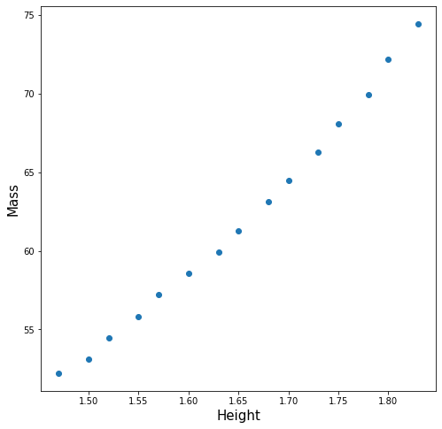

# sklearn 단순회귀분석
## 회귀분석

```python
import pandas as pd
df = pd.DataFrame({
'height': [1.47, 1.50, 1.52, 1.55, 1.57, 1.60, 1.63, 1.65, 1.68, 1.70, 1.73, 1.75, 1.78, 1.80, 1.83],
'mass': [52.21, 53.12, 54.48, 55.84, 57.20, 58.57, 59.93, 61.29, 63.11, 64.47, 66.28, 68.10, 69.92, 72.19, 74.46],
})

X = df[['height']]
Y = df['mass']

from sklearn import linear_model
reg = linear_model.LinearRegression()
reg.fit(X, Y)  # 적합시키기 
print( "coefficient=", reg.coef_ )  # 회귀계수 
print( "intercept=", reg.intercept_ )  # 절편
print( "R²=", reg.score(X, Y) ) #  결정계수 
```

```
coefficient= [61.27218654]
intercept= -39.06195591884392
R²= 0.9891969224457968
```

회귀식 
```
y = 61.27218654ㅌ - 39.0619
```


##  데이터 분포확인
```python
import matplotlib.pyplot as plt
import matplotlib

matplotlib.rcParams['axes.unicode_minus'] = False ## 마이나스 '-' 표시 제대로 출력
```
```python
## 시각화
fig = plt.figure(figsize=(8,8))
fig.set_facecolor('white')
 
font_size = 15
plt.scatter(df['height'],df['mass']) ## 원 데이터 산포도
# plt.scatter(df['speed'],df['dist']) ## 원 데이터 산포도
 
plt.xlabel('Height', fontsize=font_size)
plt.ylabel('Mass',
```




## 회귀직선 그리기
sklearn에서 회귀 직선을 그리는 방법은 아직 찾지 못했다. 

## References
[sklearn 단순회귀분석](https://zetawiki.com/wiki/Sklearn_%EB%8B%A8%EC%88%9C%ED%9A%8C%EA%B7%80%EB%B6%84%EC%84%9D)     