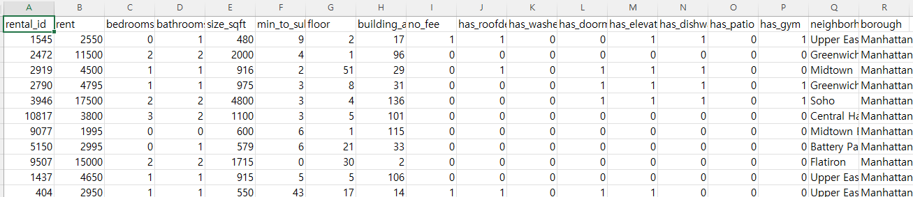
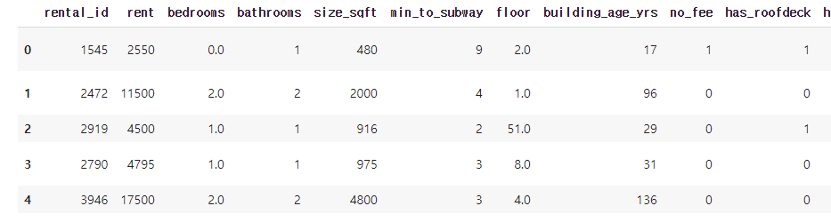
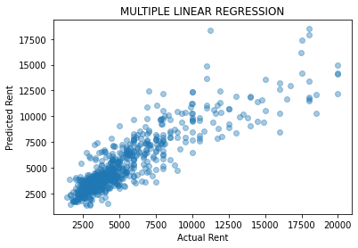
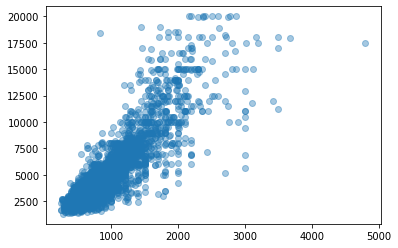
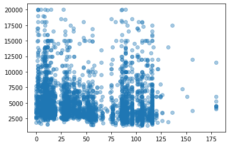

# sklearn 다중회귀분석(Multiple Linear Regression) 

> 이 문서는 다중회귀분석을 학습하기 위해 작성한 문서로 참조에 있는 여러 사이트의 내용을 학습하면서 정리한 글입니다. 


세상은 단순선형회귀로 설명할 수 있을만큼 단순하지 않다. 고려해야할 변수 X가 하나가 아니다. 예를들어 주택 임대료를 예측한다고 했을 때, 주택의 면적만 고려해서 예측한다면 단순회귀가 되겠지만, 지어진지 얼마나 오래되었는지, 지하철 역과의 거리가 얼마나 가까운지 등 다양한 요소의 영향을 받는다. 결국 주택 임대료 y를 예측하려면 여러개의 변수 X를 포함해야 한다. 이를 다중선형회귀(Multiple Linear Reression)라고 한다. 

다중회귀분석에 대한 이해는  [다중 회귀분석](regress-05.md)을 참고한다. 


데이터는 github에서 다운로드 받는다. 
[여기](https://github.com/Codecademy/datasets/blob/master/streeteasy/manhattan.csv)  





맨 왼쪽의 rent가 임대료이다. 


## 데이터셋 불러오기

```python 
import pandas as pd
df = pd.read_csv('drive/MyDrive/data/manhattan.csv') ## 데이터 불러오기
df.head()
```




##  데이터 셋 분리하기

모든 데이터를 사용하여 다중선형회귀 모델을 만들 수도 있지만 학습데이터와 시험데이터를 분리할 것이다.  

데이터 셋 분리는 sklearn에서 train_test_split 를 통해 할 수 있다. 
8:2 정도의 비율로 나눈다. 


```python
from sklearn.model_selection import train_test_split

x = df[['bedrooms', 'bathrooms', 'size_sqft', 'min_to_subway', 'floor', 'building_age_yrs', 'no_fee', 'has_roofdeck', 'has_washer_dryer', 'has_doorman', 'has_elevator', 'has_dishwasher', 'has_patio', 'has_gym']]

y = df[['rent']]

x_train, x_test, y_train, y_test = train_test_split(x, y, train_size=0.8, test_size=0.2)
```

## 모델생성하기
이제 모델을 생성하자. 당연히 학습 데이터를 가지고 모델을 생성한다. 방법은 단순선형회귀와 똑같다.
```python 
from sklearn.linear_model import LinearRegression
mlr = LinearRegression()
mlr.fit(x_train, y_train) 
```
끝났다. 이제 만약 내가 주택에 대한 14개 항목값 넣어주면 주택 임대료를 예측해준다.

```python 
my_apartment = [[1, 1, 620, 16, 1, 98, 1, 0, 1, 0, 0, 1, 1, 0]]

my_predict = mlr.predict(my_apartment)

my_predict
```

이제 x 시험 데이터 x_test를 넣어 예측한 y 값들을 y_predict라고 저장해보자. 추후에 시험 데이터에 있는 실제 정답, 즉 y_test와 비교해보기 위함이다.


```python 
y_predict = mlr.predict(x_test)
#y_predict
```


## 시각화

matplotlib의 시각화를 통해 간단히 확인하고 넘어가보자.

x축은 실제 임대료, y축은 예측한 임대료다. 만약 정답을 맞춘다면 정확히 선으로 일치되어 나올 거다.

```python
import matplotlib.pyplot as plt
plt.scatter(y_test, y_predict, alpha=0.4)
plt.xlabel("Actual Rent")
plt.ylabel("Predicted Rent")
plt.title("MULTIPLE LINEAR REGRESSION")
plt.show()
```



임대료가 낮은 항목들은 꽤 가깝게 맞추는데, 높은 임대료에서는 오차가 좀 있는 걸 알 수 있다. 그래도 어쨌든 얼추 잘 나오는 것 같다.


## 회귀계수와 상수 확인하기
단순선형회귀는 우리가 직접 그릴 수 있는 1차 방정식 y = m*x + b으로 설명이 되기 때문에 m을 기울기, b를 절편이라고 불렀다.

그런데 다중회귀에서는 변수가 많기 때문에 조금 표현을 달리해야겠다. 일단 모든 변수 x마다 각각의 m이 있다. 그러니 이것들을 회귀계수라고 부르자. 그리고 b는 그냥 상수라고 부르자.

아무튼 다중회귀에서도 단순회귀와 똑같이 이 값들을 확인할 수 있다. 모델 뒤에 .coef_ , .intercept_라고 써주면 끝이다.

```python 
print(mlr.coef_)
```
```
[[-335.94507705 1163.68623465    4.90285142  -15.07212322   20.90220458
    -8.03543145 -152.3379676    16.99783603  206.19048104 -222.56395054
   137.19942683  -69.73037265  -69.19732168  -29.77783033]]
```

위 모델에서 총 14개의 변수를 사용했기 때문에 회귀계수도 당연히 14개가 존재한다.

그런데 이렇게 보면 대체 어떤 변수가 중요한 건지 감이 안 온다.

## 상관 살펴보기
그럴 땐 matplotlib에서 scatter 플롯을 그려서 변수들과 주택 임대료의 상관을 살펴보자
```python
# 주택의 면적 'size_sqft'과 가격 'rent'
plt.scatter(df[['size_sqft']], df[['rent']], alpha=0.4)
plt.show()
```



```python 
# 주택이 얼마나 오래 전에 지어졌는지 'building_age_yrs'와 가격 'rent'
plt.scatter(df[['building_age_yrs']], df[['rent']], alpha=0.4)
plt.show()
```




일단 이 두 개의 그림만 봐도 주택 면적은 상관이 있는데 얼마나 오래된 건물인지는 딱히 상관이 나타나지 않는 걸 알 수 있다.


## 모델의 정확도(Accuracy) 평가하기

위에서 데이터 세트를 나눠놨기 때문에 학습 시킨 모델을 테스트 할 수 있다.

다중선형회귀 모델의 정확도를 평가할 때는 잔차 분석(Analysis)을 하면 된다. 잔차는 실제 값 y와 예측된 값 ŷ의 차 e를 말한다. 방정식으로 표현하면 이렇게


sklearn의 linear_model.LinearRegression를 사용해서 모델을 생성하면 .score()라는 메서드를 사용할 수 있는데 R²라고 하는 결정계수(coefficient of determination)를 돌려준다. 결정계수 R²은 이렇게 표현할 수 있다.


```python
print(mlr.score(x_train, y_train))
```
```
0.7791559118159472
```
꽤 높다. 주택 임대료의 77%를 저 14개의 항목으로 설명할 수 있다는 의미다.


## 참조
[학습과 테스트 세트분리](https://teddylee777.github.io/scikit-learn/train-test-split)       

[다중선형회귀분석](https://hleecaster.com/ml-multiple-linear-regression-example/)    


