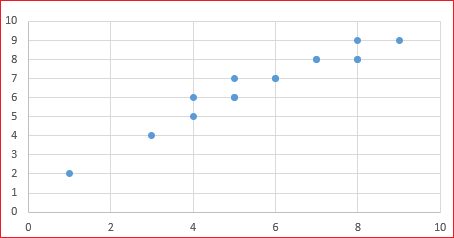

# 회귀분석 (1)

## 변수간의 관계

아래 문장의 의미를 생각해보자. 

**"학습동기가 높으면 학업 성취도가 높다."**

학업동기가 학업 성취도에 영향을 준다는 의미이다. 

여기서, 

* **학습동기를 독립변수라고 한다.**

* **학업성취도를 종속변수라고 한다.**

독립변수는 X를 사용하고 종속변수는 Y를 사용한다. 

예를 들어 학생들의 학습동기를 조사하고 그들의 실제 학업성취도를 조사한다고 가정하자. 

다음과 같은 표로 표현할 수 있다. 

|	학습동기	|	학업성취도	|
|--|--|
|	1	|	2	|
|	3	|	4	|
|	4	|	5	|
|	6	|	7	|
|	9	|	9	|
|	5	|	6	|
|	7	|	8	|
|	8	|	9	|
|	8	|	8	|
|	5	|	7	|
|	4	|	6	|
|	5	|	6	|
|	6	|	7	|
|	7	|	8	|

이 표를 그래프로 그리면 다음과 같다. 

가로(X축)가 학업동기이고 세로(Y축)가 학업성취도이다. 

이것을 산포도 혹은 산점도(scatter plot)라고 부르고 영어로는 Scatter plot이라고 부른다. 

전반적으로 분포를 살펴 보았더니 X가 증가함에 따라 Y도 증가하는 것을 볼 수 있다. 

그리고 완전한 직선은 아니지만 어느정도 직선 모양이 보인다. 이러한 관계를 선형관계라고 한다. 

어느정도 상관관계가 있는지 눈으로 확인할 수 있지만 상관관계를 정량화할 방법이 필요하다. 