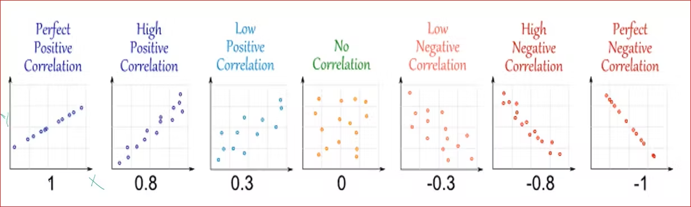

# 회귀분석 (2)
## 선형관계 정량화 

먼저 X와 Y의 평균을 구한다. 

평균은 보통 바(bar)를 씌어 표시한다. 

그리고, 

X값에서 평균을 빼고 Y 값에서 평균을 뺀다. 

이것을 곱한다. 

다시, 이것을 모든 X와 Y에 대해서 계산하여 더한다. 

그리고 이것을 다시 원소의 갯수로 나눈다. 

이것을 **공분산(Covariance)** 라고 한다. 

```
                     n       _            _
공분산(Covariance) = ∑ (Xi - X)  X ( Yi - Y)
                     i=1
                    ￣￣￣￣￣￣￣￣￣￣￣￣￣￣
                                n
```
공분산은 두 변수의 관련성을 정량화 한 것으로 원래 단위를 그대로 반영하여 계산(비표준화)
한 변수가 평균으로 부터 떨어져 있는 정도 만큼 변수도 평균으로부터 유사하게 떨여져 있는지 측정하는 것이다. 

공분산은 원래 단위를 그대로 사용한다. 예를들어, 키와 몸무게의 경우이다. 

공분산은 상한값이나 하한 값이 없다. 그래서 큰지 작은지 알 수 없다. 

### 상관계수 

이러한 불편함을 해결하기 위해서 피어슨이라는 사람이 **상관계수(correlation coefficient)** 를 만들게 된다. 

공분산에서 단위를 그대로 쓰기 때문에 단위를 없애야 하는데 표준화를 하게 된다. 

**공분산을 표준화하여 -1 ~ +1 사이에 오도록 척도화**한다. 


X에서 평균을 빼고 그것을 표준편차로 나눈다. 

```
         _
     X - X
Zx = ----- 
      SDx
```


그럼 상관계수의 크기를 살펴보자. 





X와 Y의 관계가 거의 perfect한 직선의 관계를 가지면 1이 나온다. 반대로 직선이기는 한대 방향이 반대이면 -1이 나온다. 특정한 상관관계가 없을 때 0이 나온다. 


직선에 가까울수록 절대값이 커지고 패턴이 퍼져 있으면 0에 가까운 값이 나온다. 


회귀 분석은 이처럼 두 변수 간의 방향성을 부여하여 독립변수(예측변수)가 종속변수를 '예측' 또는 '설명'한다고 설정한 모형이다. 

상관은 무엇이 원인이고 무엇이 결과인지 알 수 없다.  회귀분석은 동기가 먼저이고 성취도가 영향을 받는다.  


회귀분석은 단순회귀 분석과 다중 회귀 분석이 있는데, 

* 단순 회귀 분석은 독립변수가 하나이고
* 다중 회귀분석은 독립변수를 여러개 투입하여 

종속변수를 설명하고 예측한다. 