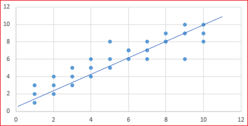
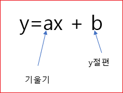
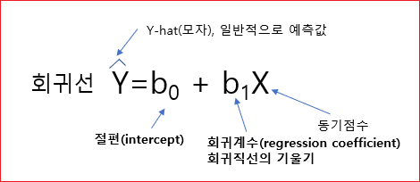
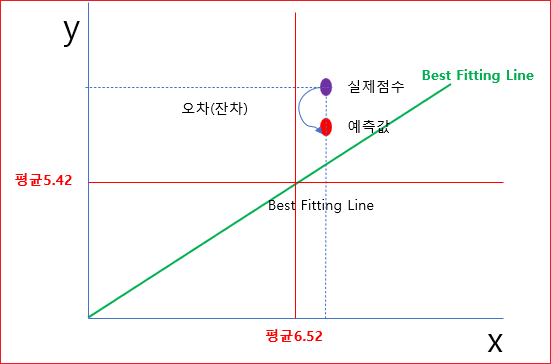
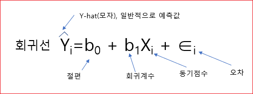

# 회귀분석 (3) 

본격적으로 회귀분석에 대해서 알아보자. 

일반적으로 회귀분석이라고 하면 선형회귀 분석을 말한다. 

**회귀분석이라는 것은 독립변수와 종속변수의 관계를 바탕으로 종속변수를 가장 잘 예측하는 선형적 관계를 추정하는 것을 말한다.** 


Scatter plot에서 **X와 Y의 관계를 가장 잘 대표할 수 있는 직선을 긋고 직선의 식을 산출하는 것**이 회귀분석이다. 




그런데 직선이라근 것은 (X,Y)의 점이 38개라면 38개를 대표하는 선이어야 한다. 

조금더 자세히 설명하자면 선형회귀 모형은  종속변수를 설명하는데 있어서 모형으로 설명하고 모형으로 설명되지 않는 부분은 오차다라고 한다. 

```
종속변수 = 모형 + 오차 
```


아무런 정보가 없는 상태에서 한 학생의 성취도를 맞춰보려고 한다. 랜덤하게 한 학생을 뽑아서 가장 오차가 적게 예측하는 방법은 평균으로부터 예측하는 것이 가장 안전하다. 


안전하다는 것은 오차가 가장 적을 수 있다는 말이다. 

아무런 정보가 없을 때에는 그 학생의 성적은 평균일거야라고 추정하게 된다. 

그런데 이런 추정은 너무 무식한 추정이다. 모형으로서 가치가 없는 것이다. 그냥 찍은 것이다. 아무런 정보도 우리에게 주지 않는다. 


이거 보다 정교한 모형을 써야 하는데, 그래서 **예측변수**를 투입하는 것이다. 


앞에서 설명한 학습동기를 투입한다. 이 학생의 성취 점수는 모르고 학습동기 점수만 알고 있다. 

이 동기 점수를 바탕으로 이 학생이 기말에 어느정도의 성취도를 보일 것인지 예측하려고 한다. 이것이 회귀 분석이다. 

그런데 사실, 이 학생의 실제 데이터는 알고 있다. 하지만 모른다고 가정하자. 

앞에서 전체 학생이 38명이라고 했다. 이 38명의  (x,y)의 관계를 가장 잘 설명하는, 대표할 수 있는 라인을 찾는 것이 회귀분석이다. 

그래서 그 라인을 가장 잘 들어 맞는 라인이다라고 해서 Best fitting line이라고 한다. 

이 라인을 찾는 방법은 나중에 설명하기로 하고 Best fitting line을 찾았다고 가정하자. 

그래서 이게 선이기 때문에 선형 방정식으로 표현할 수 있다. 



그런데 회귀분석에서는 기호를 달리 쓴다. 




절편(B0)와 회귀계수(B1)은 구했다고 치고 동기점수는 알고 있다. 


```
예측값(6.8) = 0.4 + 0.8 * 8 
```

이 학생의 실제점수를 모르고 있다고 해서 예측한 값이 6.8인데, 사실은 알고 있다. 

그래서 예측한 값과 실제 점수사이에는 오차가 존재한다. 이것을 **잔차**라고 한다. 




실제점수에서 평균을 뺀 것을 편차라고 한다. 

```
편차 = 실제점수 - 평균 
편차 = 9 - 5.42
```

그런데 편차를 다시 살펴보면 아래의 식과 같은 것을 알 수 있다 

```
(실제점수 - 평균) = ( 예측점수 - 평균) + (실제점수 - 예측점수)
= 9 - 5.42 = ( 6.8 - 5.42 ) + ( 9 - 6.8 )
```

그러면  (예측 점수 - 평균)은 모형에서 예측(설명)한 것이고 (실제점수 - 예측점수)는 충분히 설명이 안되는 오차이다. 

이렇게 전체 편차를 두 파트로 나누어 볼 수 있다. 

살펴볼 것이 있는데 휘귀선에 대한 공식이 있고 개별 사례에 대한 회귀식이 있다. 

회귀선이라는 것은 38명을 가지고 가장 대표하는 Best Fitting Line을 찾는 것이기 때문에 하나의 선으로 나온다. 개별 사례에 대한 휘귀식은 i번째 학생의 성취도를 예측하는 공식이다. 


아래는 개별 사례에 대한 회귀식이다. 




그러면 절편(B0)와 회귀계수(B1)은 어떻게 구하는가? 
