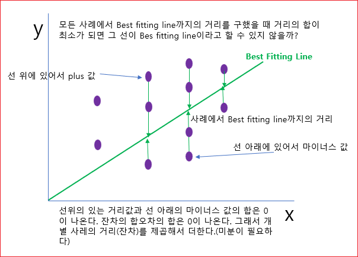
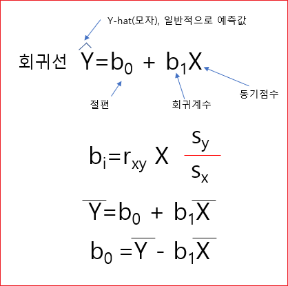

# 회귀분석 (4) 

## 회귀계수의 추정

Best Fitting Line은 어떻게 찾을까? 학자들이 생각한 방법이 **최소제곱법(최소자승법: Method of Least Squares)** 이다. 

개별 사례에 대한 잔차를 구한 다음에 그것들을 제곱해서 합을 구해서 그것이 최소가 되도록 하는 직선의 기울기와 Y절편을 구한다. 





```
● 최소제곱법을 이용하여 회귀계수 산출 
  ● "잔차제곱합"이 최소가 되도록 하는 기울기와 Y절편을 구함 
    ● D = ∑(개별 사례에 대한 관측값 - 모형으로부터의 예측값) ^ 2 가 최소가 되도로 하는 직선의 절편(B0)과 회귀계수(B1)값을 구함 
```    

이것을 어떻게 구하나? 미분을 사용해서 구하는데 식은 다음과 같다. 





그래서 절편(B0)와 회귀계수(B1)은 최소제곱법에 의해서 산출되는 값이다라고 이해하면 된다. 


## 회귀계수의 해석 
더 중요한 것은 회귀계수의 해석이다. 

표준화 회귀계수는 다중회귀분석에서 다시 설명하기로 한다. 

비표준화 회귀계수는 각 변수의 단위(척도)를 그대로 살려서 회귀계수를 해석한다. 

회귀계수도 표준화하기 전단계가 있고 표준화된 단계가 있다. 

예를 들어 다음과 같은 회귀식이 있다고 가정한다. 

```
^
Y = -90 + 0.9X 
Y = B0 + B1X 
```

어떤 여성의 키를 알고 있을 때 몸무게를 예측하는 공식에 넣어보자. 키가 160이라고 가정한다.
```
Y = -90 + 0.9 * 160 
  = 54
```
키가 160인 사람의 몸무게는 54가 나온다. 키의 단위인 cm와 몸무게 kg를 그대로 사용한 것이다. 

비표준화 계수를 사용하면 해석가능한 수치로서 예측값을 해석할 수 있다는 장점이 있다. 


### b0
b0는 절편이다.  X가 0일때, Y에 대한 예측값이다. 예를 들어서 어떤 여성의 키가 0일때 몸무게가 -90이다. 사실 이게 말이 안된다.  회귀분석에서는 별 의미는 없다. 

이것을 의미가 있게 해석하려면 중심화(Centering)이라는 것을 사용하기도 한다. 

원래의 값에서 평균을 뺀다. 
```
    _
X - X
```

이것은 평균키에서의 Y값(몸무게)를 의미한다. 


## b1 
b1은 0.9가 b1인데, x=160인 사람과  x  = 161인 사람의 몸무게 차이 
차이는 160인 사람은 50 kg,161인 사람은 54.9이다.  그래서, x가 1증가할 때 0.9kg 증가한다고 예측한다. 


