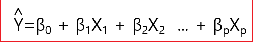

# 회귀분석 (4)

## 다중 회귀분석 
다중 회귀분석은 단순회귀분석과 원리는 동일하지만 예측(설명) 변수의 수가 2개 이상인 경우, 각 예측(설명) 변수의 고유한 예측력(설명력)을 분석한다. 


### 회귀계수의 해석 
단순 회귀분석과 유사한데 다른 점은 다른 예측변수를 통제한 상태에서 해석을 한다는 것이다. 


종속변수가 성취도이고 X1이 동기이고, X2가 지능이라고 가정한다.  성취도를 설명함에 있어 동기가 설명하는 부분이 있고, 지능이 설명하는 부분이 있다. 


또 동기화 지능이 겹치는 부분이 있다. 

지능이 없는 상태에서 동기만 가지고 성취도를 설명한다고 하면 원의 교집합에 해당하는 원의 전체가 될 것이다. 

또 동기를 고려하지 않고 지능만 가지고 성취도를 설명한다면 지능에 해당하는 원의 전체가 될 것이다. 


그런데 이번에는 동기화 지능을 동시에 투입을 했다. 그러면 동기화 지능이 공동으로 성취도를 설명하는 부분이 있을 것이다. 

하지만 공동으로 설명하는 부분은 딱히 동기로만으로도 설명할 수 없고, 지능만으로도 설명하기 어렵다. 


그래서 다른 예측변수를 고려(통제)한 상태에서 한 예측변수의 값이 1점 올라 갈 때 Y값이 몇 점 올라갈 것으로 기대하는 것이 회귀계수의 해석이다. 

**b0** 

절편이다. 모든 예측변수의 값이 0일 때 Y값이다. 


**b1**

1번부터 p번까지의 예측변수가 있다. 나머지 예측 변수의 영향력을 통제한 상태에서 첫번째 예측변수가 고유하게 예측하는 부분이 어느정도인지를 설명한다. 


**b2** 

X2 예측변수를 제외한 나머지 예측 변수의 영향력을 통제한 상태에서 X2 예측변수가 고유하게 예측하는 부분이 어느정도인지를 설명한다. 

예를들면 아래 그림에서 다른 예측변수들이 모두 통제 되었다고 가정할 때 X1이 1증가하면 Y값이 0.35 증가한다고 해석한다. 


언뜻보기에 가장 영향력이 큰 변수는 얼핏보기에는 X2의 계수가 4.82로 제일 크기 때문에  X2인 것 같지만 그것은 잘못된 것이다. 왜냐하면  이 회귀 계수들은 비표준화 회귀 계수이기 때문이다.  단위(척도)가 살아 있기 때문이다. 


### 표준화 회귀계수 (베타 계수)

**비 표준화 회귀 계수는 원래 단위를 그대로 유지한 상태에서 해석하므로 실제적인 의미를 가지는 해석이 가능하다는 장점이 있지만, 여러 예측변수들의 상대적인 영향력을 비교하는데에는 한계가 있다.**


변수를 표준화하면 공통의 단위를 사용하는 효과가 발생하므로, 각 예측변수의 상대적인 영향력을 비교할 수 있다는 장점이 있다. 

비표준화 회귀식과 똑 같지만 베타(β)로 바꾼다. 




예측변수가 X1, X2 두 개인 경우 회귀 계수 공식 


### 표준화 회귀계수의 해석 
비표준화 회귀계수와 논리는 똑같다. 그러나 차이가 있다면, 표준화 회귀계수는 단위를 없앴기 때문에 1점이라던가, 1cm라는 단위를 사용할 수 없다. 그렇기 때문에 표준편차를 한단위로 사용해야 한다. 

그래서 다른 예측변수를 통제한 상태에서 한 예측변수의 값이 1SD 단위 올라갈 때 Y 값은 몇 SD 단위 올라갈 것으로 기대하는가로 해석해야 한다. 

X라는 변수가 평균이 100이고 표준편차가 20인 그러한 점수체제를 가지는 변수라고 생각을 해보자.  이때 20이라는게 표준편차이다. 표준화한 다음에는 20을 하나의 묶음으로 봐서 1SD는 20이다. 한 단위가 올라 갔을 때 Y도 표준편차 단위로 해석을 해야 한다. 


```
학업성취도 = 01.4 - 0.25X(시험불안) + 0.4 X(학습동기) + 0.37 X (과제집착력)
```
위의 공식을 살펴보면 이제는 표준화된 계수이기 때문에 상대적인 영향력을 비교할 수 있다.  따라서 위의 식에서 학습동기에 대한 계수가 제일 높다. 그래서 학습동기가 나머지 변수들에 비해 학업성취도를 가장 잘 예측하는 번수라고 해석할 수 있다. 


### 다중상관(Muiltiple Correlation)

상관이라는 것은 X라는 변수와 Y라는 변수가 어느정도를 공유하고 있는가라는 개념으로 생각하면 된다. 

Y라는 변수가 X1, X2 두 변수가 통합적으로 어느정도와 상관을 가지는가, 가지는 관계를 다중상관이라고 한다. 


* 종속변수 한 개와 여러 개의 독립변수 간의 관계
* 관찰된 종속변수와 예측된 종속변수간의 관계 


실제 Y값과 예측된 Y값의 상관계수를 구하는 게 다중상관이다. 

**다중상관 제곱(R2: 결정계수)**

**그냥 쓰지 않고 일반적으로 제곱을 해서 쓰고 R제곱이라고 부르는데
다른말로 결정계수 이다.**


X1과 X2가 설명하는 부분이 아래 그림에서 초록색으로 칠한 부분이고 이것이  R제곱이다. 


아래에서 왼쪽과 오른쪽을 비교해 보면 오른쪽의 X1이 Y를 설명하는 부분의 영역이 크고 
, X2가 Y를 설명하는 영역이 크다. 


R스퀘어가 클수록 회귀모형에 포함된 예측변수들의 설명력(예측력)이 높다. 
