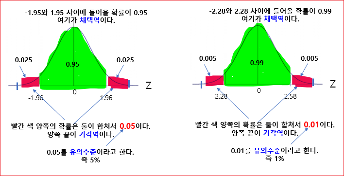
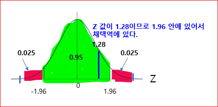
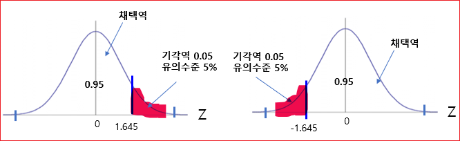
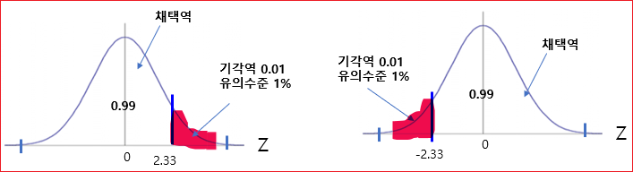
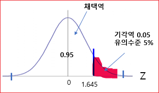

# 가설검정 

통계적 가설을 검정하려면 두 가지 형식적 가설인 귀무가설과 대립가설을 설정해야 한다. 

* 귀무가설(Null hypothesis: H0)
* 대립가설(Alternative hypothesis: H1)


> 통계적 가설 검정(統計的假說檢定, statistical hypothesis test)은 통계적 추측의 하나로서, 모집단 실제의 값이 얼마가 된다는 주장과 관련해, 표본의 정보를 사용해서 가설의 합당성 여부를 판정하는 과정을 의미한다. 간단히 가설 검정(假說檢定)이라고 부르는 경우가 많다. -위키백과 인용


**귀무가설** 
영어로는 Null hypothesis입니다. Null, 없다는 뜻이다. 귀무가설에서 '귀'자는 귀향길과 같은 돌아갈 귀 자를 쓰고있다. 없는 것으로 돌아간다는 것이다.

설정한 가설이 진실일 확률이 극히 적어 처음부터 버릴 것이 예상되는 가설. 즉, 차이가 없거나 의미있는 차이가 없는 경우의 가설.

* 영가설이라고도 한다. 
* 20세 이상의 성인 남자의 평균키는 170cm와 같다. 
* 개발한 신약은 효과가 없다.(또는 차이가 없다)
* ~와 차이가 없다. ~의 효과는 없다. ~와 같다라는 형식으로 설정


**대립가설**
연구자가 연구를 통해 입증되기를 기대하는 예상이나 주장하는 내용으로 연구가설이라고도 한다. 즉, 새로운 사실이나 현상에 대한 주장. 
* 대안가설이라고도 한다. 
* 20세 이상의 성인 남자의 키는 170cm와 다르다.(차이가 있다)
* 개발한 신약은 효과가 있다.(또는 차이가 있다)
* ~와 차이가 있다. ~의 효과는 있다. ~와 다르다라는 형식으로 이루어진다. 


## 양쪽검정 
모평균에 대한 가설검정 중 양쪽검정에 대해서 알아보자. 


목재공장이 있다. 목재의 평균길이가 평균이 m zero이고 표준편차가 시그마인 정규분포를 따른다고 가정하자. 
```
N(m0,α^2) 
```

공장을 새로 만들고 새로 만든 공장에서 만든 목재의 길이가 차이가 있는지 확인하려고 한다. 

그러기 위해서는 가설 두 개가 필요하다. 

귀무가설과 대립가설이 된다. 

H0 귀무가설은, 
새로 생산된 목재와 이전에 생산된 목재의 길이 평균이 똑같다.(차이가 없다)
```
m = m0 
```

H1 대립가설은,  
새로 생산된 목재와 이전에 생산된 목재의 길이 평균이 같지 않다.  

```
m != m0 
```


이제 가설검정을 통해서 H0를 채택할 것인지 기각할 것인지를 선택해야 한다. 

그러기 위해서는 표본을 뽑아야 한다. 

새로운 공장에서 생산된 목재들 중에서 n개의 표본을 뽑아야 한다. 

그리고 n개의 표본의 평균을 구해 본다. 


```
_
X ~ N ( m0,    α^2 / n )

```

H0을 언제 기각하는가? 

X바가 m0와 멀리 떨어져 있으면 H0를 기각한다. 

멀리 떨어져 있다는 기준은 무엇인가?

기준은 통계적 방법으로 설정한다. 


표준화한다. 

```
      X바 - m0(평균)
Z=   -------------------
       α(시그마) 
       ---------
         √n 
```

그러면,  ~ N(0, 1) 표준 정규분포를 따른다. 


X바가 m0와 가까우면  Z 값은 0 값을 갖게 된다. 

X바가 m0와 멀어지먼 Z 값은 0에서 멀어진 값을 갖게 된다. 

멀다의 기준은 무엇인가? 

확률값을 기준으로 한다. 





Z 값이 1.96 보다 커질 확률은 0.025 밖에는 안된다. 
Z 값이 1.96 보다 커졌다는 것은 

새로운 공장에서 생산된 목재의 길이가 
기존 공장에서 생산된 목재의 길이의 평균보다 
더 큰 값을 가진다는 것을 의미한다. 

즉, X바가 m0와 멀리 떨어져 있다는 결론에 이른다. 

마찬가지로 -1.96 보다 작아질 확률은 0.025이다. 

아주 작은 확률이다. 
그럼에도 불구하고 Z 값이 -1.96보다 작은 값이면  X바가 m0보다는 더 작은 값을 가졌다는 것을 의미하고 즉, X바가 m0와 멀리 떨어져 있다는 결론에 이른다. 

그래서 X 바가 1.96보다 크거나, -1.96보다 작으면  H0(귀무가설)을 기각한다. 


그러면 **유의수준**이 무엇이냐면 H0를 채택할 것인지 기각할 것인지를 
얼마나 엄격하게 판정할 것인가를 나타내는 수치이다. 

H0를 5%의 확률로 기각하는 것과 1%의 확률로 기각하는 것은 어떤
차이를 보이는가? 

유의 수준은 1%로 본다는 것은 기각시키는 확률을 더 엄격하게 
판단하겠다는 것을 의미한다. 

보통은 유의수준을 5%나 1%를 사용한다. 

이것은 모평균의 추정에서 신뢰도 95% 볼 것이냐 99%로 볼 것이냐 
그 때와 상황이 똑 같다. 


H1  에서 m != m0 인 것은 결국은 m이 더 클 수도 작을 수도 있다는 
것을 의미한다. 

따라서, 기각역이 양쪽에 생기는 것을 볼 수 있다. 

양쪽에 생기는 기각역을 가지고 H0를 선택할 것인지 기각할 것인지를 검정하는 것을 
양쪽검정이라고 한다. 

### 예제 

실제 예제를 풀어 보자. 

어느 공장에서 생산되는 공의 무게 평균 

평균 = 100g 
표준편차가 = 5g 


이 공장에서 생산설비를 새로운 것으로 교체 했는데  새로운 설비에서 생산된 제품의 평균무게가 변화가 있을까? 

가설검정을 통해서 확인한다. 


```
H0 : m = m0(100g) 

H1 : m != m0(100g) 
```

귀무가설을 채택할 것인가 기각할 것인가?

100개을 표본을 추출했다. 

```
n=100 
```

표본의 평균 X바 = 100.64g

귀무가설을 채택할 것인지 기각할 것인지를 유의수준 5% 로 결정을 하여라는 문제가 있다고 하자. 

표본의 갯수가 30개 이상이면 대충 정규분포를 따른다고 배웠다. 

계산식에 의해서 Z가 1.28이 나왔다. 

```
Z  = 1.28
```

그래서 1.28이 기각역에 들어오는지 채택역에 들어 오는지를 보면 된다. 





즉, 생산설비를 변경했음에도 불구하고 공의 평균 무게에는 변함이 없다.  귀무가설을 채택한다. 


## 한쪽검정 

새로운 노트북이 나왔고 제조사가 다음과 같이 광고를 한다고 가정하자. 

"배터리의 수명은 늘었고, CPU의 발열량은 줄어들었다."

이러한 주장이 사실인지 아닌지 확인하기 위해서 가설검정을 하게 된다. 


H0 : m = m0 
H1 : m  >  m0 

m 새롭게 나온 배터리의 수명 
m0 기존 배터리의 평균 수명 


또는 

H0 :  m = m0 
H1 :  m < m0 

m 새롭게 나온 CPU의 평균 발열량 
m0 기존 배터리의 평균 발열량 


양쪽검정은 같지 않다였고 이번에는 더작다 또는 더크다로 가설을 세운다. 

같지 않다는 크거나 작은 것을 의미한다.  그래서 기각역이 양쪽에 생긴다. 

m > m0 보다 크면 기각역이 한쪽에만 생긴다. 
m < m0 보다 작으면 기각역이 한쪽에만 생긴다. 


n 개의 표본을 추출한다. 평균은 X바이다. 


```
                       α
_                   ____
X ~ N( m0, ( √n    ) 2 )
```
m이 m0에 멀리 떨어져 있으면 귀무가설을 기각한다.  양쪽검정과는 다르게 

m > m0인 경우에는 X바가 m0보다 큰 값을 가지는 경우이고 멀리 떨어져 있다. 

m < m0인 경우에는 X바가 m0보다 작은 값을 가지는 경우이고 멀리 떨어져 있다. 


어떤 기준을 가지고 판단할 것인가? 

먼저 표준화 한다. 

```
Z = X바 - m0 
     ____________
       α
     ____
    √n 
````





멀리 떨어져 있다는 말은 m > m0인 경우 Z 값이 
1.645보다 크다는 의미이고 유의수준이 5%이다. 

반대로 m < m0인 경우Z 값이 
-1.645보다 크다는 의미이고 유의수준이 5%이다. 


유의 수준 1%로 본다면 기각역이 2.33 정도 된다. 




### 예제 

이런 논문이 있다고 가정하자. 


"콜레스테롤의 수치가 높아지면 심장마비가 될 가능성도 높아진다. "


이런 주장이 사실인지 아닌지 확인해야 한다. 


건강한 성인들의 콜레스테롤 수치 평균 = 220 

콜레스테롤의 수치가 220보다 크면 심장마비 가능성이 높아진다. 

꺼꾸로 생각하면 

"심장마비 환자들의 콜레스테롤은 220보다 크다"

심장마비 환자의 표본 30명의 평균 

X바 = 23 1


표본의 표준 편차(S)  = 20 


H0 :  m = 220 
H1 :  m > 220 


m 심장마비 환자들의 평균 콜레스테롤  수치 


Z값을 구한다. 

```
Z =   231 - 220 
       __________
         20 
        ____
       √30 
```

```
Z = 3.012
```

3.012는 기각역에 속하기 때문에 H0를 기각한다. H0을 기각하면 
H1은 채택하게 된다. 




따라서 심장마비 환자들의 평균 콜레스테롤의 수치는 220보다 크다가 맞다. 따라서 
심장마비 가능성이 높아진다. 


## ALPHA LEVEL
앞서 신뢰도를 95%이거나 99%로 정하기로 했다. 어떻게 95%임을 알 수 있을 까? 이를 수치로 나타낸다. 퍼센트로 나타내지말고 소수로 나타내보자. 1.00은 100%이다. 95%는 0.95이다. 
알파는 100%에서 신뢰도를 뺀 값이다. 1-0.95, 즉, 0.05이다. 당연히 신뢰도를 어떻게 잡느냐에 따라 값이 달라진다. 

```
1 - 0.95 = 0.05
```


## 유의확률(p-value) 

p-value가 의미하는건 probablitity value, '확률'이다. 어떤 사건이 우연히 발생할 확률이다.
p-value가 ALPHA LEVEL보다 작으면 귀무가설을 기각할 수 있기로 정했다. Alpha level은 0.05, 즉 우연히 발생할 확률이 5%보다 작으면 이 사건이 우연히 일어난게 아닐거라고 보는 것이다. 
 
쉽게말해서 **0.05**보다 작으면 이건 우연히 일어난일이 아니라는 것으로 뭔가 의미가 있다는 것이다. 그래서 유의하다라고 한다. 

그러니까, 만약 유의 확률이 0.02라면 귀무가설을 기각했을때 이 기각 결정이 잘못될 확률이 2%라는 것이고 기
각 결정이 잘못될 확률이 너무 작기 때문에 과감하게 기각해도 된다고 해석이 가능해진다. 

즉 유의 확률이 적으면 적을 수록 표본분석의 결과는 귀무가설과 상반되고, 연구자는 귀무가설이 기각 되어 대립가설이 채택되기를 원하기 때문에 보통 p-value가 낮을 수록 통계적으로 유의미하다라고 생각한다. 


## 참고 
[양쪽검정](https://youtu.be/xBINhrCQB-g)    
[한쪽검정](https://youtu.be/s8I8YM6FTOo)

