# 표본평균 구하기 


## 모집단, 모평균

어떤 조사를 하려고 할 때 그 대상이 되는 것 전체를 모집단이라 하고, 그 평균값을 모평균이라고 한다.


> 어떤 집단이 가진 자료의 값들에 대한 평균을 구하고자 할 때 이 집단 원래 그대로의 상태를 모집단이라 한다. 모집단에 속해있는 자료의 개수가 매우 많아 몇 개를 표본으로 뽑아 조사할 때 이 표본들의 평균을 표본평균이라 한다. 이에 반해 원래의 모집단의 평균을 모평균이라 한다. 모평균은 우리가 흔히 사용하는 '평균'과 그 의미가 같다. 그러므로 모평균을 구하는 방법은 평균 구하는 방법과 동일하여, 모든 자료값을 더한 뒤 자료의 개수로 나누면 모평균이 된다. 특히 표본집단을 사용하게 될 때 표본평균과 구분을 두기 위하여 모평균이라는 용어를 사용한다. 모평균은 기호로 m 또는 E(X)로 나타낸다.
[네이버 지식백과] 모평균 [Population Mean, 母平均] (두산백과 두피디아, 두산백과)


*  **모평균은 기호로 m 또는 E(X)로 나타낸다.**
* 모집단 = 전국고등학생 (60만명이라고 가정) 
* 임의추출을 한다, 표본을 뽑는다. = 서울, 대구,광주에서 가 지역별로 100 정도씩 뽑아서 조사 
* 표본평균 =서울의 평균, 대구의 평균, 광주의 평균 


표본평균을 X바 


표본평균들의 평균 


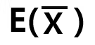


## 표본평균 구하기
### 임의추출 

모집단에서 크기 n인 표본을 여러개 뽑았다고 가정한다. 적당히  K개라고 한다. 위첨자는 뽑은 표본의 번호, 아래첨자는 표본의 원소라고 하자. 

첫번째 표본은 아래와 같이 표현한다. 


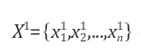


두번째 표본은 아래과 같이 표현한다. 


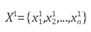


이런표본이 k가 있다. 


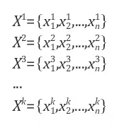


### 표본들의 평균 구하기 
각 표본의 평균을 구하면 아래와 같다. 


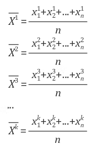


### 표본 평균들의 평균 구하기
이제 표본 평균들의 평균을 구한다.  표본 평균이 아니라, 표본평균들을 가지고 다시 평균을 구한다. 

표본은 시간만 있다면 무수히 많이 뽑을 수 있다. 따라서 표본 평균의 평균을 구할 때 ,k를 무한대로 보내야 한다.  


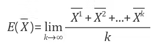


놀랍게도 표본평균의 평균은 모평균과 같아진다. 


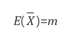


### 표본평균들의 분산 
이번에는 표분 평균의 분산을 구한다. 

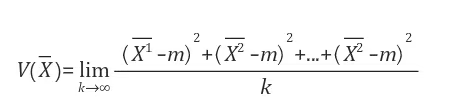


놀랍게도 표본평균의 분산은 모분산을 표본의 크기로 나눈 값과 같아진다. 


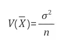


### 표본평균의 편차구하기 
표본평균의 표준편차는 분산에 루트를 씌운다.


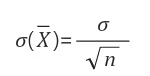


## 모평균
모집단에서 조사하고자 하는 특성을 나타내는 확률변수를 X라고 할 때, X의 평균, 분산, 표준편차를 각각 모평균, 모분산, 모표준편차라고 하며, 이것을 기호로 다음과 같이 나타낸다. 


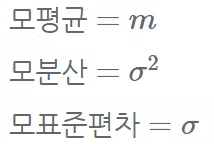


### 모평균과 표본평균 계산 

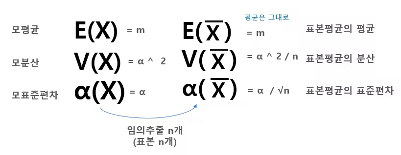


## 연습문제 
### 연습1
모평균이 30이고 모표준편차가 7인 모집단에서 임의추출한 크기가 49인 표본의 표본평균 X-bar의 평균과 표준편차를 구하라. 


```
E(X) = 30
V(X) = 49
α(X) = 7

n = 49

표본평균의 

V(X) = 49 /49    분산 
E(X) = 30        평균
∂(X) = 7 / √49 = 7/ 7 = 1 표준편차 
```


## 연습2 
어느 비행기 탑승객의 짐의 무게는 평균이 18.kg이고 표준편차가 3kg인 정규분포를 따른다고 한다. 이 비행기 탑승객 중에서 36명을 임의추출할 때, 짐의 무게가 17kg 이상일 확률을 구하라. 
단 Z가 표준정규분포를 따르는 확률변수일 때 P( 0 ≤ Z ≤ 2) =0.4772이다. 


N(18, 3 ^ 2) 의 정규분포 
n = 36 임의추출 


평균은 그대로 
표준편차는  √n으로 나누어야  =  3/ √36 = 1/ 2 = 0.5


그러면 17 이상이 될 확률을 구하라는 의미가 된다. 

계산을 하면 -2.0이 나온다. 

P(0 ≤ Z  ≤  2) = 0.4772이므로 

0 이상이 0.5이므로 

0.5 + 0.4772 =  0.9772 

가된다. 


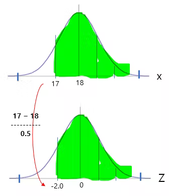
