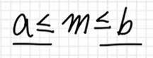
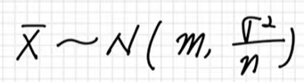
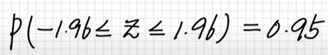
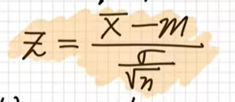
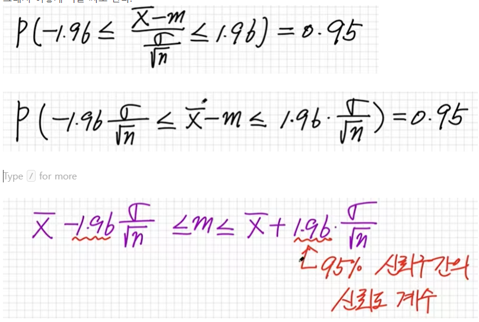
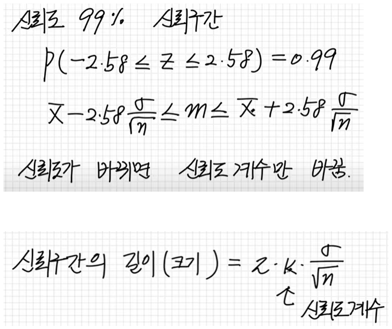

# 통계적 추정 

## 모평균 추정


전국고등학생의 키의 평균? 

추정 = 추측 

n명을 임의 추출해서 표본평균 X-bar를 구한다. 

다음과 같이 정의한다. 

진짜 평균(모평균) = m 
모표준편차 = α


그러면, 
진짜 평균은 X바에서 어느정도 뺀 거에서 
X바에서 어느정도 더한 거 사이에 있어요 
라고 말할 수 있다. 


```
X  - ?  ≤ m  ≤  X  + ?
```


이것이 모평균을 추정하는 것이다. 

그러면 뭘 더하고 뭘 빼냐? 


```
X  - k ·  α / √n   ≤ m  ≤  X  + k ·  α / √n 
```

n은 임의 추출한 갯수
X바는 표본 평균 
α 는 모 표준편차 
m은 모평균 

모르는 것이 하나 있는데 k이다. 

k는 신뢰도 상수라고 한다. 

신뢰도라는 말은 95%의 확률을 갖는다라고 말한다. 

진짜 평균이 양쪽 값의 사이에 있을 확률이 95%라는 말이다. 
표준정규분포 그래프에서 다음과 같이 표현할 수 있다. 


이말은 

P(-k ≤ Z ≤ k) = 0.95

라는 말이다. 

이것은 오른쪽만 보자면 
P(0 ≤ Z ≤ k) = 0.475

라는 의미다.


## 연습 1 
어느 호수의 납의 농도는 표준편차가 3μg / L 인 정규분포를 따른다고 한다.  이 호수에서 납의 농도를 16번 측정한 결과 평균 농도는 18 μg/L 이었다. 
이 호수에서 납의 녿오에 대한 모평균 m의 신뢰도 95%의 신뢰구간을 구하여라. 
(P( 0 ≤ z   ≤ 1.96)  0.475) (단, μg/L 는 농도를 나타내는 단위이다. )


α =3 
n  = 16 임의 추출 
X-bar =18  표본의 평균 

즉 추정을 해서 모평균이 어디에서 어디에 있는지 구하라는 의미 . 

공식을 다시 보자. 
```
X  - k ·  α / √n   ≤ m  ≤  X  + k ·  α / √n 
```

그러니까 이렇게 된다. 
```
18 - k·3 /√16  ≤ m  ≤  18 + k·3 /√16
```

이제 k를 구한다.  신뢰도 95%이니까,  표준정규분포에서  -k에서 k까지가 0.95가 되어야 한다. 한쪽만 구하면 되니까 0.475가 된다. 


```
P( 0 ≤ z ≤ k) =0.475
```

그러면 k는 1.96이다. 

```
k = 1.96
```
그래서 진짜 평균은 다음 사이에 있다. 
```
18 - 1.96·3 /√16  ≤ m  ≤  18 + 1.96·3 /√16
= 16.53 ≤ m ≤ 19.47
```

신뢰구간은 다음과 같이 계산한다. 
```
신뢰구간 = 19.47 - 16.53
```


## 연습 2
어느 고등학교 남학생 36명의 제자리 멀리띄기 기록은 평균이 216cm, 표준편차가 10cm이었다. 
이 학교 남학생들의 제자리 멀리띄기 기록이 정규분포를 따른다고 할 때, 제자리 멀리 띄기 기록에 대한 모평균 m의 신뢰도 99%의 구간을 구하여라.  P( 0 ≤ z  ≤ 2.58) = 0.495 


α = 10 
n  = 36 임의 추출 
X-bar = 216  표본의 평균 

공식을 다시 보자. 
```
X  - k ·  α / √n   ≤ m  ≤  X  + k ·  α / √n 
```


임의 추출한 n이 30이 넘어가면  n > 30  모표준편차와 표본표준편차가 같다고 본다. 

```
216  - 2.58 ·  10 / √36   ≤ m  ≤  216  + 2.58 ·   10/√36 
= 211.7 ≤ m  ≤  220.3
```


## 추가설명
구간추정




신뢰도는 위 식의 구간안에 들어올 확률 
신뢰도 95%는 모집단의 평균이  구간안에 들어올 확률이 0.95이다. 
신뢰도가 높으면 구간의 폭이 넓어지고 
신뢰도가 낮으면 구간의 폭이 좁아진다. 

표본 평균의 분포 
표본 평균의 분포는 다음 식의 정규분포를 따른다. 





정규분포 확률분포 변수 Z가 -1.6에서 1.96 사이에 들어올 확률이 0.95이다. 





정규분포의 표준화 
X바를 표준화해서 만들 수 있는데 





그래서 이렇게 식을 써도 된다. 






