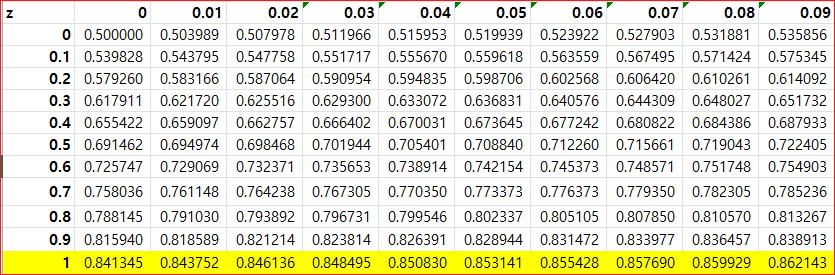
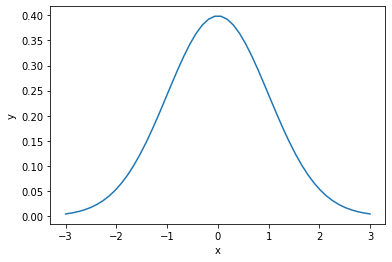
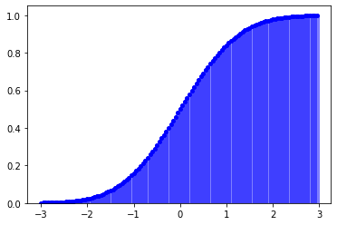

# Scipy

SciPy는 파이썬을 기반으로 하여 과학, 분석, 그리고 엔지니어링을 위한 과학(계산)적 컴퓨팅 영역의 여러 기본적인 작업을 위한 라이브러리(패키지 모음)입니다. Scipy는 기본적으로 Numpy, Matplotlib, pandas, Sympy등 과 함께 동작을 합니다. SciPy는 수치적분 루틴과 미분방정식 해석기, 방정식의 근을 구하는 알고리즘, 표준 연속/이산 확률분포와 다양한 통계관련 도구 등을 제공합니다. NumPy와 Scipy를 함께 사용하면 확장 애드온을 포함한 MATLAB을 완벽하게 대체합니다.


* scipy.integrate: 수치적분 루틴과 미분방정식 해법기 
* scipy.linalg: numpy.linalg에서 제공하는 것보다 더 확장된 선형대수 루틴과 매트릭스 분해
* scipy.optimize: 함수 최적화기와 방정식의 근을 구하는 알고리즘 
* scipy.signal: 시그널 프로세싱 도구 
* scipy.sparse: 희소 행렬과 희소 선형 시스템 풀이법
* scipy.special: 감마 함수처럼 흔히 사용되는 수학 함수를 구현한 포트란 라이브러리인 SPECFUN 확장
* scipy.stats: 표준 연속/이산 확률 분포(집적도 함수, 샘플러, 연속 분포 함수)와 다양한 통계 테스트, 그리고 좀 더 기술적인 통계 도구
* scipy.weave: 배열 계산을 빠르게 하기 위해 인라인 C++ 코드를 사용하는 도구

모든 통계 함수가 scipy.stats 패키지에 있다.


```
from scipy.stats import norm
```


## cdf()
cdf 는 Cumulative Distribution Function이다. 확률밀도함수의 누적밀도를 구하는 함수인 scipy 패키지의 norm.cdf() 함수로 구할 수 있다. 

```
cdf([확률변수값, 평균, 표준편차])
```

* x 확률변수값
* loc 기댓값(평균)
* scale 표준편차 


평균이 0 이고, 표준편차가 1인 정규분포의 -1의 누적확률밀도 출력해 보자. 


```
norm.cdf([-1., 0, 1])
```

```
array([0.15865525, 0.5       , 0.84134475])
```

평균이 0 이고 표준편차가 1인 정규분포의 확률변수값 1.07의 누적확률밀도를 구해보자.




```
norm.cdf([1.07, 0, 1])
```
```
array([0.85769035, 0.5       , 0.84134475])
```


Numpy array를 사용할 수 있다. 

```
import numpy as np
```
```
norm.cdf(np.array([1., 0, 1]))
```
```
array([0.84134475, 0.5       , 0.84134475])
```


## pdf
Python에서 정규분포의 확률밀도값(확률값이 아님을 유의)은 scipy.stats 패키지의 norm.pdf() 함수로 구할 수 있습니다. 이때 norm.pdf() 함수의 인자는 다음과 같습니다.

* x 확률변수값
* loc 기댓값(평균)
* scale 표준편차


```
norm.pdf(np.array([1., 0, 1]))
```
```
norm.pdf(np.array([1., 0, 1]))
```


##  정규분포 그리기


```
import matplotlib.pyplot as plt
```
linspace()를 사용하여 -3.0에서 3.0까지 수열을 만든다. 

```
x =  np.linspace(-3.0, 3.0,  endpoint=True)
x
```
```
array([-3.        , -2.87755102, -2.75510204, -2.63265306, -2.51020408,
       -2.3877551 , -2.26530612, -2.14285714, -2.02040816, -1.89795918,
       -1.7755102 , -1.65306122, -1.53061224, -1.40816327, -1.28571429,
       -1.16326531, -1.04081633, -0.91836735, -0.79591837, -0.67346939,
       -0.55102041, -0.42857143, -0.30612245, -0.18367347, -0.06122449,
        0.06122449,  0.18367347,  0.30612245,  0.42857143,  0.55102041,
        0.67346939,  0.79591837,  0.91836735,  1.04081633,  1.16326531,
        1.28571429,  1.40816327,  1.53061224,  1.65306122,  1.7755102 ,
        1.89795918,  2.02040816,  2.14285714,  2.26530612,  2.3877551 ,
        2.51020408,  2.63265306,  2.75510204,  2.87755102,  3.        ])
```

```
# 평균이 0, 표준편차가 1인 정규분포 배열 생성
y = norm(0, 1).pdf(x)
y
```
```
array([0.00443185, 0.00635135, 0.00896675, 0.01247075, 0.01708592,
       0.02306069, 0.03066159, 0.04016108, 0.05182083, 0.0658706 ,
       0.08248352, 0.10174921, 0.12364689, 0.1480211 , 0.17456307,
       0.20280069, 0.2320998 , 0.26167871, 0.29063661, 0.31799518,
       0.34275126, 0.36393672, 0.38068082, 0.39226937, 0.39819528,
       0.39819528, 0.39226937, 0.38068082, 0.36393672, 0.34275126,
       0.31799518, 0.29063661, 0.26167871, 0.2320998 , 0.20280069,
       0.17456307, 0.1480211 , 0.12364689, 0.10174921, 0.08248352,
       0.0658706 , 0.05182083, 0.04016108, 0.03066159, 0.02306069,
       0.01708592, 0.01247075, 0.00896675, 0.00635135, 0.00443185])
```


```
# 챠트 생성 
plt.plot(x, y) 
plt.xlabel("x") 
plt.ylabel("y") 
plt.show()
```       





-3에서 3까지 0.01 단위로 배열을 생성하려면 numpy.arange()를 사용한다.

```
rv = norm(loc = 0, scale = 1) #평균 0이고 표준편차 1인 정규분포 객체 만들기
x = np.arange(-3, 3.01, 0.01) #X 확률변수 범위
y = rv.pdf(x) #X 범위에 따른 정규확률밀도값
y

# 챠트 생성 
plt.plot(x, y) 
plt.xlabel("x") 
plt.ylabel("y") 
plt.show()
```


## 누적분포 그리기

```
rv = norm(loc = 0, scale = 1) #표준정규확률객체 만들기
x = np.arange(-3, 3, 0.05) #X 확률변수 범위
y = rv.cdf(x) #X 범위에 따른 누적확률밀도값

# 챠트 생성 
fig, ax = plt.subplots(1,1) 
ax.plot(x, y,'bo', ms=4, label = 'normal pmf')
ax.vlines(x, 0, y, colors='b', lw =5, alpha =0.5) #결과는
ax.set_ylim([0,1.05]) #y축 범위
```





