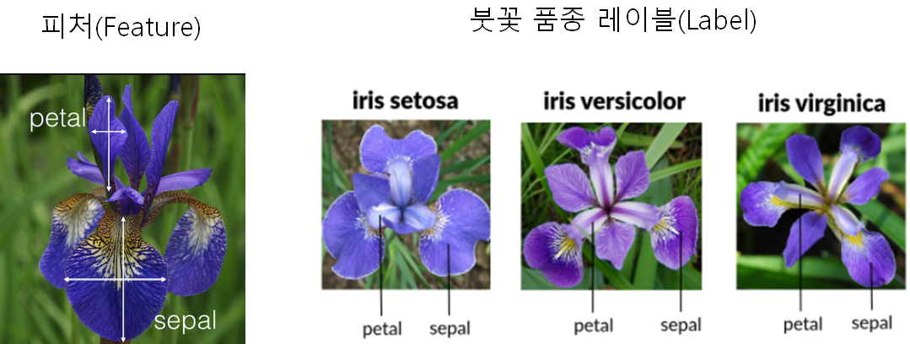

# 사이킷런 데이터셋 사용

붓꽃 데이터 세트는 분류(Classification)를 하기 위한 대표적 데이터셋으로, 꽃잎의 길이, 너비를 기반으로 꽃의 품종을 예측할 수 있다.




> petal : 꽃잎  ,   sepal : 꽃받침    


## 데이터 가져오기

```python 
# iris 붓꽃 데이터 로드
from sklearn.datasets import load_iris
```
```python 
iris = load_iris()
iris
```
```
{'DESCR': '.. _iris_dataset:\n\nIris plants dataset\n--------------------\n\n**
...중략...
 'data': array([[5.1, 3.5, 1.4, 0.2],
        [4.9, 3. , 1.4, 0.2],
        [4.7, 3.2, 1.3, 0.2],
        [4.6, 3.1, 1.5, 0.2],
        [5. , 3.6, 1.4, 0.2],
        [5.4, 3.9, 1.7, 0.4],
        [4.6, 3.4, 1.4, 0.3],
        [5. , 3.4, 1.5, 0.2],
        [4.4, 2.9, 1.4, 0.2],
...생략...
```        


```python 
print(dir(iris))
# dir() 함수로 해당 객체의 변수와 메소드 확인
```
```
['DESCR', 'data', 'data_module', 'feature_names', 'filename', 'frame', 'target', 'target_names']
```

* data : 피처의 데이터 셋
* target : 분류시 레이블 값, 회귀시 숫자 결과값 데이터
* target_names : 개별 레이블 이름 
* feature_names : 피처들의 이름 
* DESCR : 데이터 셋에 대한 설명과 각 피처에 대한 설명 

```python
iris.keys()
# dict_keys(['data', 'target', 'frame', 'target_names', 'DESCR', 'feature_names', 'filename', 'data_module'])
```
```
dict_keys(['data', 'target', 'frame', 'target_names', 'DESCR', 'feature_names', 'filename', 'data_module'])
```

## 데이터 형태

```python
iris_data = iris.data
print(iris_data.shape) 
# shape써서 data의 행렬을 보여줌
# 150개의 데이터가 4개의 정보를 갖고 있음
# (150, 4)
```
```
(150, 4)
```


## 데이터의 인덱스 값 확인
```python
iris_data[0]
# data의 0번째 인덱스 값
# array([5.1, 3.5, 1.4, 0.2])
```
```
array([5.1, 3.5, 1.4, 0.2])
```

## 데이터 라벨링
```python 
iris_label = iris.target
iris_label
# 호출할 때 target으로 호출함
```
```
array([0, 0, 0, 0, 0, 0, 0, 0, 0, 0, 0, 0, 0, 0, 0, 0, 0, 0, 0, 0, 0, 0,
       0, 0, 0, 0, 0, 0, 0, 0, 0, 0, 0, 0, 0, 0, 0, 0, 0, 0, 0, 0, 0, 0,
       0, 0, 0, 0, 0, 0, 1, 1, 1, 1, 1, 1, 1, 1, 1, 1, 1, 1, 1, 1, 1, 1,
       1, 1, 1, 1, 1, 1, 1, 1, 1, 1, 1, 1, 1, 1, 1, 1, 1, 1, 1, 1, 1, 1,
       1, 1, 1, 1, 1, 1, 1, 1, 1, 1, 1, 1, 2, 2, 2, 2, 2, 2, 2, 2, 2, 2,
       2, 2, 2, 2, 2, 2, 2, 2, 2, 2, 2, 2, 2, 2, 2, 2, 2, 2, 2, 2, 2, 2,
       2, 2, 2, 2, 2, 2, 2, 2, 2, 2, 2, 2, 2, 2, 2, 2, 2, 2])
```

## 데이터 라벨링 이름

```python 
iris.target_names 
# target_names를 통해 데이터 라벨링 이름을 알 수 있다
```
```
array(['setosa', 'versicolor', 'virginica'], dtype='<U10')
```

* target : 정답(label)
* target_names : 정답 이름( setosa, versicolor, virginica)


> 레이블(=클래스, =타겟(값), =결정(값))지도학습에서 데이터의 학습을 위해 사용되는 정답 데이터


## 데이터셋 설명

```python
print(iris.DESCR)
# DESCR 함수를 통해 데이터셋의 설명을 볼 수 있다
```
```
**Data Set Characteristics:**

    :Number of Instances: 150 (50 in each of three classes)
    :Number of Attributes: 4 numeric, predictive attributes and the class
    :Attribute Information:
        - sepal length in cm
        - sepal width in cm
        - petal length in cm
        - petal width in cm
        - class:
                - Iris-Setosa
                - Iris-Versicolour
                - Iris-Virginica
                
    :Summary Statistics:

    ============== ==== ==== ======= ===== ====================
                    Min  Max   Mean    SD   Class Correlation
    ============== ==== ==== ======= ===== ====================
    sepal length:   4.3  7.9   5.84   0.83    0.7826
    sepal width:    2.0  4.4   3.05   0.43   -0.4194
    petal length:   1.0  6.9   3.76   1.76    0.9490  (high!)
    petal width:    0.1  2.5   1.20   0.76    0.9565  (high!)
    ============== ==== ==== ======= ===== ====================

    :Missing Attribute Values: None
    :Class Distribution: 33.3% for each of 3 classes.
    ...생략...
```


## 데이터 feature 설명
```python
iris.feature_names
```
```
['sepal length (cm)',
 'sepal width (cm)',
 'petal length (cm)',
 'petal width (cm)']
```
이것은 데이터셋이 꽃받침 길이, 꽃받침 너비, 꽃잎 길이, 꽃입 너비 등 4개의 컬럼으로 구성되어 있다는 것을 의미한다.


## Pandas 사용

```python
import pandas as pd

iris_df = pd.DataFrame(data=iris_data, columns=iris.feature_names) # 배열 만들기
iris_df["label"] = iris.target # 라벨 붙이기
iris_df 
```
```
	sepal length (cm)	sepal width (cm)	petal length (cm)	petal width (cm)	label
0	5.1	3.5	1.4	0.2	0
1	4.9	3.0	1.4	0.2	0
2	4.7	3.2	1.3	0.2	0
3	4.6	3.1	1.5	0.2	0
4	5.0	3.6	1.4	0.2	0
...	...	...	...	...	...
145	6.7	3.0	5.2	2.3	2
146	6.3	2.5	5.0	1.9	2
147	6.5	3.0	5.2	2.0	2
148	6.2	3.4	5.4	2.3	2
149	5.9	3.0	5.1	1.8	2
150 rows × 5 columns
```
pandas의 DataFrame을 이용해 2차원 배열을 만들었다.
row=iris_data, columns=iris.feature_names를 사용했다.
가장 우측에 label을 통해 정답지도 같이 추가했다.


## 데이터 분리하기
현재 총 150개의 데이터셋을 갖고 있다.
머신러닝 모델은 학습용 데이터와 테스트용 데이터는 겹치면 안되기 때문에 training dataset과 test dataset으로 나눠야 한다.


```python
from sklearn.model_selection import train_test_split

X_train, X_test, y_train, y_test = train_test_split(iris_data, 
                                                    iris_label, 
                                                    test_size=0.2, 
                                                    random_state=7)

print('X_train 개수: ', len(X_train),', X_test 개수: ', len(X_test))
```

```
X_train 개수:  120 , X_test 개수:  30
```
train_test_split 기능으로 손 쉽게 나눌 수 있다.

*_train은 트레이닝용으로 후에 모델을 만들 때 사용된다. x_train은 row값, y_train은 label값을 갖고 있다.

test_size=0.2로 total 150EA의 20%인 30개의 데이터를 *_test으로 보냈다.


> 여기서 random_state는 y_train이 갖고있는 해시값이라고 보면 편하다.
랜덤으로 테스트용 데이터를 추출하지만 해시값을 같게 해서 재현할 수 있다.(해당 인자는 없어도 무관하다.)

## 데이터셋 확인하기
```python
X_train.shape, y_train.shape
```
```
((120, 4), (120,))
```
```python
X_test.shape, y_test.shape
```
```
((30, 4), (30,))
```
```python
y_train, y_test
```

```
(array([2, 1, 0, 2, 1, 0, 0, 0, 0, 2, 2, 1, 2, 2, 1, 0, 1, 1, 2, 0, 0, 0,
        2, 0, 2, 1, 1, 1, 0, 0, 0, 1, 2, 1, 1, 0, 2, 0, 0, 2, 2, 0, 2, 0,
        1, 2, 1, 0, 1, 0, 2, 2, 1, 0, 0, 1, 2, 0, 2, 2, 1, 0, 1, 0, 2, 2,
        0, 0, 2, 1, 2, 2, 1, 0, 0, 2, 0, 0, 1, 2, 2, 1, 1, 0, 2, 0, 0, 1,
        1, 2, 0, 1, 1, 2, 2, 1, 2, 0, 1, 1, 0, 0, 0, 1, 1, 0, 2, 2, 1, 2,
        0, 2, 1, 1, 0, 2, 1, 2, 1, 0]),
 array([2, 1, 0, 1, 2, 0, 1, 1, 0, 1, 1, 1, 0, 2, 0, 1, 2, 2, 0, 0, 1, 2,
        1, 2, 2, 2, 1, 1, 2, 2]))
```
y_train과 y_test는 train_test_split 덕분에 label값이 무작위로 섞여있다. 


## 참조 
[붓꽃 품종 예측하기](https://chan123.tistory.com/106)     
[Iris 품종 분류모델 만들기](https://velog.io/@wheres5/Iris-%ED%92%88%EC%A2%85-%EB%B6%84%EB%A5%98-%EB%AA%A8%EB%8D%B8-%EB%A7%8C%EB%93%A4%EA%B8%B0)     