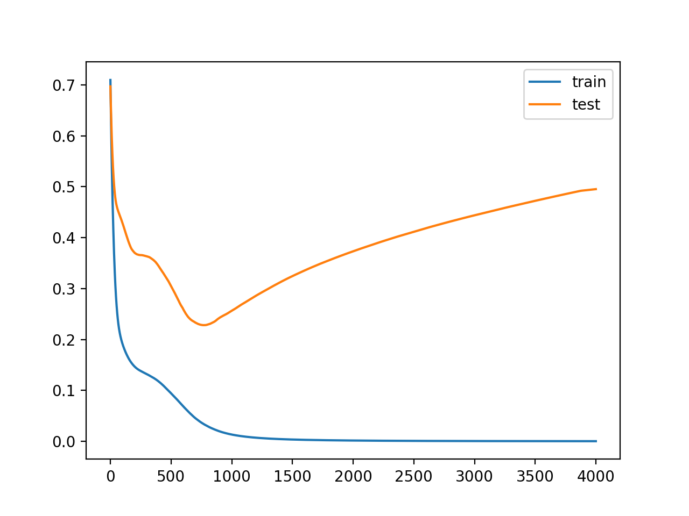

# 학습과 테스트 세트 분리 
사이킷런(scikit-learn)의 model_selection 패키지 안에 train_test_split 모듈을 활용하여 손쉽게 train set(학습 데이터 셋)과 test set(테스트 셋)을 분리할 수 있다. 

## train/test 분리 목적 

정확히 말하면, train / test 가 아닌 train / validation 으로 볼 수 있다.

머신러닝 모델에 train 데이터를 100% 학습시킨 후 test 데이터에 모델을 적용했을 때 성능이 생각보다 않 나오는 경우가 많다.

이러한 현상을 보통 Overfitting 되었다라고 한다. 

즉, 모델이 내가 가진 학습 데이터에 너무 과적합되도록 학습한 나머지, 이를 조금이라도 벗어난 케이스에 대해서는 예측율이 현저히 떨어지기 때문이다. 그래서 Overfitting을 방지하는 것은 전체적인 모델 성능을 따져보았을 때 매우 중요한 프로세스 중 하나이다. 

> 머신러닝 모델을 학습하고 그 결과를 검증하기 위해서는 원래의 데이터를 Training, Validation, Testing의 용도로 나누어 다뤄야 한다. 그렇지 않고 Training에 사용한 데이터를 검증용으로 사용하면 시험문제를 알고 있는 상태에서 공부를 하고 그 지식을 바탕으로 시험을 치루는 꼴이므로 제대로 된 검증이 이루어지지 않기 때문이다. 
> 
> 딥러닝을 제외하고도 다양한 기계학습과 데이터 분석 툴을 제공하는 scikit-learn 패키지 중 model_selection에는 데이터 분할을 위한 train_test_split 함수가 들어있다.
>
> [출처] [sklearn의 train_test_split() 사용법](https://blog.naver.com/PostView.nhn?isHttpsRedirect=true&blogId=siniphia&logNo=221396370872)


**Validation Set으로 검증 단계를 추가하여 Overfitting 방지한다.**     


그림과 같이 기존 train/test로 구분 되어 있던 데이터 셋을 train에서 train / validation으로 일정 비율 쪼갠 다음에 학습 시에는 train 셋으로 학습 후 중간중간 validation 셋으로 내가 학습한 모델 평가를 해주는 것이다. 


만약, 모델이 과적합되었다면, validation 셋으로 검증시 예측율이나 오차율이 떨어지는 현상을 확인할 수 있으며, 이런 현상이 나타나면 학습을 종료한다. 


아래 그림을 참고하면, iteration이 750을 넘어가는 순간부터 train 셋의 오차율을 계속 하강하고 있으나 validation 셋의 오차율을 점차 증가하는 것을 확인할 수 있다. 





**출처**[ machinelearningmastery.com]( machinelearningmastery.com) 


그러므로 머신러닝 모델의 하이퍼파라미터 튜닝 시 특히 n_estimators의 값은 validation 셋의 오차율을 점검해 나가면서 튜닝을 진행해야 한다.  딥러닝 모델도 마찬가지로 validation_data를 지정해 줌으로써 매 epoch 마다 validation의 오차율을 확인하면서 과적합을 방지해야 좋은 성능의 모델을 만들 수 있다. 

추가로, 검증 방법은 K-Fold 교차 검증 방식이 많이 이용되고 있다. 

**용어**     
* **Train** :  모델을 학습시키기 위한 dataset 
* **Test** : 학습과 검증이 완료된 모델의 성능을 평가하기 위한 dataset, 학습에 관여하지 않는다. 
* **Validation** : 이미 학습된 모델을 검증하기 위한 dataset으로 Train의 일부다. 


## 기본 사용 방법 
#### train/test 분리

x,y numpy 배열을 만든다. 
```python
import numpy as np
from sklearn.model_selection import train_test_split
X, y = np.arange(10).reshape((5, 2)), range(5)
X
```
결과:    
```
array([[0, 1],
       [2, 3],
       [4, 5],
       [6, 7],
       [8, 9]])
```

```python 
list(y)
```

결과:     

```
[0, 1, 2, 3, 4]
```

분리한다.     

```python 
X_train, X_test, y_train, y_test = train_test_split(
    X, y, test_size=0.33, random_state=42)

X_train
```

결과:     
```
array([[4, 5],
       [0, 1],
       [6, 7]])
```

```
y_train
```
결과:     
```
[2, 0, 3]
```
```
X_test
```
결과:     
```
array([[2, 3],
       [8, 9]])
```       
```python
y_test
```
결과:    
```
[1, 4]
```
```python
train_test_split(y, shuffle=False)
```

```결과 
[[0, 1, 2], [3, 4]]
```


**사용법***     

```python 
sklearn.model_selection.train_test_split(
        *arrays
      , test_size=None
      , train_size=None
      , random_state=None
      , shuffle=True
      , stratify=None)
```

**Parameters:**     
* **arrays**: 
  * 같은 길이를 가진 indexables의 sequence. 
  * 인풋으로 lists, numpy arrays, scipy-sparse matrices, pandas dataframes가 허용된다.
* **test_size**: 
  * 테스트 셋 구성의 비율을 나타낸다. 
  * 테스트데이터 크기를 정한다. 
  * 0~1사이의 숫자. 
  * train_size의 옵션과 반대 관계에 있는 옵션 값. 주로 test_size를 지정해 준다.  0.2는 전체 데이터 셋의 20%를 test (validation) 셋으로 지정하겠다는 의미. 
  * default 값은 0.25 이다. 
* **train_size** : 
  * 0~1사이의 숫자. 
  * train 크기를 설정한다. 
* **shuffle** : 
  * default=True 이다. 
  * split을 해주기 이전에 섞을건지 여부이다.  보통은 default 값으로 사용한다. 
  * train과 test 데이터를 섞는다. 만약 섞지 않으며면, stratify 설정은 반드시 None이어야 한다. 
* **stratify**: 
  * default=None 이다. 
  * classification을 다룰 때 매우 중요한 옵션값이다.  
  * stratify 값을 target으로 지정해주면 각각의 class 비율(ratio)을 train / validation에 유지해 준다.  (한 쪽에 쏠려서 분배되는 것을 방지한다.) 
  * 만약 이 옵션을 지정해 주지 않고 classification 문제를 다룬다면, 성능의 차이가 많이 날 수 있다.  
* **random_state**: 
  * 세트를 섞을 때 해당 int 값을 보고 섞으며, 
  * 하이퍼 파라미터를 튜닝시 이 값을 고정해두고 튜닝해야 매번 데이터셋이 변경되는 것을 방지할 수 있다.


```
x_train, x_valid, y_train, y_valid = train_test_split(x_data, y_data, test_size=0.2, shuffle=True, stratify=target, random_state=34)
```


**return**     

> stratify : 계층화 하다 
* X_train, X_test, Y_train, Y_test : arrays에 데이터와 레이블을 둘 다 넣었을 경우의 반환이며, 데이터와 레이블의 순서쌍은 유지된다.

* X_train, X_test : arrays에 레이블 없이 데이터만 넣었을 경우의 반환

**용어**     
* X_train : 학습용 피처 데이터 세트 
* X_test : 테스트용 피처 데이터 세트
* Y_train : 학습용 레이블 데이터 세트
* Y_test : 테스트용 레이블 데이터 세트 


## 참조 
[sklearn.model_selection.train_test_split](https://scikit-learn.org/stable/modules/generated/sklearn.model_selection.train_test_split.html)     


