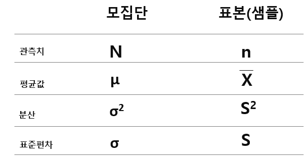
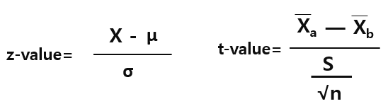
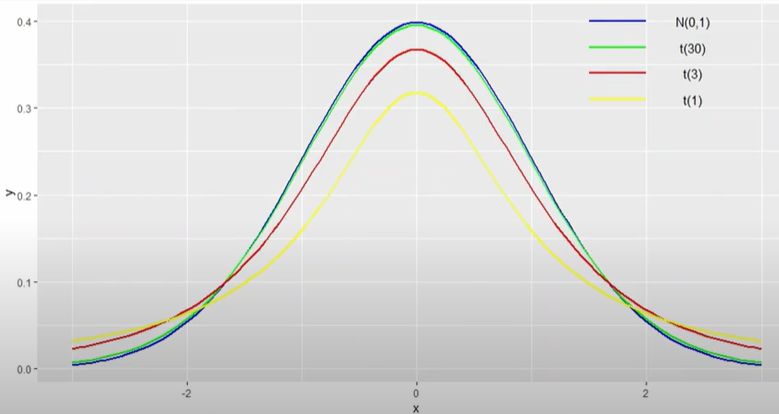
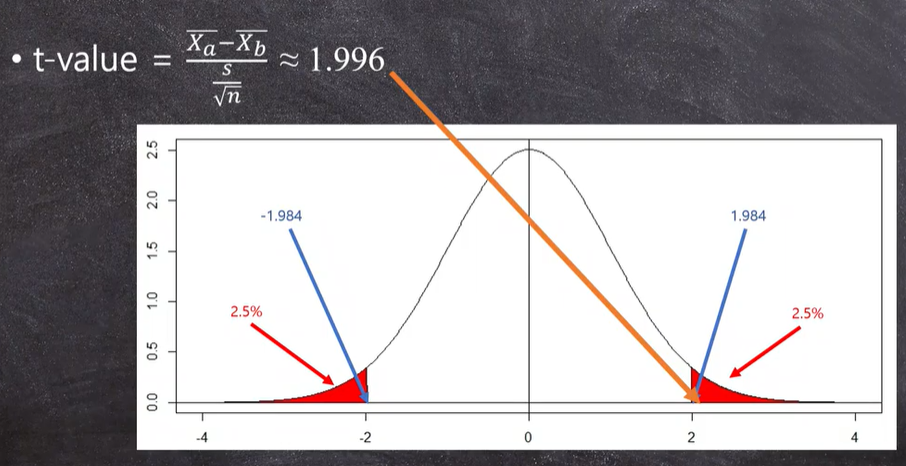
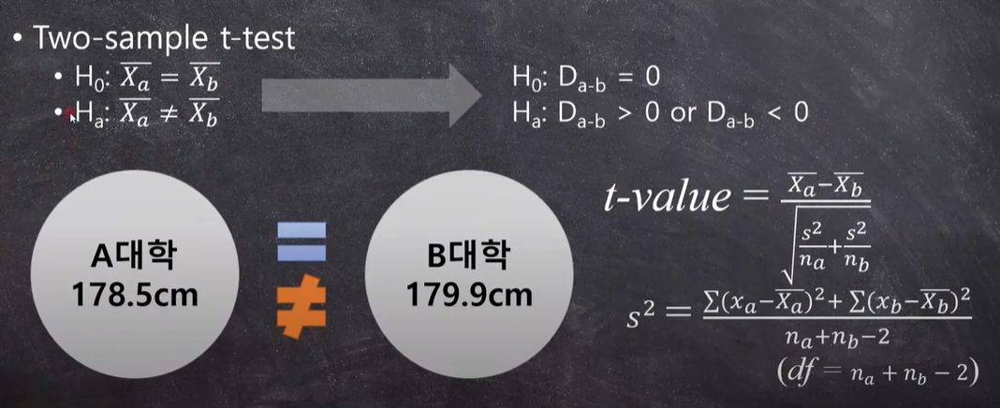
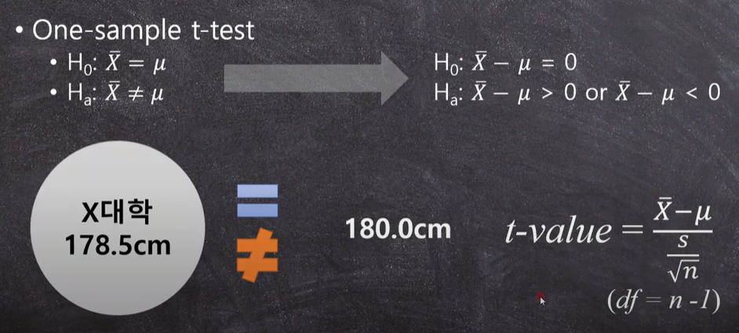
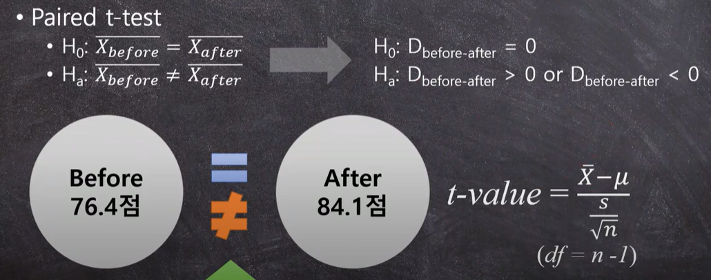

# T 검정 

이 문서는 창작물이 아니며 Youtube의 강의를 학습을 위해 정리한 것입니다. 자세한 내용은 참조에 있는 Youtube 동영상을 참고하시면 됩니다. 


## 1. T-검정
> t 검정 (t-test)     
모집단의 분산이나 표준편차를 알지 못할 때
모집단을 대표하는 표본으로부터 추정된 분산이나 표준편차를 가지고 검정하는 방법으로
“두 모집단의 평균간의 차이는 없다”라는 귀무가설과 “두 모집단의 평균 간에 차이가 있다”라는 대립가설 중에 하나를 선택할 수 있도록 하는 통계적 검정방법이다.    
(교육평가용어사전, 2004, 학지사)


**왜 이름이 t-test인가?**    
가설이고 정확히 알려지지 않았다. 
1908년 영국의 William Sealy Gosset이 개발한 방법
그의 필명이 Student였다고 함. 
Student의 마지막 글자 't'를 땨서 t-test라고한다. 


### t-test의 목적 
* 두 개의 집단이 같은지 다른지 비교하기 위해 사용한다. 

통계에서는 일반적으로 집단이란 샘플(표본)을 이야기 한다. 
그러나 샘플만 존재하는 것은 아니다. 
모집단(population)이라는 것도 있다. 
팸플(표본)과 모집단은 어떻게 다른가? 





무엇을 가지고 비교할까?  

두 집단이 같은지 다른지 알기 위해서는 두 표본의 평균값을 가지고 비교한다. 

두 샘플의 대푯값이 평균을 가지고 비교한다. 


t-test의 예 

* A대학 남학생 평균키 = 178.5cm 
* B대학 남학생 평균키 = 179.9cm 


두 대학 남학생의 평균키의 차이는 1.4cm 차이가 난다.  
그러면 두 대학 남학생의 키는 같을까요? 다를까요? 

1.4cm는 큰차이일까요? 같은 차이일까요? 


t-test를 위한 통계적 질문 
* A대학 남학생 평균키(178.5cm)와 B대학 남학생 평균키(179.9cm)가 우연히 같은 확률은 얼마나 될까? 
* A대학과 B대학의 남학생 평균키 차이인 1.4cm가 우연히 발생했을 확률은 얼마나 될까? 


t-test의 목적은 두 집단이 같은지 다른지 알고 싶을 때 하는 것이고, 그것을 비교하기 위해 두 집단의 평균값을 비교하고, 그 때 우리가 해야 할 질문은 두 집단의 차이가 우연히 발생할 수 있는 확률을 구함으로써 t-test의 결론을 내리는 것이다. 


## 2. T-검정 이해 

t-test를 위한 통계적 질문 
* 그렇다면 관연 1.4cm의 차이가 얼마나 커야 우연히 발생하지 않았다고 판단할 수 있을까? 
* 1.4cm의 차이는 과연 큰 것인가 작은 것인가? 


결정론적 사고에서는 A대학 학생의 키가 B대학의 학생보다 1.4cm 크다. 
그러나 통계적 의사결정을 그렇지 않다. 


t-test에 대한 보다 깊은 이해 
* 우리는 1.4cm가 얼마나 큰지 혹은 작은지 알 수 없다. 
* 우리는 이제 이 1.4cm가 얼마나 큰지 혹은 작은지 결정할 나름의 비교 대상이 필요하다. 
* 누구를 가지고 와서 비교해야 할까요? 

이것 하나 있다. 

표준편차(분산)

왜 표준편차가 비교의 대상일까요? 다시 돌아가 보자. 
* 우리가 가진 자료고 { 1,2,3,4,5} 이렇게 되어 있다면, 평균은 3이고 
* 분산
```
     (1-3)^2 + ( 2 -3)^2 + (3-3)^2 + (4-3)^2 + (5-3)^2 
분산 --------------------------------------------------------  = 2.5
                            4
``` 
      
* 표준편차 = 1.58 


표준편차의 의미를 다시 생각해 보자. 

* 여기서 우리가 가진 데이터는 평균값 3을 중심으로 평균적으로 1.58만큼 퍼져 있다는 의미
* 3 -1.58은 = 1.,42 & 3 + 1.58 = 4.58 
* 그렇다면, 이렇게 3을 중심으로 ± 1.58 정도 퍼져 있다는 것은 의미있는 중요한 퍼짐일까? 아니면 우연히 발생한 퍼짐일까? 


t-test에 대한 보다 깊은 이해 
* 그렇다. 표준편차는 데이터에 큰 문제가 없는 한은 의미 없는 우연히 퍼져 있는 정도이다. 
* 즉, 우리의 데이터는 평균값 3을 중심으로 랜덤하게 1.58정도 좌우로 퍼져 있다는 것이다. 
* 그렇다면, 다시 앞의 1.4cm 차이로 돌아가 보자. 
* 이 1.4cm의 차이도 결국 두 집단의 평균적인 거리이다. 
  * 왜냐하면, 두 집단의 수많은 데이터의 평균의 차이가 1.4cm라는 것은 두 집단의 수많은 데이터들 사이의 평균적인 거리가 1.4cm라느 의미이기 때문이다. 


* 그렇다면 비교해보자
  * 두 집단 A와 B의 데이터 사이의 평균적인 거리는 1.4cm이다. 
  * 두 집단 A와 B의 데이터들의 표준편차는 XXXcm이다. 
* 따라서
  *  만약 이 1.4cm가 표준편차 XXXcm보다 현저히 작다면, 우리는 1.4cm의 차이에 큰의미를 둘 수 없을 것이다. 
  * 그러나 1.4cm가 표준편차 XXXcm보다 현저히 크다면, 우리는 이 1.4cm의차이에 큰 의미를 둘 수 있을 것이다. 

* 결론적으로 
  * 두 집단의 평균값의 차이가 표준편차보다 현저히 작으면, 우리는 이 차이가 우연히 발생했다라고 결론을 내리게 된다. 
  * 반대로, 두 집단의 평균값의 차이가 표준편차보다 현저히 크면, 우리는 이 차이가 우연히 발생하지 않았다고 결론을 내릴 것이다. 


* 앞에서 통계학이란 분산(표준편차)의 마법이라고 이야기했다. 
  * 결론적으로 t-test는 평균값의 차이와 표준편차의 비율이 얼마나 큰지 혹은 작은지를 보고서 결정하는 통계적 과정이다. 


## 3. 정규분포 이해 

* Starting point 1 - 정규분포 
  * t-test 를 이해하기 위해서는 정규분포를 이해해야 한다. 
  * 대부분의 경우 정규분포의 z-stest와 t-test를 단순/별도로 설명하지만 연결해서 볼 필요가 있다. 
  * 분질적으로 같은 것이기 때문이다. 
  * 그래서 여거시 정규분포를 이해하고 넘어가야 한다. 

**z-test**     
* 이와 같이 z-score(z값)을 가지고 하는 테스트를 z-test라 한다. 
* z-test는 z값과 표준정규분포표를 이용하여 할 수 있다. 
* z-score(z값)으로 변환하는 것을 z-transformation이라고 하기도 하고 표준화(standardization)이라고 하기도 한다. 
  * z-score  ( X - μ )/ σ
  * 1 표준편차당 관찰값(X)가 평균으로부터 얼마나 떨어져 있는지를 의미 
  * z값은 단위로부터 자유롭다(dimensionless quantity) 

* 정규분포표는 그렇다 치고 어디에 써먹어야 할까? 
  * 정규분포곡선의 아랫쪽 면적이 확률이다. 
  * 이게 어디에 연결될까? 
  * 첫 강의에서 이야기 했던 내용을 기억해 보자. 
    * 어떤 사건이 우연히 발생할 확률이 얼마일까? 
    * 여기서 말하는 확률이 정규분포곡선 아랫쪽의 면적인 그 확률이다. 
  * 이것을 우리가 처음 하려고 했던 t-test의 질문을 떠올려 보면
    * A대학 남학생 평균키(178.5cm)와 B대학 남학생 평균키(179.9cm)가 우연히 같은 확률은 얼마나 될까? 
    * A대학과 B대학의 남학생 평균키 차이인 1.4cm가 우연히 발생했을 확률은 얼마나 될까? 
    * 다만, t-test를 할 때는 정규분포를 쓰지 않고 다른 분포 곡선을 사용한다. 
   


## 4. 가설검정 

* Starting point 2 - 양측검정 vs. 단측검정 
  * t-test를 이해하기 위한 다음은 양측/단측검정을 이해하는 것이다. 
  * 앞에 나왔던 t-test의 예를 통계적 검정에 연결해 보자. 

귀무가설은: H0 = Xa = Xb     
대립가설은: H1 = Xa <> Xb     

양측검정은 크거나(\>) 작다(\<) 양쪽을 포함한다. 단측검정은 큰것만 따지거나 작은 것만 따진다. 


다를 것이다라고 하면, 양측이 되고, 크다고 하거나 혹은 작을 것이다라고 하면 단측검정이 된다. 


어쨋든 확률이 5%보다 큰지를 찾아야 한다. 

우연이 아니라면 5%의 확률에 들어와야 하고, 
우연이라면 95%의 확률에 들어와야 한다. 

0에 가까운 95%는 우연이고, 0에서 먼 5%는 우연이 아니다. 


* 결론적으로 양측검정과 단측검정의 차이는 대립가설(Alternative Hypothesis)의 차이에서 발생 
  * 양측은 0보다 크거나 작은 두 가지를 모두 포함하므로 분포곡선의 양쪽 꼬리의 면적의 합이 5.0%에 들어갈 만큼 작어야 한다. 
  * 단측은 0보다 크다(우측검정)와 0보다 작다(좌측검정)의 두 가지로 나누어 볼 수 있고 어느 한쪽 꼬리의 면적이 5.0%에 들어갈 만큼 크거나 작어야 한다. 
  * 0을 기준으로 양측이든 단측이든 95% 안에 들어오면 두 평균 값의 차이인 Da -b는 우연히 발생한 것이므로 두 집단의 평균값은 통계적으로 같은 것이다. 

  
## 5. T-검정하기 

통계적 가설      
H0 : Xa  = Xb  →  H0: Da-b = 0     
H1 : Xa \<\> Xb  →  H1: Da-b \> 0 or Da-b \< 0    


t-test를 위한 t-값 & t-분포

* z-test를 떠올려 보자
  * z-test를 하기 위해 필요했던 것은, z-값과 표준 정규분포
  * 따라서 우리는 이제 t-값과 t-분포가 필요하다

 



표본의 표준편차를 루트 n(표본의 갯수)로 나눈 것이다. 


**df(degree of freedom) - 자유도**     


**t-값의 의미**    
* 다시, 봅시다. 
  * 우리의 목적은 두 집단의 평균값이 같은지 다른지 알고 싶다. 
  * 그래서 통계적 가설에 의해 두 집단의 평균값의 차이가 "0"과 같은지 다른지 궁금하다. 
  * 위의 값에서 우리가 궁금해 하는 그 차이는 분자에 있다. 
  * 여기서부터 중요한 것이 통계적인 생각/질문/접근법이다. 
  * 도대체 저 값이 얼마나 커야 큰 것인가?
  * 비교 대상이 필요하다. 

* 그렇다면 
  * 우리는 이 두 평균값의 차이를 표준편차와 비교하는 것이다.
  * 왜? 
    * 표준편차란 우리의 데이터가 평균값을 기준으로 평균적으로 퍼진 정도이다.
    * 따라서, 이 자체는 의미 없는 편차 
    * 만약 두 집단의 평균값의 (편)차가 의미 없는 편차인 표준편차만도 못하다면 당연히, 이 차이는 우연히 발생했다고 보아야 할 것이다. 
    * 그런데 여기서 √n의 역할은 무엇인가? 


t 분포는 

t(30)

과 같이 표현하는데, 이것이 df이다. 

자유도 df는 n -1 이다. 

데이터가 증가할 수록 t분포는 표준정규분포와 같아진다. 
이것을 "근사"한다고 한다. 


* 정리하자면 
  * 두 집단의 평균값의 (편)차이가 의미 없는 편차인 표준편차 만도 못하다면, 이 차이는 우연히 발생했다고 본다. 
  * 표본의 크기 (n)이 커지면 커질 수록 t-값은 커지고
  * 표본의 크기 (n)이 커지면 커질 수돍 t-분포는 표준 정규분포에 근사
  * t-test에서 자유도(df)는 n-1로 계산되므로, 표본의 크기가 커지면 자유도가 커지고, 자유도가 커졌다는 의미는 우리가 t-분포에 묶여 있다고 자유롭게 표준 정규분포를 사용할 수 있음을 의미 





* 다시 돌아와 본다면 
  * A대학 178.5 cm , B대학 179.9 cm
  * 표준편차(S)가 7.05cm, 표본의 크기(n)가 101명이라면 
  * 대략 값이 1.996이 된다. 


우리는 이제 t-distribution을 보았고 t-distribution을 정리한 테이블을 찾으면 된다. 
인터넷에서 t-table을 찾으면 된다. 

t-table에서 찾으면 1.984가 나오는데 이것을 critical value(c.v.)라고 한다. 





1.996이 1.984보다 크므로 우연히 아니다. 즉, 95%에 들어가지 않는다. 


* 결론적으로 양측검정을 전제했을 때, 
  * 표준 편차(s)가 7.05였고, 표본의 크기(n)가 101명이라면
  * t-value = 1.996, df = 100 
  * critical value(c.v.) == 1.984이므로 
  * 우리의  t-값이 c.v.보다 크므로 두 평균의 차이인 1.4cm가 우연히 발생했을 확률은 5%보다 작으므로, 이 차이는 통계적으로 유의하다. 
  * 그러므로, 두 대학의 학생의 키는 통계적으로 유의하게 다르다
    * 이 뜻은 두 대학 학생의 평균키 차이인 1.4cm가 우연히 발생했을 확률은 5%보다 작으며
    * 이는 우연히 발생했다고 보기 어려워(현재는 정확한 이유는 모르겠으나) 두 대학의 학생의 키가 다른 뭔가 원인이 있다고 볼 수 있다. 

  * 유의하다가 끝이 아니다. 

  그것이 왜 다른지 연구나 생각, 고민을 해 봐야 한다. 


## 6  T-Test의 종류 

* Two-sample t-test 
  * 두집단의 차이 구한다. 
* One-sample t-test
  * 샘플은 한 개
  * 표본은 하나 인데 내가 생각한 값과 같으냐? 
* Paried t-test
  * 샘플은 한 개 
  * 시간에 따라 테스트 
  * 같은 학생에 대해 영어시험을 보고 새로운 교재를 적용하고 시험을 봤을 때, 새로운 교재가 효과가 있느냐라고 보는 것 


### 각 방식의 공식 
앞에서 설명한 공식은 사실은 one-sample test 공식이다. 설명을 간단히 하기 위해서 사용했다. 





one-sample test와 동일한 공식을 사용한다.  



공식을 외워야 할까요? 
* 경험상 그럴 필요가 전혀 없다. 
* 먼저 이해를 하고 
* 컴퓨터에 계산을 맡긴다. 


# 참고 
[Youtube t-test (1)](https://youtu.be/mEWQ_vl3IPw)    
[Youtube t-test (2)](https://youtu.be/D_wJuKIADEU)     
[Youtube t-test (3)](https://youtu.be/AovOoq4p3nY)     
[Youtube t-test (4)](https://youtu.be/JhvanJrl6oE)     
[Youtube t-test (5)](https://youtu.be/EzH5n31Com0)     
[Youtube t-test (6)](https://youtu.be/yy3YLYTmnu0)     
